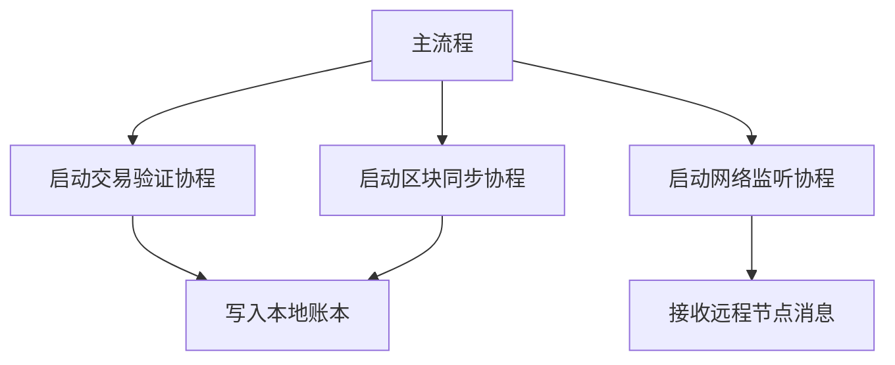
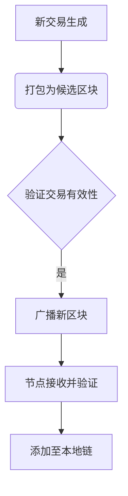
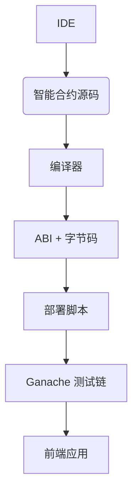
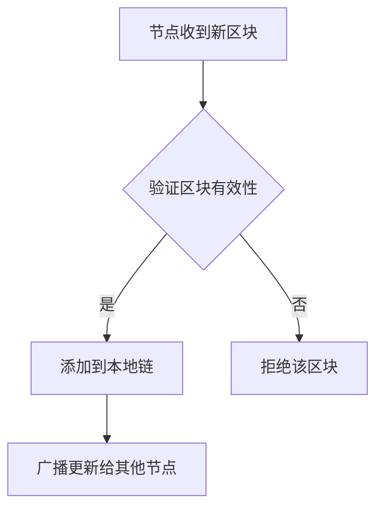
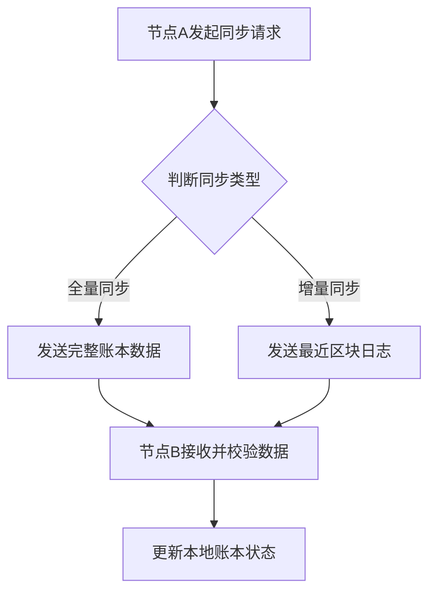
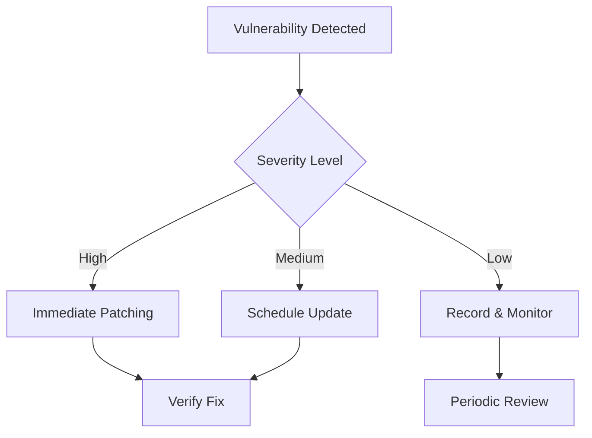

# 区块链开发入门

## 第一章：Go语言基础与区块链开发概述

Go语言，由Google于2009年推出，是一种静态类型、编译型、并发型的开源编程语言。它以简洁的语法、高效的编译速度和内置并发支持著称，非常适合构建高性能的分布式系统，因此在区块链开发领域得到了广泛应用。

区块链是一种去中心化的分布式账本技术，其核心特性包括数据不可篡改、交易透明和点对点通信。开发一个基础的区块链系统通常需要实现区块结构、链式存储、哈希计算和共识机制等关键组件。

在Go语言中构建一个简单的区块链原型，可以使用标准库中的 `fmt` 和 `time` 包来处理输出和时间戳。以下是一个最简化的区块结构示例：

```go
package main

import (
    "fmt"
    "time"
)

type Block struct {
    Timestamp     int64  // 区块创建时间
    Data          []byte // 区块承载的数据
    PreviousHash  []byte // 前一个区块的哈希
    Hash          []byte // 当前区块的哈希
}

func main() {
    fmt.Println("区块链开发入门示例")
    fmt.Println("当前时间戳：", time.Now().UnixNano())
}
```


该代码定义了一个 `Block` 结构体，并在 `main` 函数中输出了当前时间戳。后续章节将基于此结构扩展哈希计算与链式连接功能。

## 第二章：Go语言核心编程与区块链原理

### 2.1 Go语言语法特性与高效编码规范

Go语言以其简洁、高效的语法设计，成为现代后端开发的热门选择。其原生支持并发、垃圾回收机制和接口导向编程，极大提升了开发效率与代码可维护性。

**简洁而强大的语法特性**

Go语言摒弃了传统OOP的继承与泛型（1.18前），转而采用结构体嵌套与接口实现，使代码逻辑更清晰，降低了耦合度。

**高效编码规范建议**

- 使用短变量声明（:=）提升代码简洁性
- 包名使用小写、简洁语义
- 控制函数长度，保持单一职责
- 错误处理统一，避免忽略error

示例：简洁函数设计

```go
func fetchUser(id int) (string, error) {
    if id <= 0 {
        return "", fmt.Errorf("invalid user id")
    }
    return fmt.Sprintf("User-%d", id), nil
}
```


该函数通过明确返回值与错误类型，保证调用方能清晰处理结果，符合Go语言错误处理最佳实践。

### 2.2 并发编程与Go协程在区块链中的应用

在区块链系统中，高并发的数据处理和节点通信是核心挑战之一。Go语言原生支持的协程（goroutine）为构建高效、稳定的区块链服务提供了强有力的基础。

**协程在交易处理中的应用**

通过启动多个协程并行验证交易，可以显著提升区块打包效率。例如：

```go
func validateTransaction(tx Transaction, wg *sync.WaitGroup) {
    defer wg.Done()
    // 模拟交易验证逻辑
    time.Sleep(10 * time.Millisecond)
    fmt.Println("Validated transaction:", tx.Hash)
}
```


逻辑分析：

- `tx` 表示待验证的交易对象；
- `wg` 是同步等待组，用于协程间同步；
- `defer wg.Done()` 确保协程结束时通知主流程；
- `time.Sleep` 模拟实际验证耗时。

**节点通信的并发模型**

区块链节点需同时处理多个网络请求，使用协程可轻松实现非阻塞通信：

| 模块     | 协程数量 | 功能描述               |
| -------- | -------- | ---------------------- |
| 交易广播 | 多个     | 并行推送交易至邻居节点 |
| 区块同步 | 多个     | 异步拉取最新区块       |
| 共识机制 | 单/多    | 执行PoW/PoS等算法      |

**协程调度优化**

使用mermaid展示区块链中协程调度流程：




### 2.3 数据结构与区块模型设计实践

在区块链系统中，数据结构与区块模型的设计是构建系统底层逻辑的核心环节。合理的结构不仅能提升数据存储效率，还能增强系统的安全性与可扩展性。

**区块结构设计**

一个典型的区块通常包含区块头和交易数据两部分。以下是一个简化版的区块结构定义（使用 Python 类实现）：

```python
class Block:
    def __init__(self, index, previous_hash, timestamp, transactions, nonce):
        self.index = index              # 区块高度
        self.previous_hash = previous_hash  # 上一区块哈希
        self.timestamp = timestamp      # 时间戳
        self.transactions = transactions  # 交易列表
        self.nonce = nonce              # 工作量证明随机数
```


该结构中，`previous_hash` 字段确保了区块之间的链式关系，而 `nonce` 则用于 PoW（工作量证明）机制。

**数据结构选型**

在实际系统中，常采用 Merkle Tree 来组织交易数据，以提升数据完整性验证效率。例如：

| 结构类型    | 用途说明                 | 优势特性               |
| ----------- | ------------------------ | ---------------------- |
| Merkle Tree | 交易数据摘要组织与验证   | 支持高效轻节点验证     |
| 链表结构    | 区块间顺序连接           | 保证数据不可篡改性     |

**数据同步机制**

为了支持节点间的数据一致性，可使用如下 mermaid 流程图展示区块传播过程：




该机制确保了区块在网络中传播的可靠性与一致性，是构建分布式账本的重要基础。

### 224 加密算法实现与数字签名机制

在现代信息安全体系中，加密算法和数字签名是保障数据完整性和身份认证的关键技术。加密算法主要分为对称加密与非对称加密两类。

**非对称加密与数字签名**

非对称加密使用一对密钥（公钥和私钥），其中公钥用于加密，私钥用于解密。其核心原理在于数学难题的计算复杂性，如RSA算法基于大整数分解问题。

```python
from Crypto.Signature import pkcs1_15
from Crypto.Hash import SHA256
from Crypto.PrivateKey import RSA

# 加载私钥并创建签名器
private_key = RSA.import_key(open('private.pem').read())
signer = pkcs1_15.new(private_key)

# 对数据进行哈希处理并签名
data = b"Secure this message"
hash_obj = SHA256.new(data)
signature = signer.sign(hash_obj)
```


上述代码展示了使用RSA私钥对一段数据进行数字签名的过程。`SHA256.new(data)`生成数据摘要，`signer.sign()`方法使用私钥对摘要进行加密，形成签名。接收方可通过发送方公钥验证签名完整性，从而实现身份认证与防篡改机制。

### 2.5 网络通信模型与P2P协议实现

在现代分布式系统中，网络通信模型是构建高效数据交互机制的基础。P2P（Peer-to-Peer）协议作为一种去中心化的通信架构，节点之间可以直接通信而无需依赖中央服务器。

**通信模型对比**

| 模型类型 | 优点             | 缺点                 |
| -------- | ---------------- | -------------------- |
| C/S 模型 | 结构清晰、易管理 | 单点故障、扩展性差   |
| P2P 模型 | 高可用、负载均衡 | 节点动态性强、管理复杂 |

**P2P 连接建立示例**

```python
import socket

def connect_to_peer(ip, port):
    s = socket.socket(socket.AF_INET, socket.SOCK_STREAM)
    s.connect((ip, port))  # 主动连接目标节点
    return s
```


上述代码展示了如何使用 Python 的 `socket` 模块发起对其他节点的 TCP 连接。其中 `ip` 和 `port` 分别为目标节点的地址和监听端口。该方式适用于节点间直接通信的场景。

## 第三章：基于Go的区块链开发实战入门

### 3.1 搭建本地开发环境与测试链部署

在进行区块链开发前，首先需要搭建一个稳定的本地开发环境，并部署一条用于测试的私有链。这一步是后续智能合约编写与调试的基础。

**安装依赖与开发工具**

要开始开发，需安装以下核心组件：

- Go 或 Node.js（根据所选区块链平台）
- Truffle / Hardhat（以太坊开发框架）
- Ganache（本地测试链工具）
- MetaMask（浏览器钱包插件）

**使用 Ganache 启动本地测试链**

```bash
ganache-cli --port 8545 --networkId 1337
```


该命令启动一个本地以太坊兼容的测试节点，监听在 8545 端口，网络 ID 为 1337。

参数说明：

- `--port`：指定 JSON-RPC 服务监听端口；
- `--networkId`：设置网络标识，用于钱包识别连接目标链。

**开发环境结构示意**




该流程图展示了从代码编写到合约部署的完整本地开发路径。

### 3.2 构建简易区块链与交易验证逻辑

在了解区块链的基本原理后，我们可以尝试构建一个简易的区块链系统，并实现交易验证逻辑。

**区块结构定义**

每个区块包含索引、时间戳、交易数据、前一个区块的哈希值以及当前区块的哈希值。以下是一个简单的 Python 实现：

```python
import hashlib
import time

class Block:
    def __init__(self, index, previous_hash, timestamp, data, hash):
        self.index = index
        self.previous_hash = previous_hash
        self.timestamp = timestamp
        self.data = data
        self.hash = hash
```


**交易验证机制**

在交易被写入区块之前，需验证其合法性，例如检查数字签名和账户余额。以下伪代码展示了验证流程：

```python
def validate_transaction(transaction):
    if not verify_signature(transaction):
        raise Exception("签名无效")
    if not check_balance(transaction.sender, transaction.amount):
        raise Exception("余额不足")
    return True
```


**数据同步机制**

区块链节点之间需通过共识机制保持数据一致性。常见的流程如下图所示：




### 3.3 智能合约开发与Go语言调用实践

在区块链开发中，智能合约是实现业务逻辑的核心组件。Solidity 是以太坊平台上最常用的智能合约开发语言，而 Go 语言则因其高效性和并发能力，广泛用于构建区块链后端服务。

**智能合约编写示例**

以下是一个简单的 Solidity 合约，用于实现一个可存储变量的合约：

```solidity
pragma solidity ^0.8.0;

contract SimpleStorage {
    uint storedData;

    function set(uint x) public {
        storedData = x;
    }

    function get() public view returns (uint) {
        return storedData;
    }
}
```


逻辑分析：

- `storedData` 是一个状态变量，用于在链上保存数据；
- `set` 函数允许外部调用并更新该变量；
- `get` 函数是只读的，用于查询当前值。

**使用 Go 调用智能合约**

借助 `go-ethereum` 提供的 `abigen` 工具，可将 Solidity 合约生成 Go 语言绑定，实现链上交互：

```bash
abigen --abi=SimpleStorage.abi --bin=SimpleStorage.bin --pkg=main --out=contract.go
```


该命令将生成 Go 可用的合约接口，开发者可通过 `ethclient` 模块连接节点并调用合约方法。

## 第四章：深入区块链项目开发

### 4.1 区块链共识机制实现与优化

区块链的核心在于其去中心化特性，而共识机制是支撑这一特性的关键技术。常见的共识算法包括 PoW（工作量证明）、PoS（权益证明）和 DPoS（委托权益证明），它们在安全性、效率和可扩展性方面各有优劣。

以 PoW 为例，其核心逻辑是通过算力竞争来决定记账权：

```python
def proof_of_work(last_proof):
    proof = 0
    while not valid_proof(last_proof, proof):
        proof += 1
    return proof

def valid_proof(last_proof, proof):
    guess = f'{last_proof}{proof}'.encode()
    guess_hash = hashlib.sha256(guess).hexdigest()
    return guess_hash[:4] == "0000"  # 设定难度阈值
```


上述代码中，`valid_proof` 函数通过检查哈希值前缀是否满足特定条件来验证工作量是否达标。这种方式保证了攻击网络的成本高昂，从而保障系统安全。

随着技术发展，更多优化机制如 PBFT（实用拜占庭容错）被引入，提升了共识效率并降低了能耗。未来，结合零知识证明、分片等技术，共识机制将向更高效、更安全的方向演进。

### 4.2 分布式账本与状态同步机制设计

在分布式系统中，账本数据的一致性是保障系统可靠运行的核心。状态同步机制的设计需兼顾一致性、可用性与性能开销。

**数据同步机制**

常见的状态同步方式包括全量同步与增量同步。全量同步适用于节点初始化阶段，而增量同步用于持续追加新数据，降低带宽消耗。

**同步流程示意图**




**同步过程中的关键逻辑**

以下是一个简化的区块同步代码示例：

```python
def sync_blocks(peer, mode='incremental'):
    if mode == 'full':
        blocks = peer.get_all_blocks()  # 获取全部区块
    else:
        blocks = peer.get_new_blocks()  # 获取新区块
    for block in blocks:
        if validate_block(block):     # 校验区块合法性
            apply_block_to_ledger(block)  # 更新本地账本
        else:
            raise Exception("区块校验失败")
```


逻辑分析：

- `mode` 参数决定同步模式，`full` 表示全量同步，`incremental` 表示增量同步；
- `get_all_blocks()` 和 `get_new_blocks()` 分别从远程节点获取全部或新增区块；
- `validate_block()` 用于验证区块的哈希、签名等信息；
- `apply_block_to_ledger()` 将合法区块写入本地账本。

### 4.3 性能调优与高并发场景处理

在高并发系统中，性能调优是保障服务稳定性和响应速度的关键环节。常见的优化方向包括减少请求延迟、提升吞吐量、合理管理系统资源。

**缓存策略优化**

引入多级缓存机制，如本地缓存（Caffeine）+ 分布式缓存（Redis），可显著降低后端数据库压力。

```java
// 使用 Caffeine 构建本地缓存示例
Caffeine.newBuilder()
    .maximumSize(1000)          // 设置最大缓存条目数
    .expireAfterWrite(10, TimeUnit.MINUTES) // 写入后10分钟过期
    .build();
```


**异步处理与线程池配置**

通过异步化处理，将非关键路径操作剥离主线程，提高响应速度。合理配置线程池参数，防止资源争用和线程爆炸。

```java
// 自定义线程池示例
ThreadPoolTaskExecutor executor = new ThreadPoolTaskExecutor();
executor.setCorePoolSize(10);     // 核心线程数
executor.setMaxPoolSize(20);      // 最大线程数
executor.setQueueCapacity(1000);  // 队列容量
executor.setThreadNamePrefix("async-pool-");
executor.initialize();
```


**数据库连接池调优**

数据库连接池的配置直接影响系统在高并发下的表现。常见参数包括最大连接数、空闲超时时间、连接等待超时等。

| 参数名              | 推荐值            | 说明                         |
| ------------------- | ----------------- | ---------------------------- |
| maxPoolSize         | CPU核心数 * 4     | 控制最大并发数据库连接数     |
| idleTimeout         | 300000（5分钟）   | 空闲连接回收时间             |
| connectionTimeout   | 3000（3秒）       | 获取连接的最大等待时间       |

**请求限流与降级策略**

使用限流算法（如令牌桶、漏桶）控制单位时间内的请求数量，防止系统雪崩。结合服务降级机制，在系统负载过高时返回兜底数据。

**性能监控与反馈机制**

通过 APM 工具（如 SkyWalking、Prometheus）实时监控系统性能指标，如 QPS、TP99、GC 时间等，为后续调优提供数据支撑。

**小结**

性能调优是一个持续迭代的过程，需结合业务特点、系统架构和硬件资源进行综合分析与调整。通过缓存、异步、限流、监控等手段，可有效应对高并发场景下的挑战，提升系统整体稳定性与吞吐能力。

### 4.4 安全加固与漏洞防护策略

在系统运行过程中，安全加固是防止潜在攻击和数据泄露的关键环节。常见的加固手段包括关闭非必要端口、配置防火墙策略、启用访问控制列表（ACL）等。

**安全策略配置示例**

以下是一个基础的防火墙规则配置示例：

```bash
# 禁止所有外部访问，仅允许本地回环
iptables -P INPUT DROP
iptables -P FORWARD DROP
iptables -P OUTPUT ACCEPT

# 允许本地回环接口通信
iptables -A INPUT -i lo -j ACCEPT

# 允许已建立的连接和相关数据包
iptables -A INPUT -m state --state ESTABLISHED,RELATED -j ACCEPT

# 允许SSH访问（限制为特定IP）
iptables -A INPUT -p tcp --dport 22 -s 192.168.1.0/24 -j ACCEPT
```


该配置通过限制默认策略、允许必要服务访问，实现基础网络层防护。

**漏洞防护流程图**

通过流程图可清晰展示漏洞响应机制：




## 第五章：杭州区块链技术生态与未来趋势

杭州作为中国数字经济的前沿城市，近年来在区块链技术的探索与应用方面取得了显著进展。从政策扶持到企业落地，再到产业链协同，杭州已经初步构建起一个多元化的区块链技术生态体系。

**政策支持与产业协同**

杭州市政府高度重视区块链技术发展，出台了多项扶持政策，推动区块链与实体经济深度融合。例如，余杭区设立区块链产业园，为初创企业提供办公场地、资金补贴和技术支持。同时，杭州还通过"城市大脑"项目，探索区块链在政务数据共享、公共信用体系中的应用。

**重点企业与平台建设**

在杭州，不乏一批具有代表性的区块链技术企业和平台，例如蚂蚁链、复杂美、之江实验室等。其中，蚂蚁链作为全球领先的区块链平台，已在跨境支付、供应链金融、电子存证等多个领域实现商业化落地。以某杭州本地物流公司为例，其通过蚂蚁链实现运输数据的实时上链，有效提升了物流追踪的透明度和数据可信度。

**行业应用场景落地**

杭州的区块链应用已渗透到多个行业。在知识产权保护方面，有企业通过区块链实现作品版权登记与侵权追踪；在农业领域，有项目通过区块链记录农产品从种植到销售的全过程，实现"一物一码"溯源；在司法存证方面，杭州互联网法院上线了基于区块链的电子证据平台，实现证据自动校验与快速审理。

**技术演进与趋势展望**

随着区块链与人工智能、物联网等技术的融合加深，杭州的区块链生态正朝着高性能、高可用、高安全的方向演进。未来，跨链技术、隐私计算、分布式存储等关键技术将推动区块链在更大范围内的落地。同时，随着国家对数字人民币的推进，杭州有望成为区块链+数字金融的重要试验田。

| 领域 | 区块链示例应用   | 技术特点                 |
| ---- | ---------------- | ------------------------ |
| 物流 | 运输数据上链     | 实时性、不可篡改         |
| 农业 | 农产品溯源       | 全流程记录、可追溯       |
| 司法 | 电子证据存证     | 高可信度、自动化审理     |
| 金融 | 供应链金融       | 数据透明、降低信任成本   |