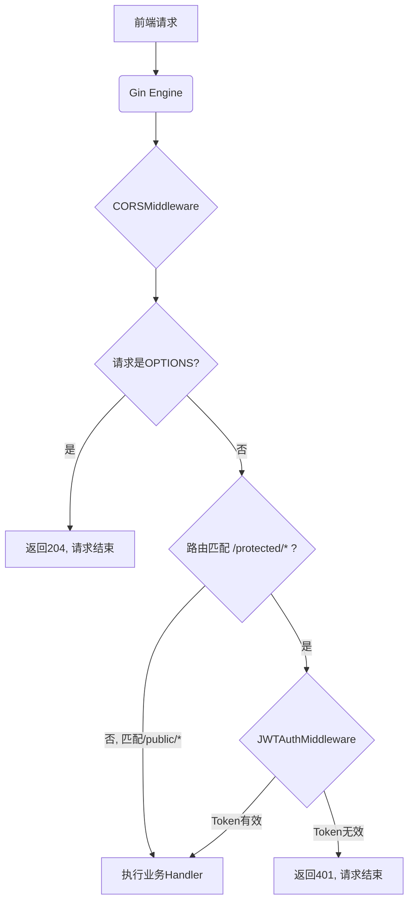

### Golang Web开发：从根源上搞懂Gin跨域与JWT认证冲突(中间件执行顺序)### 大家好，我是阿亮。在医疗信息化这个领域摸爬滚打了八年多，我主要负责构建我们公司的后端系统，比如大家可能听过的电子患者自报告结局系统（ePRO）、临床试验数据采集系统（EDC）等等。这些系统对数据的安全性和实时性要求极高，因为它们处理的都是敏感的患者健康信息（PHI）。

今天，我想跟大家聊一个在实际项目中几乎 100% 会遇到的问题：**如何让跨域（CORS）和用户认证（JWT）这两个机制在 Gin 框架里和谐共存？**

这个问题看似简单，但很多刚入行一两年的朋友，甚至一些有经验的开发者，在项目初期都可能因为中间件的顺序问题踩坑，导致前端同事天天来找你：“阿亮，我接口又跨域了！”。这篇分享，就是把我从我们真实项目——“临床研究智能监测系统”中的一次复盘经验，毫无保留地分享给大家。

### 一、问题的根源：浏览器和服务器的“安全对话”

在开始之前，我们必须先理解两个主角：CORS 和 JWT，以及它们为什么会“打架”。

#### 1. 什么是跨域（CORS）？它在我们项目中如何体现？

想象一个场景：患者在手机上使用我们开发的微信小程序来填写自己的病情日记（这就是 ePRO 系统）。这个小程序的前端页面，域名是 `weapp.our-hospital.com`。当患者点击“提交”时，数据需要发送到我们的后端 API 服务器，而服务器的域名是 `api.our-hospital.com`。

看到了吗？**域名不一样**。这时，浏览器的“**同源策略**”就会站出来说：“等等！你一个 `weapp` 的页面，凭什么随便给 `api` 的服务器发数据？万一你是恶意网站，想窃取用户信息怎么办？”

为了解决这个“信任”问题，W3C 推出了 **CORS（跨域资源共享）** 机制。它允许服务器明确告诉浏览器：“别担心，`weapp.our-hospital.com` 是我信任的伙伴，它发来的请求，你放行吧。”

这个“告知”的过程，对于一些复杂的请求（比如 `POST` 请求，还带了自定义的请求头），会触发一个特殊的“**预检请求**”（Preflight Request）。

> **通俗理解预检请求（OPTIONS）**：
> 这就像你去一个高级别安保的公司拜访。在正式进去之前，保安会先通过对讲机问前台：“喂，有个人说要来找产品部，他有没有预约？可以进来吗？” 这个用对讲机询问的过程，就是预检请求。它使用 `OPTIONS` 方法，不带任何业务数据，目的就是为了“投石问路”，问问服务器，我待会儿要发的这个正式请求（比如 `POST`），你支持吗？支持哪些请求方法？支持哪些请求头？

服务器收到 `OPTIONS` 请求后，如果同意，就会在响应头里返回类似 `Access-Control-Allow-Origin`、`Access-Control-Allow-Methods` 等信息。浏览器看到这些信息，确认服务器是许可的，才会发送真正的业务数据请求。

#### 2. 什么是 JWT？它在保护患者数据中的作用？

**JWT（JSON Web Token）** 是一种认证方案。在我们的系统中，当研究员、医生或患者登录后，服务器会生成一个加密的字符串（Token），返给前端。这个 Token 就像一张有时效性的“电子门禁卡”。

后续用户每次请求需要身份验证的接口（比如获取患者列表、提交敏感数据），都必须在请求头（`Authorization` Header）里带上这张“门禁卡”。服务器收到后，会验证这张卡的真伪和有效期，确认无误后，才知道“哦，这是张三研究员，他有权限访问这些数据”。

> **JWT 结构剖析（小白必看）**：
> 一个 JWT Token 通常由三部分组成，用 `.` 隔开，形如 `xxxxx.yyyyy.zzzzz`。
> *   **Header（头部）**：记录了 Token 的类型和使用的加密算法。就像门禁卡的材质说明。
> *   **Payload（载荷）**：存放实际的用户信息，比如用户 ID、角色、过期时间等。**切记不要放密码这类敏感信息**，因为这部分只是 Base64 编码，可以被轻易解开。这就像门禁卡上印着你的名字和部门。
> *   **Signature（签名）**：这是最关键的部分。它用一个只有服务器知道的**密钥（Secret）**，把 Header 和 Payload 加密生成。当服务器收到 Token，会用同样的密钥再算一次签名，如果两次结果一致，就说明这张卡是真的，没被伪造。这就像门禁卡上的防伪芯片。

### 二、冲突爆发点：当预检请求遇到 JWT 认证

好了，现在问题来了。我们的 API 接口为了安全，配置了 JWT 认证中间件，要求每个请求都必须携带有效的 Token。

而浏览器发起的 `OPTIONS` 预检请求，**是不会携带 `Authorization` 请求头的**！因为它只是一个“礼节性”的询问，还没到出示“门禁卡”的环节。

这时候，如果你的 Gin 中间件处理顺序是这样的：

1.  先执行 JWT 认证中间件
2.  再执行 CORS 跨域处理中间件

会发生什么？

`OPTIONS` 请求一进来，JWT 中间件会立刻拦下它：“站住！你的 `Authorization` 头呢？没有 Token，不许过！” 然后直接返回一个 `401 Unauthorized` 错误。

这个 `401` 错误根本到不了 CORS 中间件那里。浏览器收不到预期的、带有 `Access-Control-Allow-*` 信息的成功响应，就会认为服务器不允许跨域，于是直接在控制台抛出那个经典的红色错误，然后拒绝发送真正的业务请求。

这就是问题的核心：**错误的中间件执行顺序，导致了本应被放行的预检请求，被认证逻辑错误地拦截了。**

### 三、Gin 实战：从踩坑到最佳实践

知道了原理，解决起来就简单了。核心原则就一句话：**永远让 CORS 中间件在最前面，第一个处理请求。**

下面，我用一个简化的 Gin 项目代码，来完整展示如何正确地组织我们的代码。假设我们正在开发一个接口，用于研究员（Researcher）提交临床观察数据。

#### 1. 项目结构

为了清晰，我们把中间件单独存放。

```
/my-clinical-system
|-- main.go
|-- middlewares/
|   |-- cors.go
|   |-- jwt.go
```

#### 2. CORS 中间件 (`middlewares/cors.go`)

我们先自己手写一个，这样能更深刻地理解它的工作原理。

```go
package middlewares

import (
	"net/http"
	"github.com/gin-gonic/gin"
)

// CORSMiddleware 创建一个处理CORS的中间件
func CORSMiddleware() gin.HandlerFunc {
	return func(c *gin.Context) {
		// 允许访问的源，我们这里写死，实际项目中应该从配置中读取
		// 比如 "https://researcher-portal.our-hospital.com"
		c.Writer.Header().Set("Access-Control-Allow-Origin", "*") // 为方便演示，暂时设为 *

		// 允许的请求头
		c.Writer.Header().Set("Access-Control-Allow-Headers", "Content-Type, Authorization")

		// 允许的请求方法
		c.Writer.Header().Set("Access-Control-Allow-Methods", "POST, GET, OPTIONS, PUT, DELETE")

		// 允许携带凭证（如 Cookies）
		c.Writer.Header().Set("Access-Control-Allow-Credentials", "true")

		// 关键：处理预检请求（OPTIONS）
		// 浏览器发起预检请求时，它的Method就是OPTIONS
		if c.Request.Method == "OPTIONS" {
			// 直接返回204 No Content，表示服务器已成功处理该次请求，但不需要返回任何内容
			// 浏览器接收到这个状态码后，就会发送真正的业务请求
			c.AbortWithStatus(http.StatusNoContent)
			return
		}

		// 如果不是OPTIONS请求，则继续处理后续的中间件和handler
		c.Next()
	}
}
```

**代码讲解**：
*   我们设置了几个关键的 `Access-Control-Allow-*` 响应头。在生产环境中，`Access-Control-Allow-Origin` 绝对不能用 `*`，而应该是一个明确的白名单，比如我们前端应用的域名。
*   最核心的逻辑是 `if c.Request.Method == "OPTIONS"`。当检测到是预检请求时，我们直接调用 `c.AbortWithStatus(204)`。`Abort` 会中断后续所有中间件的执行，直接返回响应。这确保了 JWT 中间件根本没有机会处理这个请求。

#### 3. JWT 认证中间件 (`middlewares/jwt.go`)

这里我们用 `dgrijalva/jwt-go` 这个库来演示。

```go
package middlewares

import (
	"net/http"
	"strings"
	"time"

	"github.com/dgrijalva/jwt-go"
	"github.com/gin-gonic/gin"
)

// 我们的自定义密钥，实际项目中从配置或环境变量读取
var jwtSecret = []byte("my_secret_key_for_clinical_system")

// CustomClaims 定义了我们想在JWT中携带的信息
type CustomClaims struct {
	UserID   string `json:"userID"`
	Role     string `json:"role"`
	jwt.StandardClaims
}

// GenerateToken 生成JWT
func GenerateToken(userID, role string) (string, error) {
	claims := CustomClaims{
		UserID: userID,
		Role:   role,
		StandardClaims: jwt.StandardClaims{
			ExpiresAt: time.Now().Add(24 * time.Hour).Unix(), // Token有效期24小时
			Issuer:    "our-clinical-system",
		},
	}
	token := jwt.NewWithClaims(jwt.SigningMethodHS256, claims)
	return token.SignedString(jwtSecret)
}

// JWTAuthMiddleware 创建一个JWT认证的中间件
func JWTAuthMiddleware() gin.HandlerFunc {
	return func(c *gin.Context) {
		authHeader := c.Request.Header.Get("Authorization")
		if authHeader == "" {
			c.JSON(http.StatusUnauthorized, gin.H{"error": "请求未携带token，无权限访问"})
			c.Abort()
			return
		}

		// 按空格分割
		parts := strings.SplitN(authHeader, " ", 2)
		if !(len(parts) == 2 && parts[0] == "Bearer") {
			c.JSON(http.StatusUnauthorized, gin.H{"error": "token格式不正确"})
			c.Abort()
			return
		}

		// parts[1]是获取到的tokenString，我们使用之前定义好的解析JWT的函数来解析它
		token, err := jwt.ParseWithClaims(parts[1], &CustomClaims{}, func(token *jwt.Token) (interface{}, error) {
			return jwtSecret, nil
		})

		if err != nil {
			c.JSON(http.StatusUnauthorized, gin.H{"error": "无效的token"})
			c.Abort()
			return
		}

		if claims, ok := token.Claims.(*CustomClaims); ok && token.Valid {
			// 验证通过后，将用户信息存储到gin.Context中，方便后续的handler使用
			c.Set("userID", claims.UserID)
			c.Set("role", claims.Role)
		} else {
			c.JSON(http.StatusUnauthorized, gin.H{"error": "无效的token"})
			c.Abort()
			return
		}
		
		c.Next()
	}
}
```

**代码讲解**：
*   我们定义了 `CustomClaims` 结构体，除了标准字段，还加入了 `UserID` 和 `Role`，这在做权限控制时非常有用。
*   `GenerateToken` 用于用户登录成功后签发 Token。
*   `JWTAuthMiddleware` 是核心认证逻辑：
    1.  从 `Authorization` 请求头获取 Token。
    2.  校验 Token 格式是否为 `Bearer <token>`。
    3.  解析并验证 Token 的签名和有效期。
    4.  如果验证成功，通过 `c.Set()` 将解析出的用户信息（如 `userID`）存入 `gin.Context`，这样后续的业务处理函数就能直接 `c.Get("userID")` 来获取当前操作者的身份了。
    5.  如果失败，则调用 `c.Abort()` 终止请求，并返回 `401` 错误。

#### 4. 组装起来 (`main.go`)

现在，我们在 `main.go` 中把它们按**正确的顺序**组装起来。

```go
package main

import (
	"net/http"
	"my-clinical-system/middlewares" // 替换成你自己的项目路径
	"github.com/gin-gonic/gin"
)

func main() {
	r := gin.Default()

	// 1. 注册全局CORS中间件
	// 确保它在所有路由和认证中间件之前执行
	r.Use(middlewares.CORSMiddleware())

	// --- 路由定义 ---

	// 公开路由组：比如登录，不需要JWT认证
	publicGroup := r.Group("/api/v1/public")
	{
		// 模拟研究员登录
		publicGroup.POST("/login", func(c *gin.Context) {
			// 实际项目中会验证用户名密码
			// 这里我们直接签发token作为演示
			userID := "researcher001"
			role := "researcher"
			token, err := middlewares.GenerateToken(userID, role)
			if err != nil {
				c.JSON(http.StatusInternalServerError, gin.H{"error": "token生成失败"})
				return
			}
			c.JSON(http.StatusOK, gin.H{"token": token})
		})
	}

	// 受保护的路由组：需要JWT认证
	protectedGroup := r.Group("/api/v1/protected")
	// 2. 在这个组里，注册JWT认证中间件
	protectedGroup.Use(middlewares.JWTAuthMiddleware())
	{
		// 提交临床观察数据的接口
		protectedGroup.POST("/observation", func(c *gin.Context) {
			// 从context中获取通过JWT认证的用户信息
			userID, _ := c.Get("userID")
			role, _ := c.Get("role")

			// 可以在这里做更细粒度的权限控制，比如检查role是否为"researcher"
			if role != "researcher" {
				c.JSON(http.StatusForbidden, gin.H{"error": "只有研究员才能提交数据"})
				return
			}

			// ... 这里是处理提交数据的业务逻辑 ...
			
			c.JSON(http.StatusOK, gin.H{
				"message": "数据提交成功",
				"operator_id": userID,
			})
		})
	}

	r.Run(":8080")
}
```

**最终的执行流程图**



### 四、延伸思考：在微服务架构（go-zero）中该怎么做？

在我们更复杂的“临床试验项目管理系统（CTMS）”中，我们采用了 `go-zero` 构建微服务。虽然框架不同，但**核心思想是完全一致的**。

在 `go-zero` 中，你通常会在 API 网关层统一处理 CORS 和 JWT 认证。

1.  **CORS 配置**：`go-zero` 的网关配置（`etc/gateway.yaml`）中直接提供了 CORS 的配置项，你可以在这里设置白名单，比手写中间件更方便。

    ```yaml
    # gateway.yaml
    ...
    Cors:
      Origins:
      - "https://ctms-frontend.our-hospital.com" # 只允许这个源
      Methods:
      - GET
      - POST
      - PUT
      - DELETE
      - OPTIONS
    ...
    ```

2.  **JWT 中间件**：你依然需要编写一个 JWT 中间件，但它会是一个 `go-zero` 风格的 `middleware`。在 `.api` 文件中，你可以为需要认证的路由组指定这个中间件。

    ```api
    // user.api
    jwt:
      Auth:
        AccessSecret: "your_access_secret"
        AccessExpire: 86400

    service user-api {
      @server(
        jwt: Auth // 为整个服务启用jwt
        group: user
      )
      post /user/submit (SubmitReq) returns (SubmitResp)
    }
    ```
    `go-zero` 框架会确保在执行业务逻辑前，先通过你定义的 `jwt` 中间件。由于 CORS 是在网关更早的层面处理的，所以 `OPTIONS` 请求同样会被正确处理，不会进入到 JWT 认证环节。

### 总结与回顾

好了，阿亮今天的分享就到这里。我们来回顾一下最重要的几个点：

*   **跨域的本质**是浏览器的安全策略，`OPTIONS` 预检请求是关键。
*   **JWT 的作用**是无状态认证，保护 API 接口不被非法访问。
*   **核心冲突**在于，无认证信息的 `OPTIONS` 请求可能会被 JWT 中间件误杀。
*   **解决方案**：调整中间件顺序，**确保 CORS 中间件永远是第一个执行的**，并且它能正确处理 `OPTIONS` 请求并提前返回，不让其进入后续的认证流程。
*   **实践要点**：使用路由组（`r.Group`）来精细化管理哪些接口需要认证，哪些是公开的。

这个问题虽然不大，但它完美地体现了 Web 开发中“请求生命周期”和“中间件责任链模式”的重要性。理解了这一点，以后再遇到类似的问题，你就能举一反三，从容应对了。

希望这次结合我们医疗信息系统真实场景的复盘，能帮助大家彻底搞懂这个问题。如果在你的项目中还有其他困惑，欢迎随时交流！