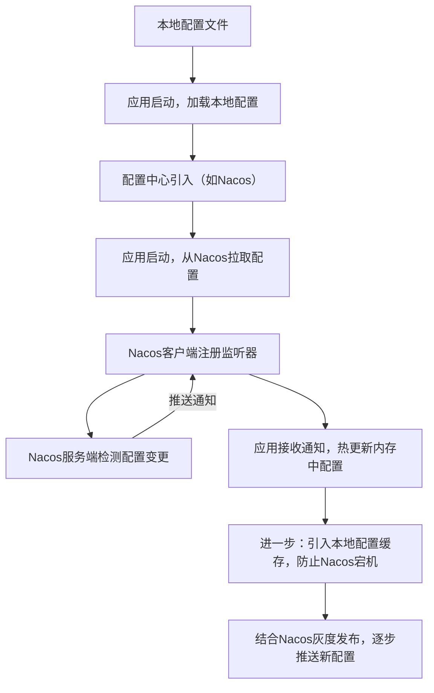
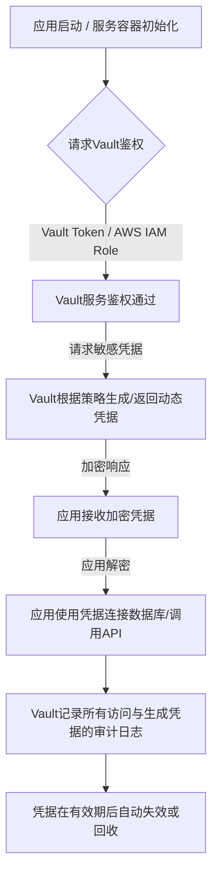

### Golang企业级配置管理：从根源上搞懂多格式与热更新实战(Viper,Nacos,Vault)### 阿亮实战：构建医疗级Go应用，配置文件版本化管理的深度探索与实践

作为一名在医疗互联网领域摸爬滚打多年的Golang架构师，我深知在构建“互联网医院管理平台”、“电子患者自报告结局系统”这类高要求系统时，配置管理绝不是小事。它关乎系统的稳定性、数据的安全性，甚至直接影响到患者服务的连续性。我们团队在实践中，从最初简单的配置文件，一步步演进到如今复杂且严谨的版本化、中心化管理，踩过不少坑，也积累了一些宝贵的经验。今天，我想把这些心得，尤其是如何在Go语言生态下，结合Gin和go-zero框架进行企业级配置管理，毫无保留地分享给大家。

---

### 第一章：Gin项目配置文件格式选型与演进——我们的医疗级考量

在我们研发“临床研究智能监测系统”的过程中，我发现配置管理是项目初期最容易被忽视，却也最能影响后期维护效率的关键。选择一个合适的配置文件格式，不只是语法喜好问题，更是为了团队协作、多环境部署和未来可扩展性打下基础。

**1.1 配置格式的常见选择与我们团队的抉择**

市面上主流的配置格式无外乎 JSON、YAML、TOML 和环境变量。它们各有千秋，而我们的选择则更多地基于项目特性和团队约定。

| 格式       | 可读性 | 支持注释 | 嵌套结构 | 我们团队推荐场景（医疗行业）                                |
| :--------- | :----- | :------- | :------- | :---------------------------------------------------------- |
| **JSON**   | 一般   | 不支持   | 支持     | 早期小型内部工具API，或与前端、外部系统API交互时的简单配置。 |
| **YAML**   | 高     | 支持     | 支持     | 大多数复杂微服务配置，尤其需要多环境区分和清晰逻辑分组的场景，如“电子患者自报告结局系统”的服务参数。 |
| **TOML**   | 高     | 支持     | 支持     | go-zero框架的项目偏好，如“临床研究智能监测”子服务配置。      |
| **环境变量** | 低     | 不适用   | 扁平     | 容器化部署的关键配置，如数据库连接字符串、第三方API密钥、AI模型服务地址等敏感信息。 |

我记得刚开始做“互联网医院管理平台”的一些辅助服务时，我们图方便用了JSON。但没多久就发现，缺乏注释导致新人接手时一头雾水，而且一旦配置复杂起来，JSON冗余的引号和逗号也让它看起来非常笨重。

后来，我们逐渐转向了YAML。它那自然、简洁的语法，尤其是对注释的良好支持，让我们在定义复杂的服务参数、路由规则、数据库连接池配置时，能做到一目了然。比如“电子患者自报告结局系统”中，不同机构、不同研究项目可能会有不同的数据上报配置，YAML能够很好地组织这些层级关系。

而当团队引入了go-zero框架来构建新的微服务，比如“智能开放平台”中负责AI分析结果分发的服务，TOML就成了自然的选择。go-zero默认推荐TOML，它的表结构（`[section]`）让我们能清晰地组织配置，每个section就像一个独立的模块，可读性极高。

最后，环境变量，这在我们的容器化、云原生部署中是“压舱石”一般的存在。对于数据库密码、第三方AI服务（例如我们与外部AI公司合作的影像识别服务）的API Key这类**绝对不能硬编码**的敏感信息，我们强制使用环境变量。这遵循了12-Factor App原则，让我们的应用在开发、测试、生产环境之间能够无缝切换，同时极大地提升了安全性。

### 第二章：主流配置格式在Go项目中的应用实践

搞清楚了各种配置格式的优劣和适用场景，接下来就是如何在Go项目，特别是结合Gin和go-zero框架中落地了。我主要依赖`spf13/viper`这个强大的库，它几乎能搞定所有主流格式的配置加载。

**2.1 JSON格式配置：Gin单体服务中的静态配置管理**

在一些早期的或轻量级的Gin应用中，例如我们内部某个管理患者档案的单体API服务，JSON文件因为其简单直观的键值对结构，仍然是可行的选择。

**配置示例 (`config.json`)**

```json
{
  "server": {
    "host": "0.0.0.0",
    "port": 8080,
    "debug_mode": true
  },
  "database": {
    "type": "mysql",
    "host": "localhost",
    "port": 3306,
    "user": "root",
    "password": "your_db_password",
    "name": "patient_db"
  },
  "log": {
    "level": "debug",
    "output_file": "/var/log/patient_api.log"
  }
}
```

**Go代码中加载与使用 (`main.go`)**

这里我们用Gin框架来启动一个简单的Web服务，并通过Viper加载JSON配置。

```go
package main

import (
	"fmt"
	"log"
	"time"

	"github.com/gin-gonic/gin" // Gin框架，用于构建Web应用
	"github.com/spf13/viper"   // Viper库，用于配置管理
)

// ServerConfig 定义服务配置结构
type ServerConfig struct {
	Host      string `json:"host"`       // 服务监听的IP地址
	Port      int    `json:"port"`       // 服务监听的端口
	DebugMode bool   `json:"debug_mode"` // 是否开启调试模式
}

// DatabaseConfig 定义数据库配置结构
type DatabaseConfig struct {
	Type     string `json:"type"`      // 数据库类型 (e.g., mysql, postgres)
	Host     string `json:"host"`      // 数据库主机地址
	Port     int    `json:"port"`      // 数据库端口
	User     string `json:"user"`      // 数据库用户名
	Password string `json:"password"`  // 数据库密码 (在生产环境应使用环境变量或密钥管理服务)
	Name     string `json:"name"`      // 数据库名称
}

// LogConfig 定义日志配置结构
type LogConfig struct {
	Level      string `json:"level"`        // 日志级别 (e.g., debug, info, warn, error)
	OutputFile string `json:"output_file"`  // 日志输出文件路径
}

// AppConfig 聚合所有应用配置
type AppConfig struct {
	Server   ServerConfig   `json:"server"`
	Database DatabaseConfig `json:"database"`
	Log      LogConfig      `json:"log"`
}

var appConfig AppConfig // 全局应用配置实例

func init() {
	// 初始化Viper
	viper.SetConfigName("config") // 配置文件名为 config (不带扩展名)
	viper.SetConfigType("json")   // 指定配置文件类型为 JSON
	viper.AddConfigPath(".")      // 告诉Viper在当前目录查找配置文件

	// 尝试读取配置文件
	if err := viper.ReadInConfig(); err != nil {
		// 如果配置文件读取失败，可能是文件不存在或格式错误
		log.Fatalf("Fatal error reading config file: %s \n", err)
	}

	// 将配置绑定到结构体
	if err := viper.Unmarshal(&appConfig); err != nil {
		// 如果绑定失败，可能是结构体字段与配置不匹配
		log.Fatalf("Unable to unmarshal config into struct: %s \n", err)
	}

	// 打印加载的配置，验证是否正确
	fmt.Printf("Loaded Server Config: Host=%s, Port=%d, DebugMode=%t\n",
		appConfig.Server.Host, appConfig.Server.Port, appConfig.Server.DebugMode)
	fmt.Printf("Loaded Database Config: Type=%s, Host=%s, Port=%d, User=%s, Name=%s\n",
		appConfig.Database.Type, appConfig.Database.Host, appConfig.Database.Port, apppConfig.Database.User, appConfig.Database.Name)
	fmt.Printf("Loaded Log Config: Level=%s, OutputFile=%s\n",
		appConfig.Log.Level, appConfig.Log.OutputFile)

	// 根据DebugMode设置Gin模式
	if appConfig.Server.DebugMode {
		gin.SetMode(gin.DebugMode)
	} else {
		gin.SetMode(gin.ReleaseMode)
	}
}

func main() {
	router := gin.Default()

	// 定义一个简单的路由来测试配置是否生效
	router.GET("/ping", func(c *gin.Context) {
		c.JSON(200, gin.H{
			"message":  "pong",
			"db_host":  appConfig.Database.Host,
			"log_level": appConfig.Log.Level,
			"current_time": time.Now().Format(time.RFC3339),
		})
	})

	// 启动服务
	addr := fmt.Sprintf("%s:%d", appConfig.Server.Host, appConfig.Server.Port)
	if err := router.Run(addr); err != nil {
		log.Fatalf("Gin server failed to start: %v", err)
	}
}

```

**知识点说明：**

*   **`github.com/gin-gonic/gin`**：一个高性能的Go语言Web框架，是我们团队在单体服务中常用的选择。
*   **`github.com/spf13/viper`**：Go语言中非常强大的配置解决方案，支持多种文件格式（JSON, YAML, TOML等）、环境变量、命令行参数、远程配置中心等。
*   **`init()` 函数**：Go语言的特殊函数，在`main()`函数执行前被自动调用。我们通常在这里进行应用的初始化工作，例如加载配置、数据库连接等。
*   **`viper.SetConfigName("config")`**：设置配置文件的基础名称为“config”。Viper会根据你指定的类型或尝试匹配不同扩展名（如`config.json`, `config.yaml`）。
*   **`viper.SetConfigType("json")`**：明确告诉Viper要解析JSON格式的文件。
*   **`viper.AddConfigPath(".")`**：指定Viper搜索配置文件的路径。`"."`表示当前执行程序所在的目录。你也可以添加多个路径，Viper会按顺序查找。
*   **`viper.ReadInConfig()`**：真正执行读取配置文件的操作。如果出错，表示文件不存在或无法解析。
*   **`viper.Unmarshal(&appConfig)`**：将Viper读取到的配置内容反序列化（解析）到Go的结构体`appConfig`中。`json:"..."`是结构体标签，告诉Viper（以及`encoding/json`等库）如何将配置文件中的键映射到结构体字段。
*   **`log.Fatalf(...)`**：如果配置加载或解析失败，我们会直接终止程序运行。因为没有正确的配置，应用是无法正常启动的。
*   **`gin.SetMode(...)`**：根据配置中的`debug_mode`来设置Gin的运行模式。在生产环境中，我们通常会设置为`gin.ReleaseMode`以关闭调试信息，提升性能和安全性。
*   **错误处理**：Go语言的惯用写法是函数返回一个`error`类型的值来表示错误。这里我们在`init`函数中直接使用`log.Fatalf`，因为配置加载是应用程序启动的先决条件，一旦失败就无法继续。在`main`函数中，`router.Run`也会返回错误，我们同样用`log.Fatalf`处理。

**运行步骤：**

1.  创建一个名为 `config.json` 的文件，内容如上文所示。
2.  创建一个名为 `main.go` 的文件，内容如上文所示。
3.  在终端中运行 `go mod init your_module_name` 初始化Go模块。
4.  运行 `go get github.com/gin-gonic/gin github.com/spf13/viper` 下载依赖。
5.  运行 `go run main.go` 启动服务。
6.  在浏览器或Postman中访问 `http://localhost:8080/ping`，你将看到服务返回的JSON数据中包含了从`config.json`中读取的数据库主机和日志级别信息。

**2.2 YAML格式配置：微服务中的多环境配置方案**

在我们的微服务架构中，比如“智能开放平台”，每个微服务都有自己独立的配置，并且需要支持开发、测试、生产等多种环境。YAML因为其出色的可读性和对复杂结构的支持，成为了我们的首选。

**配置示例 (`config.yaml`)**

```yaml
# config.yaml (开发环境默认配置)
server:
  host: 0.0.0.0
  port: 8000
  timeout: 5s # 服务超时时间，我们习惯用持续时间格式

database:
  driver: mysql
  source: "user:pass@tcp(localhost:3306)/dev_platform_db?charset=utf8mb4&parseTime=True&loc=Local" # 开发数据库DSN
  maxIdleConns: 10
  maxOpenConns: 100

redis:
  host: localhost:6379
  password: ""
  db: 0

log:
  level: debug
  path: "./logs/service_dev.log"

# ---
# # config_prod.yaml (生产环境配置) - 实际使用时会单独一份或通过配置中心管理
# server:
#   port: 8001 # 生产环境可能使用不同端口
#   timeout: 10s
#
# database:
#   source: "prod_user:prod_pass@tcp(prod-db-cluster:3306)/prod_platform_db?charset=utf8mb4&parseTime=True&loc=Local" # 生产数据库DSN
#
# redis:
#   host: prod-redis-cluster:6379
#   password: "prod_redis_password" # 生产环境的Redis密码
#
# log:
#   level: info
#   path: "/var/log/service_prod.log"
```

**Go代码中加载与使用 (`main.go`，使用go-zero)**

go-zero框架天然对配置有良好的支持，它推荐将配置文件放在`etc`目录下，并且自动处理加载。这里我们将演示如何使用go-zero的配置机制。

首先，假设我们已经通过`goctl`工具创建了一个go-zero服务，例如`platform-api`。

**`etc/platform-api.yaml` (go-zero标准配置)**

```yaml
# etc/platform-api.yaml
Name: platform-api # 服务名称
Host: 0.0.0.0      # 监听地址
Port: 8888         # 监听端口

# Auth 认证配置 (示例，真实项目可能更复杂)
Auth:
  AccessSecret: "your_access_secret" # JWT密钥

# 数据库配置
DataSource: "root:password@tcp(localhost:3306)/platform_db?charset=utf8mb4&parseTime=True&loc=Local"

# Redis 缓存配置
CacheRedis:
  - Host: localhost:6379
    Pass: ""
    Db: 0

# 日志配置
Log:
  ServiceName: platform-api
  Level: info
  Encoding: json
  Path: logs/platform-api
  Stat: false

# RPC 客户端配置 (如果需要调用其他go-zero RPC服务)
# UserRpc:
#   Target: 127.0.0.1:8080
```

**`internal/config/config.go` (go-zero生成的配置结构)**

```go
package config

import (
	"github.com/zeromicro/go-zero/rest" // 引入go-zero的rest服务配置
	"github.com/zeromicro/go-zero/zrpc" // 引入go-zero的rpc服务配置 (如果服务是rest+rpc)
	"github.com/zeromicro/go-zero/core/stores/redis" // 引入go-zero的redis配置
)

// Config 定义了整个服务的配置结构体
// go-zero会通过etc/*.yaml文件自动填充这个结构体
type Config struct {
	rest.RestConf   // 继承rest服务配置，包含Name, Host, Port等
	# zrpc.RpcClientConf // 如果是RPC客户端，则包含Target等

	Auth struct {
		AccessSecret string
	}

	DataSource string // 数据库连接字符串

	CacheRedis []redis.RedisConf // Redis配置列表，用于多个Redis实例或集群
	
	Log struct { // 日志配置
		ServiceName string
		Level string
		Encoding string
		Path string
		Stat bool
	}
}

```

**`internal/svc/servicecontext.go` (go-zero的服务上下文)**

在go-zero中，我们通常会在`servicecontext`中初始化所有外部依赖（如数据库连接、Redis客户端），这些依赖会使用`config.Config`中加载的参数。

```go
package svc

import (
	"database/sql"
	"fmt"
	"log"

	"your_module_name/internal/config" // 引入我们自己的配置结构体
	"github.com/zeromicro/go-zero/core/stores/redis" // Redis客户端
	_ "github.com/go-sql-driver/mysql" // MySQL驱动，这里使用了匿名导入
)

// ServiceContext 包含了所有服务的依赖
type ServiceContext struct {
	Config config.Config // 加载的配置
	DB     *sql.DB       // 数据库连接实例
	Redis  *redis.Redis  // Redis客户端实例
	// 其他业务逻辑所需的依赖...
}

// NewServiceContext 创建并返回一个新的ServiceContext实例
func NewServiceContext(c config.Config) *ServiceContext {
	// 初始化数据库连接
	db, err := sql.Open("mysql", c.DataSource)
	if err != nil {
		log.Fatalf("Failed to connect to database: %v", err) // 如果数据库连接失败，直接终止服务
	}
	if err := db.Ping(); err != nil {
		log.Fatalf("Failed to ping database: %v", err) // 检查数据库连接是否可用
	}
	db.SetMaxIdleConns(10) // 设置最大空闲连接数
	db.SetMaxOpenConns(100) // 设置最大打开连接数
	
	// 初始化Redis客户端
	// 注意：这里我们只取了CacheRedis列表的第一个配置作为示例
	// 实际项目中可能需要根据业务逻辑选择不同的Redis实例
	redisClient := redis.New(c.CacheRedis[0].Host, c.CacheRedis[0].Pass, c.CacheRedis[0].Db)

	fmt.Printf("Database connected: %s\n", c.DataSource)
	fmt.Printf("Redis connected: %s\n", c.CacheRedis[0].Host)
	fmt.Printf("Service Name: %s, Port: %d\n", c.Name, c.Port)

	return &ServiceContext{
		Config: c,
		DB:     db,
		Redis:  redisClient,
	}
}
```

**`main.go` (go-zero的启动入口)**

go-zero的`main.go`通常非常简洁，大部分工作由框架自动完成。

```go
package main

import (
	"flag"
	"fmt"

	"your_module_name/internal/config" // 引入我们自己的配置结构体
	"your_module_name/internal/handler" // 引入路由处理器
	"your_module_name/internal/svc"   // 引入服务上下文

	"github.com/zeromicro/go-zero/core/conf" // go-zero的配置加载器
	"github.com/zeromicro/go-zero/rest"     // go-zero的rest服务
)

var configFile = flag.String("f", "etc/platform-api.yaml", "the config file")

func main() {
	flag.Parse() // 解析命令行参数

	var c config.Config
	conf.MustLoad(*configFile, &c) // 使用go-zero的配置加载器加载配置文件

	server := rest.MustNewServer(c.RestConf) // 创建RESTful服务实例
	defer server.Stop() // 确保服务停止时释放资源

	ctx := svc.NewServiceContext(c) // 创建服务上下文
	handler.RegisterHandlers(server, ctx) // 注册路由处理器

	fmt.Printf("Starting platform-api server at %s:%d...\n", c.Host, c.Port)
	server.Start() // 启动服务
}

```

**知识点说明：**

*   **`goctl` 工具**：go-zero框架提供的一个命令行工具，可以帮助我们快速生成项目结构、API定义、CRUD代码等。通常我们通过它来创建服务骨架。
*   **`conf.MustLoad(configFile, &c)`**：这是go-zero框架加载配置的核心函数。它会根据`configFile`路径读取文件（支持JSON, YAML, TOML等），并自动解析到`c`这个配置结构体中。如果加载失败，程序会直接panic。
*   **`rest.RestConf`**：go-zero内置的RESTful服务基础配置结构体，包含了`Name`, `Host`, `Port`等通用参数。通过结构体嵌入（组合），`Config`结构体直接获得了这些字段。
*   **`_ "github.com/go-sql-driver/mysql"`**：Go语言中常见的做法是，驱动包只需导入，而不需要直接使用其导出的任何符号。我们通过`database/sql`接口来操作数据库，底层具体的驱动实现是通过导入包来注册的。
*   **`servicecontext.go`**：这是go-zero服务的核心概念。它是一个结构体，包含了我们服务运行所需的所有外部依赖（数据库连接、Redis客户端、RPC客户端等）和业务逻辑。`NewServiceContext`函数负责这些依赖的初始化。这种模式让我们的服务逻辑与基础设施解耦，易于测试和维护。
*   **`flag` 包**：Go标准库，用于解析命令行参数。`flag.String("f", "etc/platform-api.yaml", "the config file")`定义了一个名为`-f`的命令行参数，用于指定配置文件的路径，默认值为`etc/platform-api.yaml`。
*   **`rest.MustNewServer(c.RestConf)`**：基于配置创建一个新的go-zero RESTful服务器实例。`MustNewServer`表示如果创建失败会panic。
*   **`defer server.Stop()`**：Go语言的`defer`关键字用于确保在函数返回之前执行某个语句。这里确保服务器在`main`函数退出时能够优雅地停止，释放资源。
*   **多环境管理**：go-zero本身不直接处理YAML的`---`分隔多文档块，但我们可以通过命令行参数`-f`指定不同的配置文件（例如`go run main.go -f etc/platform-api-prod.yaml`）来实现多环境配置。或者更推荐的方式是结合中心化配置中心（如Nacos）。

**运行步骤（go-zero 示例）：**

1.  创建一个go-zero项目骨架（如果还没有）：`goctl api new platform-api`
2.  进入`platform-api`目录。
3.  创建/修改`etc/platform-api.yaml`文件，内容如上文所示。
4.  修改`internal/config/config.go`，确保`Config`结构体包含所需的字段。
5.  修改`internal/svc/servicecontext.go`，添加数据库和Redis的初始化逻辑。
6.  修改`main.go`，确保命令行参数和配置加载正确。
7.  添加一个简单的处理器来测试：
    *   在`internal/handler/pinghandler.go`中（如果还没有）：
        ```go
        package handler

        import (
        	"net/http"
        	"your_module_name/internal/svc" // 假设your_module_name是你的模块名，如platform-api

        	"github.com/zeromicro/go-zero/rest/httpx" // go-zero的HTTP工具包
        )

        func PingHandler(svcCtx *svc.ServiceContext) http.HandlerFunc {
        	return func(w http.ResponseWriter, r *http.Request) {
        		// 从ServiceContext中获取配置或依赖
        		dbSource := svcCtx.Config.DataSource
        		redisHost := svcCtx.Config.CacheRedis[0].Host
        		
        		httpx.OkJson(w, map[string]string{
        			"message": "pong from go-zero service",
        			"db_source": dbSource,
        			"redis_host": redisHost,
        		})
        	}
        }
        ```
    *   在`internal/handler/register.go`中注册路由：
        ```go
        package handler

        import (
        	"your_module_name/internal/svc"

        	"github.com/zeromicro/go-zero/rest"
        )

        func RegisterHandlers(server *rest.Server, svcCtx *svc.ServiceContext) {
        	server.AddRoutes(
        		[]rest.Route{
        			{
        				Method:  http.MethodGet,
        				Path:    "/ping",
        				Handler: PingHandler(svcCtx),
        			},
        		},
        	)
        }
        ```
8.  运行 `go run main.go -f etc/platform-api.yaml` 启动服务。
9.  访问 `http://localhost:8888/ping`，将看到服务返回的配置信息。

**2.3 TOML格式配置：Go生态偏爱的语义化配置设计**

TOML因其清晰的语义结构和可读性，特别受到Go社区的青睐。在我们的团队中，只要是新的go-zero微服务项目，我们都会倾向于使用TOML（尽管go-zero也支持YAML）。它显式的表定义和键值对排列，让配置文件的逻辑结构异常清晰。

**配置结构示例 (`config.toml`)**

```toml
# config.toml
# 服务基础配置，用于我们“临床试验电子数据采集系统”的某个辅助服务
[server]
host = "0.0.0.0"
port = 9000
read_timeout = "5s"  # Go-zero支持time.Duration格式
write_timeout = "5s"

# 数据库连接，专门用于存储临床试验元数据
[database]
dsn = "user:password@tcp(localhost:3306)/clinical_meta?charset=utf8mb4&parseTime=True&loc=Local"
max_idle_connections = 10
max_open_connections = 100

# 外部数据源API配置，可能用于同步第三方临床数据
[external_api]
base_url = "https://api.external-clinical.com/v1"
api_key = "your_external_api_key" # 生产环境应从环境变量或密钥管理服务获取
```

**Go中解析TOML (`main.go`，这里仍然用Gin作为示例，方便演示TOML解析)`**

```go
package main

import (
	"fmt"
	"log"
	"time"

	"github.com/gin-gonic/gin"
	"github.com/spf13/viper"
	_ "github.com/pelletier/go-toml/v2" // 引入TOML解析器，Viper会通过这个包识别toml文件
)

// ServerConfig 定义服务配置结构
type ServerConfig struct {
	Host         string        `toml:"host"`
	Port         int           `toml:"port"`
	ReadTimeout  time.Duration `toml:"read_timeout"`  // 注意这里是time.Duration类型
	WriteTimeout time.Duration `toml:"write_timeout"` // time.Duration能自动解析如"5s"的字符串
}

// DatabaseConfig 定义数据库配置结构
type DatabaseConfig struct {
	DSN             string `toml:"dsn"`
	MaxIdleConns    int    `toml:"max_idle_connections"`
	MaxOpenConns    int    `toml:"max_open_connections"`
}

// ExternalAPIConfig 定义外部API配置结构
type ExternalAPIConfig struct {
	BaseURL string `toml:"base_url"`
	APIKey  string `toml:"api_key"`
}

// AppConfig 聚合所有应用配置
type AppConfig struct {
	Server    ServerConfig      `toml:"server"`
	Database  DatabaseConfig    `toml:"database"`
	ExternalAPI ExternalAPIConfig `toml:"external_api"`
}

var appConfig AppConfig

func init() {
	viper.SetConfigName("config")    // 配置文件名为 config
	viper.SetConfigType("toml")      // 指定配置文件类型为 TOML
	viper.AddConfigPath(".")         // 在当前目录查找

	if err := viper.ReadInConfig(); err != nil {
		log.Fatalf("Fatal error reading TOML config file: %s \n", err)
	}

	if err := viper.Unmarshal(&appConfig); err != nil {
		log.Fatalf("Unable to unmarshal TOML config into struct: %s \n", err)
	}

	fmt.Printf("Loaded Server Config: Host=%s, Port=%d, ReadTimeout=%v\n",
		appConfig.Server.Host, appConfig.Server.Port, appConfig.Server.ReadTimeout)
	fmt.Printf("Loaded Database Config: DSN=%s, MaxIdleConns=%d\n",
		appConfig.Database.DSN, appConfig.Database.MaxIdleConns)
	fmt.Printf("Loaded External API Config: BaseURL=%s\n",
		appConfig.ExternalAPI.BaseURL)
}

func main() {
	router := gin.Default()

	router.GET("/status", func(c *gin.Context) {
		c.JSON(200, gin.H{
			"service_port": appConfig.Server.Port,
			"db_dsn":       appConfig.Database.DSN,
			"external_api_url": appConfig.ExternalAPI.BaseURL,
			"read_timeout": appConfig.Server.ReadTimeout.String(), // time.Duration转字符串
		})
	})

	addr := fmt.Sprintf("%s:%d", appConfig.Server.Host, appConfig.Server.Port)
	if err := router.Run(addr); err != nil {
		log.Fatalf("Gin server failed to start: %v", err)
	}
}
```

**知识点说明：**

*   **`_ "github.com/pelletier/go-toml/v2"`**：尽管没有直接使用`go-toml`包中的函数，但Viper需要这个包来注册TOML的解析能力。这是Go模块机制下的一个常见模式。
*   **`toml:"..."` 结构体标签**：与JSON类似，`toml`标签告诉Viper如何将TOML文件中的键映射到Go结构体字段。
*   **`time.Duration` 类型**：Viper配合`go-toml`能够智能地解析TOML中表示时间持续的字符串（例如`"5s"`, `"1m30s"`）并直接赋值给Go的`time.Duration`类型字段，非常方便。
*   TOML的优势在于它的结构性比JSON更强，没有JSON的冗余符号，同时比YAML对缩进的敏感度低一些，这在团队协作时能减少一些因格式问题引起的困扰。

**运行步骤：**

1.  创建一个名为 `config.toml` 的文件，内容如上文所示。
2.  创建一个名为 `main.go` 的文件，内容如上文所示。
3.  初始化Go模块：`go mod init your_module_name`
4.  下载依赖：`go get github.com/gin-gonic/gin github.com/spf13/viper github.com/pelletier/go-toml/v2`
5.  运行 `go run main.go` 启动服务。
6.  访问 `http://localhost:9000/status`，你将看到TOML配置被正确加载并返回。

**2.4 环境变量驱动配置：12-Factor App在医疗云中的实践**

在云原生和容器化部署的背景下，环境变量是我们“智能开放平台”和“组织运营管理系统”中不可或缺的配置方式。它们将配置彻底从代码中解耦，使得同一个Docker镜像可以在开发、测试、生产等不同环境中运行，只需注入不同的环境变量即可。这不仅提升了部署的灵活性，也极大地增强了敏感数据的安全性。

**配置与环境解耦**

假设我们需要配置数据库连接、Redis地址和日志级别。

**本地开发 (`.env` 文件示例，用于本地工具加载，不应提交到Git)**

```bash
# .env 文件示例 (本地开发，通过工具加载)
DATABASE_URL="user:pass@tcp(localhost:3306)/dev_db"
REDIS_HOST="localhost:6379"
LOG_LEVEL="debug"
```

**生产部署 (Kubernetes ConfigMap 或 Secret 示例)**

```yaml
# Kubernetes ConfigMap 示例 (非敏感配置)
apiVersion: v1
kind: ConfigMap
metadata:
  name: app-config
data:
  REDIS_HOST: "prod-redis-cluster.svc.local:6379"
  LOG_LEVEL: "info"
---
# Kubernetes Secret 示例 (敏感配置，通常通过KMS或Vault管理)
apiVersion: v1
kind: Secret
metadata:
  name: db-credentials
type: Opaque
data:
  # Base64 编码后的值
  DATABASE_URL: "dXNlcjpwYXNzQHRjcChuYy1kYi1jbHVzdGVyOjMzMDYpL3Byb2RfZGI=" 
```

在Go代码中，Viper可以很方便地读取环境变量。

**Go代码中读取环境变量 (`main.go`，使用Gin框架)**

```go
package main

import (
	"fmt"
	"log"
	"os"
	"time"

	"github.com/gin-gonic/gin"
	"github.com/spf13/viper"
)

// AppConfig 聚合应用配置
type AppConfig struct {
	DatabaseURL string `mapstructure:"DATABASE_URL"` // mapstructure是Viper内部用于结构体映射的库
	RedisHost   string `mapstructure:"REDIS_HOST"`
	LogLevel    string `mapstructure:"LOG_LEVEL"`
	ServerPort  int    `mapstructure:"SERVER_PORT"` // 也可以通过环境变量指定端口
}

var appConfig AppConfig

func init() {
	// 告诉Viper从环境变量中读取配置
	viper.AutomaticEnv() // 开启自动从环境变量读取

	// 设置默认值，如果环境变量未设置，则使用默认值
	viper.SetDefault("DATABASE_URL", "default_user:default_pass@tcp(127.0.0.1:3306)/default_db")
	viper.SetDefault("REDIS_HOST", "127.0.0.1:6379")
	viper.SetDefault("LOG_LEVEL", "info")
	viper.SetDefault("SERVER_PORT", 8080)

	// 将环境变量值绑定到结构体
	// 注意：这里没有ReadInConfig，因为我们不从文件读取
	if err := viper.Unmarshal(&appConfig); err != nil {
		log.Fatalf("Unable to unmarshal environment variables into struct: %s \n", err)
	}

	fmt.Printf("Loaded Config from Env: DatabaseURL=%s, RedisHost=%s, LogLevel=%s, ServerPort=%d\n",
		appConfig.DatabaseURL, appConfig.RedisHost, appConfig.LogLevel, appConfig.ServerPort)

	// 根据LogLevel设置Gin模式 (简化处理，实际应有更完善的日志库)
	if appConfig.LogLevel == "debug" {
		gin.SetMode(gin.DebugMode)
	} else {
		gin.SetMode(gin.ReleaseMode)
	}
}

func main() {
	router := gin.Default()

	router.GET("/env_status", func(c *gin.Context) {
		c.JSON(200, gin.H{
			"database_url": appConfig.DatabaseURL,
			"redis_host":   appConfig.RedisHost,
			"log_level":    appConfig.LogLevel,
			"server_port":  appConfig.ServerPort,
			"current_time": time.Now().Format(time.RFC3339),
		})
	})

	addr := fmt.Sprintf(":%d", appConfig.ServerPort) // 监听所有网卡
	if err := router.Run(addr); err != nil {
		log.Fatalf("Gin server failed to start: %v", err)
	}
}
```

**知识点说明：**

*   **`viper.AutomaticEnv()`**：这是关键！它告诉Viper自动检查环境变量。Viper会尝试将环境变量名（转换为大写并用`_`连接）与配置项进行匹配。
*   **`mapstructure:"..."` 结构体标签**：Viper内部使用`mapstructure`库进行结构体映射。这里用`mapstructure:"DATABASE_URL"`指定了环境变量`DATABASE_URL`应映射到`DatabaseURL`字段。
*   **`viper.SetDefault("KEY", VALUE)`**：为配置项设置默认值。如果环境变量或配置文件中没有找到该配置项，Viper就会使用这个默认值。这是提供“安全网”的重要方式，确保即使没有外部配置，应用也能以一个合理的状态启动。
*   **`os.Setenv("KEY", "VALUE")`**：在Go程序中，你可以通过`os.Setenv`来设置环境变量，但这通常用于测试。在实际部署中，环境变量是通过shell脚本、Docker `CMD`或`ENTRYPOINT`、Kubernetes `env`等方式注入的。

**运行步骤：**

1.  创建一个名为 `main.go` 的文件，内容如上文所示。
2.  初始化Go模块：`go mod init your_module_name`
3.  下载依赖：`go get github.com/gin-gonic/gin github.com/spf13/viper`
4.  **不设置环境变量直接运行**：`go run main.go`。你会看到服务使用默认配置启动。
5.  **设置环境变量后运行**：
    ```bash
    DATABASE_URL="prod_user:prod_pass@tcp(my_prod_db:3306)/prod_db" \
    REDIS_HOST="prod_redis:6379" \
    LOG_LEVEL="error" \
    SERVER_PORT=8081 \
    go run main.go
    ```
    你会发现服务监听在8081端口，并且 `/env_status` 接口返回的环境变量已经被覆盖。
6.  访问 `http://localhost:8080/env_status` (或 `http://localhost:8081/env_status` 取决于你设置的环境变量)，验证配置是否正确加载。

**2.5 结合Viper实现多格式统一配置加载**

在我的实战经验中，一个大型项目往往不会只使用一种配置格式。例如，我们“互联网医院管理平台”的主服务可能用YAML配置，而它依赖的一个遗留服务却使用JSON。Viper的强大之处就在于它能够统一加载多种配置源，并进行优先级合并，这极大简化了多技术栈项目的配置管理。

**Viper的配置加载优先级 (从高到低):**

1.  **显式设置 (e.g., `viper.Set("key", value)`)**：在代码中直接设置的值，优先级最高，通常用于测试或紧急覆盖。
2.  **命令行参数 (e.g., `flag`包解析后通过Viper绑定)**：通常用于临时调整或运行时参数。
3.  **环境变量 (e.g., `viper.AutomaticEnv()`)**：云原生部署中的首选，用于区分环境和注入敏感信息。
4.  **配置文件 (e.g., `config.yaml`, `config.json`, `config.toml`)**：项目的主要配置，提供默认和大部分业务参数。
5.  **默认值 (e.g., `viper.SetDefault("key", value)`)**：最低优先级，作为最终的安全兜底。

这意味着，如果我们设置了一个默认端口8080，配置文件里写了8081，环境变量里又设置了8082，那么最终会使用8082。

**多源配置融合策略示例 (`main.go`，使用Gin)**

```go
package main

import (
	"fmt"
	"log"
	"time"

	"github.com/gin-gonic/gin"
	"github.com/spf13/pflag" // pflag是go标准库flag的替代品，支持GNU风格的命令行参数
	"github.com/spf13/viper"
	_ "github.com/pelletier/go-toml/v2" // 导入TOML解析器
)

// AppConfig 聚合所有应用配置
type AppConfig struct {
	Server struct {
		Host string `mapstructure:"host"`
		Port int    `mapstructure:"port"`
	} `mapstructure:"server"`
	Database struct {
		DSN string `mapstructure:"dsn"`
	} `mapstructure:"database"`
	Feature struct {
		EnableNewFeature bool `mapstructure:"enable_new_feature"`
	} `mapstructure:"feature"`
}

var appConfig AppConfig

func init() {
	// 1. 设置默认值 (最低优先级)
	viper.SetDefault("server.host", "0.0.0.0")
	viper.SetDefault("server.port", 8080)
	viper.SetDefault("database.dsn", "default_user:default_pass@tcp(localhost:3306)/default_db")
	viper.SetDefault("feature.enable_new_feature", false)

	// 2. 从文件读取配置 (中等优先级)
	// 我们约定配置文件名为 config，且支持 yaml, json, toml 自动识别
	viper.SetConfigName("config") // 文件名 (不含扩展名)
	viper.AddConfigPath(".")      // 搜索当前目录
	// viper.SetConfigType("yaml") // 可以显式指定类型，也可以让Viper自动识别 (如果文件存在)

	if err := viper.ReadInConfig(); err != nil {
		// 配置文件是可选的，如果找不到可以继续，但要打印警告
		if _, ok := err.(viper.ConfigFileNotFoundError); ok {
			fmt.Println("No config file found, using defaults and environment variables.")
		} else {
			log.Fatalf("Error reading config file: %s \n", err)
		}
	}

	// 3. 从环境变量读取 (高优先级)
	viper.AutomaticEnv()
	// 设置环境变量前缀，避免与系统环境变量冲突，例如配置项'server.port'对应'APP_SERVER_PORT'
	viper.SetEnvPrefix("APP")
	viper.BindEnv("server.port", "APP_SERVER_PORT") // 将配置项 'server.port' 绑定到环境变量 'APP_SERVER_PORT'
	viper.BindEnv("database.dsn", "APP_DATABASE_DSN")
	viper.BindEnv("feature.enable_new_feature", "APP_ENABLE_NEW_FEATURE")


	// 4. 从命令行参数读取 (更高优先级)
	// pflag提供更强大的命令行参数解析能力
	pflag.Int("port", 0, "Specify the server port (overrides config/env)")
	pflag.String("db_dsn", "", "Specify the database DSN (overrides config/env)")
	pflag.Bool("enable_feature", false, "Enable a new feature (overrides config/env)")
	pflag.Parse() // 解析命令行参数
	
	// 将pflag解析的参数绑定到Viper
	viper.BindPFlags(pflag.CommandLine)

	// 5. 显式设置 (最高优先级，这里作为示例，通常不会在init中硬编码)
	// viper.Set("server.port", 9999)

	// 将最终合并的配置反序列化到结构体
	if err := viper.Unmarshal(&appConfig); err != nil {
		log.Fatalf("Unable to unmarshal final config into struct: %s \n", err)
	}

	fmt.Println("--- Final Merged Config ---")
	fmt.Printf("Server: Host=%s, Port=%d\n", appConfig.Server.Host, appConfig.Server.Port)
	fmt.Printf("Database: DSN=%s\n", appConfig.Database.DSN)
	fmt.Printf("Feature: Enabled=%t\n", appConfig.Feature.EnableNewFeature)
	fmt.Println("--------------------------")
}

func main() {
	router := gin.Default()

	router.GET("/merged_config_status", func(c *gin.Context) {
		c.JSON(200, gin.H{
			"server_host":    appConfig.Server.Host,
			"server_port":    appConfig.Server.Port,
			"database_dsn":   appConfig.Database.DSN,
			"new_feature_enabled": appConfig.Feature.EnableNewFeature,
			"current_time": time.Now().Format(time.RFC3339),
		})
	})

	addr := fmt.Sprintf("%s:%d", appConfig.Server.Host, appConfig.Server.Port)
	if err := router.Run(addr); err != nil {
		log.Fatalf("Gin server failed to start: %v", err)
	}
}
```

**知识点说明：**

*   **`github.com/spf13/pflag`**：`pflag`是`flag`包的增强版，它提供了更灵活的命令行参数解析，例如支持短参数、长参数、以及更复杂的类型。go-zero框架也使用了`pflag`。
*   **`viper.SetEnvPrefix("APP")`**：这个方法非常有用。它告诉Viper在查找环境变量时，只匹配以"APP_"开头的环境变量。例如，`server.port`会尝试匹配`APP_SERVER_PORT`。这可以避免与系统其他不相关的环境变量冲突。
*   **`viper.BindEnv("config_key", "ENV_VAR_NAME")`**：手动将Viper的内部配置键（如`server.port`）绑定到特定的环境变量名称（如`APP_SERVER_PORT`）。这在配置键与环境变量命名习惯不一致时很有用。
*   **`viper.BindPFlags(pflag.CommandLine)`**：将通过`pflag`解析的命令行参数绑定到Viper。这样，命令行参数的值就能够覆盖其他低优先级的配置。
*   **配置文件的可选性**：在`ReadInConfig()`的错误处理中，我们通过`if _, ok := err.(viper.ConfigFileNotFoundError); ok`来判断是否是文件未找到的错误。如果只是文件没找到，我们可以选择继续运行（例如在某些环境中可能没有配置文件），而不是直接终止。

**运行步骤：**

1.  创建一个 `config.yaml` 文件（或 `config.json` 或 `config.toml`）：
    ```yaml
    # config.yaml
    server:
      port: 8085
    database:
      dsn: "file_user:file_pass@tcp(file_db:3306)/file_db"
    feature:
      enable_new_feature: true
    ```
2.  创建一个 `main.go` 文件，内容如上文所示。
3.  初始化Go模块：`go mod init your_module_name`
4.  下载依赖：`go get github.com/gin-gonic/gin github.com/spf13/pflag github.com/spf13/viper github.com/pelletier/go-toml/v2`
5.  **各种组合运行，观察优先级**：
    *   `go run main.go`: 使用默认值 (8080端口)。
    *   `go run main.go -f config.yaml`: 使用`config.yaml`中的值 (8085端口)。
    *   `APP_SERVER_PORT=8088 go run main.go -f config.yaml`: 使用环境变量的值 (8088端口)。
    *   `APP_SERVER_PORT=8088 go run main.go -f config.yaml --port 8089`: 使用命令行参数的值 (8089端口)。
    *   `go run main.go --db_dsn "cmd_user:cmd_pass@tcp(cmd_db:3306)/cmd_db"`: 命令行参数覆盖DB DSN。
    *   `APP_ENABLE_NEW_FEATURE=false go run main.go --enable_feature=true`: 命令行参数覆盖环境变量。

---

### 第三章：配置的生命周期：版本、变更与审计

在像“临床试验电子数据采集系统”这样对数据严谨性要求极高的项目中，任何配置的变更都可能带来合规性风险，甚至影响临床数据的准确性。因此，配置的版本化管理、变更追踪和审计日志是我们团队的**强制性要求**。

**3.1 基于Git的配置变更追踪与回滚策略**

我们把所有非敏感配置文件都存放在Git仓库中，这为我们提供了天然的版本控制能力。每一次配置修改，都必须通过代码评审流程，并且提交信息必须清晰明了。

**变更提交规范示例：**

```
feat(config): 更新数据库连接池配置，适应高并发医嘱录入
- 调整 'order_processing' 服务的数据库最大连接数由 20 提升至 50，以应对医嘱高峰期并发写入。
- 优化 'order_processing' 服务数据库超时时间为 30s，减少连接中断风险。
```

这种结构化的提交信息，配合`git log`命令，可以让我们迅速回溯某个配置项的所有历史变更，知道是谁、何时、为何修改的。

**回滚流程示例：**

设想一下，我们在“电子患者自报告结局系统”的一次配置更新后，发现新的连接池配置导致了服务异常。快速回滚是救命稻草。

```bash
# 1. 查看最近的配置变更历史
git log --oneline -5  # 查看最近5次提交

# 假设发现是 commit hash 为 'abc1234' 的提交导致问题
# abc1234 feat(config): 更新数据库连接池配置
# ...

# 2. 撤销指定版本，并生成一个新的反向提交（推荐方式，保留历史记录）
git revert abc1234

# 这会打开一个编辑器让你编辑撤销提交的日志信息，通常默认即可：
# Revert "feat(config): 更新数据库连接池配置"
# This reverts commit abc1234.

# 3. 推送到远程仓库
git push origin main
```

**重要提示：** `git revert` 是我们团队在生产环境中优先选择的回滚方式，因为它会创建一个新的提交来撤销之前的变更，从而保留了完整的提交历史。而 `git reset --hard` 虽然也能回滚，但会销毁历史提交，这在多人协作和需要审计的医疗项目中是**严格禁止**的。

**3.2 配置快照与标签化发布实践**

在“互联网医院管理平台”这种大型系统中，每次发布新版本，我们都会为代码和配置同时打上标签，形成一个“快照”。这确保了在生产环境出现问题时，我们可以快速定位到特定代码版本所对应的配置状态，实现精准回滚。

**标签命名规范：**

我们通常采用语义化版本（Semantic Versioning）结合环境信息，例如 `v1.2.3-env-prod-20240726`。这表示主版本1，次版本2，修订版本3，发布到生产环境（prod），发布日期为2024年7月26日。

**Git标签管理示例：**

当我们将“患者信息管理服务”的`v1.5.2`版本部署到生产环境后，会进行如下操作：

```bash
# 1. 确保当前分支代码和配置是最新的，并且已经准备好发布
git checkout main
git pull origin main

# 2. 创建一个带有注释的标签
git tag -a v1.5.2-prod-config -m "Release v1.5.2 to Production, config snapshot for patient-service"

# -a 表示创建一个附注标签 (annotated tag)，它会存储创建者的信息、日期、标签信息等
# -m 提供了标签的描述信息，这是非常重要的审计信息。

# 3. 将标签推送到远程仓库
git push origin v1.5.2-prod-config
# 或者推送所有标签：git push origin --tags
```

**配置快照存储结构 (示例，通过CI/CD自动化归档):**

在我们的CI/CD流水线中，每次发布前，不仅会构建Docker镜像，还会自动将当前部署环境所使用的配置文件进行归档，存放在一个版本化的路径下，例如：

```
/config-snapshots/
├── dev/
│   ├── patient-service-v1.3.yaml
│   └── order-service-v1.0.yaml
└── prod/
    ├── patient-service-v1.5.2.yaml
    └── order-service-v1.2.1.yaml
```

这样，即使Git仓库中的配置发生了后续变更，我们也能准确找到特定生产版本上线时的真实配置。

**3.3 配置审计日志与团队协作规范**

在医疗行业，合规性是生命线。我们对配置变更的审计日志要求达到了非常高的级别。每一次对配置中心的修改（如果使用了中心化配置服务），或者提交到Git的配置文件变更，都必须有详细的日志记录。

**审计日志记录实践：**

当使用Nacos或Apollo这类配置中心时，它们通常自带审计功能。如果使用Git管理，那么Git提交日志本身就是一种审计记录。
日志中通常包含：

*   **`timestamp`**：操作发生时间。
*   **`user_id`**：操作者唯一标识（谁修改的）。
*   **`action`**：执行的操作类型（创建、修改、删除）。
*   **`resource`**：被操作的资源路径（哪个服务的哪个配置项）。
*   **`change_details`**：具体的修改内容（例如，`diff`）。
*   **`status`**：操作结果（成功/失败）。

例如，在我们的“临床试验机构项目管理系统”中，当管理员通过Web界面修改了某个试验项目的通知邮箱配置时，后台会生成一条详细的审计日志：

```json
{
  "timestamp": "2024-07-26T14:30:00Z",
  "user_id": "admin_liang",
  "action": "UPDATE_CONFIG",
  "resource": "/nacos/config/clinical-trial-service/notification.email",
  "change_details": {
    "old_value": "old_email@example.com",
    "new_value": "new_email@example.com"
  },
  "status": "success",
  "client_ip": "192.168.1.100"
}
```

**团队协作流程可视化：**

为了确保所有配置变更都经过严格管理，我们建立了一套强制性的CI/CD流程：

```mermaid
graph TD
    A[开发者修改配置文件并提交代码] --> B{Gitlab Merge Request / Github Pull Request}
    B --> C[CI流水线触发：代码静态检查 & 配置格式校验]
    C -- 失败 --> D[通知开发者，阻断合并，等待修复]
    C -- 成功 --> E[代码审查通过，合并至主分支]
    E --> F[CI/CD流水线：构建Docker镜像]
    F --> G[CI/CD流水线：将当前配置归档为快照]
    G --> H[CI/CD流水线：打Git标签 (如 v1.2.3-prod-config)]
    H --> I[CI/CD流水线：将镜像和标签部署到目标环境]
    I --> J[应用启动，从配置中心拉取配置或读取本地配置]
    J --> K[配置中心/审计系统记录配置变更审计日志]
    K --> L[运维监控：配置漂移检测 & 告警]
```

这套流程确保了所有配置变更都有迹可循，并且经过了自动化校验和人工审核，极大地降低了生产环境的配置风险。

---

### 第四章：企业级配置管理架构设计：中心化与动态热更新

随着微服务数量的爆炸式增长，特别是我们“智能开放平台”这种场景，服务间相互调用，每个服务又有多套环境，传统的文件配置管理方式显得力不从心。中心化配置服务和动态热更新能力成为了标配。

**4.1 中心化配置服务集成（以Nacos为例）**

我们团队在多个go-zero微服务项目中，选择了Nacos作为中心化配置服务。Nacos不仅提供了配置管理，还有服务发现、流量管理等功能，与go-zero框架的生态结合得非常好。

**配置拉取机制对比：**

| 工具 | 配置存储   | 监听机制      | 动态刷新 | 我们选择Nacos的原因                                          |
| :--- | :--------- | :------------ | :------- | :----------------------------------------------------------- |
| **Consul** | KV 存储    | HTTP长轮询    | 支持     | 早期项目有使用，但Nacos在微服务治理方面更全面。                 |
| **Nacos** | 内建配置中心 | 长轮询 + WebSocket | 支持     | 与go-zero集成度高，国人开发，文档丰富，社区活跃，功能全面，部署相对简单。 |
| **Apollo** | 内建配置中心 | HTTP长轮询 + Push | 支持     | 功能强大，但与go-zero的直接集成略复杂于Nacos。                |

**go-zero集成Nacos的客户端实践**

在go-zero中集成Nacos进行配置管理非常简洁。go-zero的`conf`包已经提供了对Nacos的适配。

**1. Nacos配置服务端的准备：**

首先，你需要在Nacos控制台发布你的配置。
假设我们有一个服务叫 `ai-analysis-service`，它的配置 `Data ID` 是 `ai-analysis-service.yaml`，`Group` 是 `DEFAULT_GROUP`。
内容示例：

```yaml
# Nacos上的配置内容 (Data ID: ai-analysis-service.yaml, Group: DEFAULT_GROUP)
# 这是我们“AI相关的系统”中的一个图片分析服务配置
aiModel:
  version: v1.0
  endpoint: "http://ai-model-inference:8080/inference/image"
  timeout: 3s
  maxConcurrentRequests: 100

log:
  level: info # 生产环境日志级别设为info
  path: /var/log/ai-analysis-service

# ... 其他配置
```

**2. Go-zero服务中定义配置结构 (`internal/config/config.go`)**

```go
package config

import (
	"github.com/zeromicro/go-zero/rest"
)

// AiModelConfig AI模型服务配置
type AiModelConfig struct {
	Version             string `json:"version"`
	Endpoint            string `json:"endpoint"`
	Timeout             string `json:"timeout"` // go-zero配置中通常用string表示Duration，然后在代码中解析
	MaxConcurrentRequests int    `json:"maxConcurrentRequests"`
}

// Config 聚合所有配置，包括Rest服务配置和我们自定义的AI模型配置
type Config struct {
	rest.RestConf

	AiModel AiModelConfig `json:"aiModel"` // 将AI模型配置嵌入到总配置中

	Log struct { // 日志配置
		ServiceName string
		Level       string
		Encoding    string
		Path        string
		Stat        bool
	}
}

```

**3. Go-zero服务中加载Nacos配置 (`main.go`)**

```go
package main

import (
	"flag"
	"fmt"
	"log"
	"your_module_name/internal/config"
	"your_module_name/internal/handler"
	"your_module_name/internal/svc"

	"github.com/zeromicro/go-zero/core/conf" // go-zero的配置加载器
	"github.com/zeromicro/go-zero/rest"
	"github.com/nacos-group/nacos-sdk-go/clients" // Nacos Go SDK
	"github.com/nacos-group/nacos-sdk-go/common/constant"
	"github.com/nacos-group/nacos-sdk-go/vo"
)

var (
	// 定义命令行参数，用于指定配置文件的路径或Nacos相关参数
	configFile  = flag.String("f", "etc/ai-analysis-service.yaml", "the config file")
	useNacos    = flag.Bool("nacos", false, "whether to use nacos for config center")
	nacosServer = flag.String("nacos_server", "127.0.0.1:8848", "nacos server address")
	nacosDataId = flag.String("nacos_dataid", "ai-analysis-service.yaml", "nacos config dataid")
	nacosGroup  = flag.String("nacos_group", "DEFAULT_GROUP", "nacos config group")
	nacosNamespaceId = flag.String("nacos_namespace", "", "nacos config namespace id")
)

func main() {
	flag.Parse()

	var c config.Config

	if *useNacos {
		// 使用Nacos配置中心
		fmt.Printf("Loading config from Nacos server: %s, DataId: %s, Group: %s, Namespace: %s\n",
			*nacosServer, *nacosDataId, *nacosGroup, *nacosNamespaceId)

		serverConfig := []constant.ServerConfig{
			*constant.NewServerConfig("127.0.0.1", 8848, constant.WithContextPath("/nacos")), // Nacos服务器地址和端口
		}
		// 如果nacosServer命令行参数被设置，则覆盖
		if *nacosServer != "127.0.0.1:8848" { // 假设默认是127.0.0.1:8848
			host, portStr, err := net.SplitHostPort(*nacosServer)
			if err != nil {
				log.Fatalf("Invalid Nacos server address: %v", err)
			}
			port, err := strconv.Atoi(portStr)
			if err != nil {
				log.Fatalf("Invalid Nacos server port: %v", err)
			}
			serverConfig[0] = *constant.NewServerConfig(host, uint64(port), constant.WithContextPath("/nacos"))
		}

		clientConfig := *constant.NewClientConfig(
			constant.WithNamespaceId(*nacosNamespaceId), // 如果设置了命名空间
			constant.WithTimeoutMs(5000),
			constant.WithNotLoadCacheAtStart(true),
			constant.WithLogDir("/tmp/nacos/log"),
			constant.WithCacheDir("/tmp/nacos/cache"),
			constant.WithRotateTime("24h"),
			constant.WithMaxAge(3),
			constant.WithLogLevel("debug"),
		)

		// 创建配置客户端
		configClient, err := clients.CreateConfigClient(map[string]interface{}{
			"serverConfigs": serverConfig,
			"clientConfig":  clientConfig,
		})
		if err != nil {
			log.Fatalf("Failed to create Nacos config client: %v", err)
		}

		// 获取Nacos配置
		content, err := configClient.GetConfig(vo.ConfigParam{
			DataId: *nacosDataId,
			Group:  *nacosGroup,
		})
		if err != nil {
			log.Fatalf("Failed to get config from Nacos: %v", err)
		}

		// 将Nacos获取到的配置内容加载到go-zero的配置结构体
		// conf.LoadConfigByBytes(bytes []byte, v interface{})
		// 由于go-zero的conf.MustLoad只接受文件路径，我们需要自己先获取内容再解析
		// 这里可以直接使用go-zero的Unmarshal，但需要确保配置格式正确
		if err := conf.LoadConfigFromBytes([]byte(content), &c); err != nil {
			log.Fatalf("Failed to load config from Nacos content: %v", err)
		}
		
		// 监听配置变更，实现热更新 (见2.4节的详细实现)
		err = configClient.ListenConfig(vo.ConfigParam{
			DataId: *nacosDataId,
			Group:  *nacosGroup,
			OnChange: func(namespace, group, dataId, data string) {
				fmt.Printf("Nacos config changed! DataId: %s, New Content:\n%s\n", dataId, data)
				// 重新加载配置并更新服务上下文中的配置
				var newConfig config.Config
				if err := conf.LoadConfigFromBytes([]byte(data), &newConfig); err != nil {
					log.Printf("Failed to hot reload config from Nacos content: %v", err)
					return
				}
				// 假设 ServiceContext.UpdateConfig 方法可以更新配置
				// 实际项目中需要更复杂的机制来安全地热更新依赖
				// ctx.UpdateConfig(newConfig) 
				// 或者重新创建ServiceContext
				fmt.Println("Config hot reloaded successfully!")
				// 这里需要注意，热更新复杂依赖（如DB连接池）可能需要更多处理
			},
		})
		if err != nil {
			log.Fatalf("Failed to listen config changes from Nacos: %v", err)
		}

	} else {
		// 使用本地文件配置
		fmt.Printf("Loading config from local file: %s\n", *configFile)
		conf.MustLoad(*configFile, &c)
	}

	server := rest.MustNewServer(c.RestConf)
	defer server.Stop()

	// 在ServiceContext中传入配置
	ctx := svc.NewServiceContext(c) 
	handler.RegisterHandlers(server, ctx)

	fmt.Printf("Starting %s server at %s:%d...\n", c.Name, c.Host, c.Port)
	server.Start()
}

// 模拟 ServiceContext.UpdateConfig 方法，实际需要根据业务实现
// func (s *ServiceContext) UpdateConfig(newConfig config.Config) {
// 	s.Config = newConfig
// 	// 如果AI模型配置的Endpoint变更，可能需要重建AI客户端
// 	// if s.Config.AiModel.Endpoint != newConfig.AiModel.Endpoint {
// 	//		s.AiClient = NewAiClient(newConfig.AiModel)
// 	// }
// }

```

**知识点说明：**

*   **`github.com/nacos-group/nacos-sdk-go/clients`**：Nacos官方提供的Go语言SDK，用于与Nacos服务器进行交互。
*   **`flag` 包的灵活使用**：通过命令行参数控制是从本地文件加载配置还是从Nacos加载，以及Nacos服务器的地址、Data ID、Group等，这在多环境部署和测试时非常有用。
*   **`constant.NewServerConfig` & `constant.NewClientConfig`**：Nacos SDK中用于配置Nacos服务器地址和客户端行为的结构体。
*   **`clients.CreateConfigClient`**：创建Nacos配置客户端的入口。
*   **`configClient.GetConfig`**：从Nacos服务器获取指定`DataId`和`Group`的配置内容。返回的是字符串。
*   **`conf.LoadConfigFromBytes([]byte(content), &c)`**：go-zero提供的一个非常方便的函数，可以直接从字节数组（即Nacos返回的字符串内容）加载配置到结构体。
*   **`configClient.ListenConfig`**：这是实现配置热更新的关键！它会注册一个监听器，当Nacos服务器上的配置发生变更时，会触发`OnChange`回调函数。
*   **配置热更新的挑战**：在`OnChange`回调中，我们重新加载了配置。但**这只是更新了内存中的配置结构体**。如果你的服务依赖（如数据库连接池、Redis客户端、HTTP客户端等）是根据旧配置初始化的，它们并不会自动更新。**在生产级应用中，热更新需要更复杂的机制**：
    *   **简单配置**：如果只是更新日志级别、某个特性开关等，可以直接修改`ServiceContext`中的配置，并在使用这些配置的地方重新读取。
    *   **复杂依赖**：如果数据库连接字符串、API Endpoint等发生变化，可能需要优雅地关闭旧连接，用新配置创建新连接。这通常涉及`sync.atomic`或者重新创建部分`ServiceContext`，并小心地替换旧的依赖，确保不会中断正在处理的请求。对于go-zero，`servicecontext.Context`是一个很好的承载点，但更新内部依赖需要我们自己小心处理。

**运行步骤：**

1.  确保你有一个运行中的Nacos服务器。
2.  在Nacos控制台发布名为 `ai-analysis-service.yaml` (Data ID) 和 `DEFAULT_GROUP` (Group) 的配置，内容如上文示例。
3.  创建一个go-zero项目骨架，并修改`config.go`，`svc.go`，`main.go`，`handler.go`，`register.go`使其与上面代码示例一致。
4.  运行命令启动服务并从Nacos加载配置：
    ```bash
    go run main.go --nacos --nacos_server "YOUR_NACOS_IP:8848" --nacos_dataid "ai-analysis-service.yaml" --nacos_group "DEFAULT_GROUP"
    ```
    （请将`YOUR_NACOS_IP`替换为你的Nacos服务器IP地址）
5.  访问服务的 `/status` 接口，验证配置是否从Nacos加载。
6.  在Nacos控制台修改 `ai-analysis-service.yaml` 中的 `aiModel.version` 或 `aiModel.endpoint`。观察服务的控制台输出，会看到`OnChange`回调被触发，表明配置热更新机制已生效。

**4.2 动态配置热更新与监听机制实现（深入）**

我刚刚在Nacos集成中提到了热更新，这里再深入聊聊。在“智能开放平台”这种场景下，我们常常需要调整API限流阈值、熔断参数、日志级别，甚至某些AI模型的开关，而无需重启服务。这背后依赖的就是动态配置热更新。

**配置监听的核心流程：**

我们通过Nacos SDK的`ListenConfig`来监听配置。当Nacos通知有变更时，我们需要：

1.  **接收变更通知**：`OnChange`回调被触发。
2.  **获取最新配置**：回调函数会提供最新的配置内容（字符串）。
3.  **解析新配置**：将新内容解析到新的配置结构体中。
4.  **安全地更新应用状态**：这是最关键也是最复杂的一步。

**安全更新应用状态的策略：**

*   **轻量级配置（如日志级别、功能开关）**：直接更新`ServiceContext`中对应的配置字段，业务逻辑在使用时总是读取`ServiceContext`中的最新值。
    ```go
    // 假设在 ServiceContext 中定义了一个更新日志级别的方法
    func (s *ServiceContext) UpdateLogLevel(newLevel string) {
        s.Config.Log.Level = newLevel
        // 如果使用了日志库，可能需要调用日志库的SetLevel方法
        // logger.SetLevel(newLevel)
        log.Printf("Log level updated to: %s", newLevel)
    }

    // 在 Nacos OnChange 回调中
    func(namespace, group, dataId, data string) {
        var newConfig config.Config
        if err := conf.LoadConfigFromBytes([]byte(data), &newConfig); err != nil {
            log.Printf("Failed to hot reload config: %v", err)
            return
        }
        // 直接更新日志级别
        globalSvcCtx.UpdateLogLevel(newConfig.Log.Level) // globalSvcCtx 是一个全局或可访问的服务上下文
    }
    ```
*   **重量级配置（如数据库连接池、外部API客户端）**：
    这种情况下，直接替换可能导致正在进行的请求失败。我们通常采用“平滑切换”或“延迟关闭”策略：
    1.  创建新的连接池/客户端，使用新配置。
    2.  将`ServiceContext`中的旧连接替换为新连接（通常使用`sync.atomic.Value`来原子性地替换）。
    3.  等待一段时间，确保所有旧连接上的请求都已完成，然后优雅地关闭旧连接。

    ```go
    // 假设 ServiceContext 中有一个数据库连接，我们希望热更新
    type ServiceContext struct {
        Config config.Config
        DB     atomic.Value // 使用 atomic.Value 存储 *sql.DB，实现原子性替换
    }

    // NewServiceContext 初始化
    func NewServiceContext(c config.Config) *ServiceContext {
        // ... (创建初始DB连接)
        db := createDBConnection(c.DataSource) // 假设createDBConnection是一个创建DB连接的函数
        
        svcCtx := &ServiceContext{
            Config: c,
        }
        svcCtx.DB.Store(db) // 存储DB连接
        return svcCtx
    }

    // UpdateDatabaseConnection 用于热更新数据库连接
    func (s *ServiceContext) UpdateDatabaseConnection(newDataSource string) {
        newDB := createDBConnection(newDataSource) // 创建新连接
        oldDB := s.DB.Swap(newDB).(*sql.DB)       // 原子性替换，并获取旧连接
        log.Printf("Database connection updated. Closing old connection in 10 seconds...")
        
        // 延迟关闭旧连接，给正在处理的请求一些时间
        time.AfterFunc(10*time.Second, func() {
            if oldDB != nil {
                oldDB.Close()
                log.Printf("Old database connection closed.")
            }
        })
    }

    // 在 Nacos OnChange 回调中
    func(namespace, group, dataId, data string) {
        var newConfig config.Config
        if err := conf.LoadConfigFromBytes([]byte(data), &newConfig); err != nil {
            log.Printf("Failed to hot reload config: %v", err)
            return
        }
        // 判断DataSource是否变更
        if globalSvcCtx.Config.DataSource != newConfig.DataSource {
            globalSvcCtx.UpdateDatabaseConnection(newConfig.DataSource)
            // 更新ServiceContext中的Config结构体
            globalSvcCtx.Config.DataSource = newConfig.DataSource 
        }
        // ... 其他配置更新
    }
    ```

**知识点说明：**

*   **`sync.atomic.Value`**：Go标准库中的原子值类型。它允许你原子性地存储和加载任意类型的值，非常适合在并发环境中安全地替换共享变量（如数据库连接、配置对象），而无需使用互斥锁。
    *   `Store(val interface{})`: 原子性地存储一个新值。
    *   `Load() interface{}`: 原子性地加载当前值。
    *   `Swap(new interface{}) (old interface{})`: 原子性地将值替换为`new`，并返回旧值。
*   **平滑关闭 (Graceful Shutdown)**：对于旧的数据库连接或其他需要释放资源的依赖，不应立即关闭，而是等待所有当前正在使用它的请求完成。`time.AfterFunc`可以用来安排一个延迟执行的函数。

**数据同步机制：**

Nacos在客户端与服务端之间通过**长轮询 (Long Polling)** 和 **WebSocket** 结合的方式实现配置的实时推送。

*   **长轮询**：客户端发起一个HTTP请求到Nacos服务器，Nacos服务器会挂起这个请求，直到有配置变更发生或者达到超时时间。一旦有变更，Nacos立即响应，客户端收到变更后处理并再次发起长轮询。
*   **WebSocket**：Nacos也支持WebSocket，提供更低延迟的实时推送能力，尤其适合大量客户端监听。

**架构演进路径 (我们团队的真实路径):**

1.  **本地配置文件**：简单直接，适用于小项目。
2.  **定时拉取远程配置**：为了实现多环境和少量动态，我们开始让应用定时去拉取配置中心的数据。但实时性不够。
3.  **基于事件的实时监听**：引入Nacos的`ListenConfig`，实现配置变更实时通知，解决了实时性问题。
4.  **多层级缓存 + 灰度发布**：在大规模部署“智能开放平台”时，为了防止配置中心单点故障和冲击，我们在客户端增加了本地缓存。同时，结合Nacos的灰度发布能力，允许我们将新配置先推送到一小部分实例，验证无误后再全量发布，极大降低了风险。



**4.3 多环境隔离与敏感信息加密存储**

在医疗行业，数据安全和隐私保护是重中之重。我们曾遇到测试环境不慎连接到生产数据库的事故（幸亏发现及时，未造成严重后果），自此以后，多环境隔离和敏感信息加密存储成为我们团队不可逾越的红线。

**环境隔离策略：**

我们通过以下方式实现环境隔离：

1.  **独立的Kubernetes Namespace/AWS VPC**：开发、测试、UAT、生产环境部署在完全隔离的命名空间或虚拟网络中。
2.  **不同的Nacos Namespace/Group**：每个环境在Nacos中拥有独立的配置命名空间或配置组。
3.  **CI/CD流水线自动注入**：通过流水线根据目标环境自动注入正确的环境变量，或者从Nacos的对应Namespace拉取配置。

**配置文件占位符示例 (`config.yaml`)**

```yaml
# config.yaml 示例 (通用模板，实际值由环境注入)
database:
  url: ${DB_URL}       # 数据库连接字符串，来自环境变量或密钥管理服务
  username: ${DB_USER}
  password: ${DB_PASSWORD} # 数据库密码，绝对不能明文存储

thirdPartyApi:
  aiServiceKey: ${AI_SERVICE_KEY} # 第三方AI服务密钥

# 其他配置...
```

**敏感信息加密存储：**

我们绝不会在Git仓库或任何非加密存储中明文存放数据库密码、第三方API密钥、证书等敏感信息。我们主要使用**HashiCorp Vault**。

| 方案               | 加密方式          | 动态凭证   | 审计日志 | 优势                                          |
| :----------------- | :---------------- | :--------- | :------- | :-------------------------------------------- |
| **HashiCorp Vault** | TLS + 密钥环，多种后端加密 | 支持       | 是       | 功能强大，支持动态凭证，细粒度权限控制，适合企业级。 |
| **云服务KMS**      | AES-256，与云平台集成 | 部分支持 | 是       | 简单易用，与云原生生态无缝集成。              |

**密钥调用流程 (使用HashiCorp Vault)：**



**Go应用中与Vault集成的思路：**

虽然具体实现复杂，但核心思路是在Go服务启动时，通过Vault Go客户端（`github.com/hashicorp/vault/api`）连接Vault，获取敏感信息。

```go
package main

import (
	"fmt"
	"log"
	"os"

	"github.com/hashicorp/vault/api" // Vault Go Client
	"github.com/spf13/viper"
	"github.com/gin-gonic/gin"
)

// Config 假设我们的应用配置
type Config struct {
	DatabaseDSN string
	ServerPort  int
	// ... 其他非敏感配置
}

var appConfig Config

func init() {
	// 1. 初始化Vault客户端
	vaultConfig := api.DefaultConfig()
	// Vault地址通常来自环境变量
	vaultAddr := os.Getenv("VAULT_ADDR")
	if vaultAddr == "" {
		log.Fatal("VAULT_ADDR environment variable not set")
	}
	vaultConfig.Address = vaultAddr

	client, err := api.NewClient(vaultConfig)
	if err != nil {
		log.Fatalf("Error creating Vault client: %v", err)
	}

	// 2. Vault鉴权 (多种方式，这里以Token为例，生产环境通常用AppRole或Kubernetes Auth)
	vaultToken := os.Getenv("VAULT_TOKEN") // 生产中此Token也应短生命周期或通过其他方式获取
	if vaultToken == "" {
		log.Fatal("VAULT_TOKEN environment variable not set")
	}
	client.SetToken(vaultToken)

	// 3. 从Vault读取敏感信息
	// 假设我们在 'secret/data/my-app/database' 路径下存储了数据库凭证
	secret, err := client.Logical().Read("secret/data/my-app/database")
	if err != nil {
		log.Fatalf("Error reading secret from Vault: %v", err)
	}
	if secret == nil || secret.Data == nil {
		log.Fatal("Database secret not found in Vault")
	}

	// Vault KV v2 引擎会将数据放在 .Data["data"] 中
	dbUsername := secret.Data["data"].(map[string]interface{})["username"].(string)
	dbPassword := secret.Data["data"].(map[string]interface{})["password"].(string)
	dbHost := secret.Data["data"].(map[string]interface{})["host"].(string)
	dbName := secret.Data["data"].(map[string]interface{})["name"].(string)

	appConfig.DatabaseDSN = fmt.Sprintf("%s:%s@tcp(%s:3306)/%s?charset=utf8mb4&parseTime=True&loc=Local",
		dbUsername, dbPassword, dbHost, dbName)

	// 4. 加载其他非敏感配置 (例如从环境变量或文件)
	viper.AutomaticEnv()
	viper.SetDefault("SERVER_PORT", 8080)
	appConfig.ServerPort = viper.GetInt("SERVER_PORT")

	fmt.Printf("Database DSN loaded from Vault: %s (password masked)\n", appConfig.DatabaseDSN[:20]+"...")
	fmt.Printf("Server Port: %d\n", appConfig.ServerPort)
}

func main() {
	router := gin.Default()

	router.GET("/vault_status", func(c *gin.Context) {
		c.JSON(200, gin.H{
			"status":      "ok",
			"server_port": appConfig.ServerPort,
			"database_dsn_prefix": appConfig.DatabaseDSN[:20]+"...", // 不返回完整DSN
			"current_time": time.Now().Format(time.RFC3339),
		})
	})

	addr := fmt.Sprintf(":%d", appConfig.ServerPort)
	if err := router.Run(addr); err != nil {
		log.Fatalf("Gin server failed to start: %v", err)
	}
}
```

**运行Vault示例的步骤（非常简要，需要预先设置Vault）：**

1.  安装并启动HashiCorp Vault。
2.  初始化并解锁Vault。
3.  启用KV secret引擎v2 (`vault secrets enable -version=2 kv`)。
4.  写入数据库凭证：
    `vault kv put secret/my-app/database username=testuser password=testpass host=localhost name=testdb`
5.  创建一个Vault Token，并将其设置为环境变量 `VAULT_TOKEN`。
6.  设置 `VAULT_ADDR=http://127.0.0.1:8200` (如果Vault运行在默认地址)。
7.  下载依赖：`go get github.com/gin-gonic/gin github.com/spf13/viper github.com/hashicorp/vault/api`
8.  运行 `go run main.go`。

**4.4 配置验证与自动化测试流程嵌入**

我们团队在构建“电子患者自报告结局系统”时，曾因为一个配置文件的缩进错误导致服务启动失败，浪费了宝贵的部署时间。从那时起，我深知，仅仅有版本控制和中心化是不够的，还需要在CI/CD流水线中嵌入**配置验证与自动化测试**。

**验证策略设计：**

我们采用分层验证机制，确保配置的健康：

1.  **语法检查**：最基本的，确保YAML/JSON/TOML格式是合法的。一个逗号或缩进错误就能让服务崩溃。
2.  **语义校验**：检查配置项的值是否在预期范围内（例如，端口号是否在合法范围，数据库连接池大小是否合理），或者某些配置项是否存在（如必须的API密钥）。
3.  **环境一致性比对**：这是我们尤其看重的，防止生产环境的配置与预发环境出现“漂移”。例如，检查生产环境的数据库地址是否指向生产DB，而不是意外地指向了测试DB。

**自动化测试集成 (在CI/CD流水线中):**

当开发者提交代码或配置到Git仓库后，我们的CI/CD流水线会被触发，自动执行一系列配置验证步骤。

```mermaid
graph TD
    A[开发者提交代码或配置文件] --> B{GitLab CI / GitHub Actions 触发}
    B --> C[步骤1: 配置格式语法校验 (例如 yaml-lint, json-lint)]
    C -- 失败 --> D[CI失败，通知开发者，阻断构建]
    C -- 成功 --> E[步骤2: 配置语义规则引擎校验 (自定义脚本或工具)]
    E -- 失败 --> D
    E -- 成功 --> F[步骤3: 环境配置基线对比 (与已知稳定配置进行 diff)]
    F -- 不一致 --> G[发出告警，人工介入审查]
    F -- 一致 --> H[进入后续的单元测试、集成测试、镜像构建等流程]
```

**测试脚本示例 (简化版 `validate-config.sh`):**

这个脚本可以在CI/CD流水线中执行，用于检查YAML配置文件的语法。

```bash
#!/bin/bash
# validate-config.sh

# 检查是否存在至少一个配置文件路径参数
if [ "$#" -eq 0 ]; then
  echo "Usage: $0 <config_file1.yaml> [config_file2.json] ..."
  exit 1
fi

# 确保python和pyyaml库已安装，或者使用go-zero/conf的校验能力
# 对于生产环境，我们通常会在Docker镜像中预装必要的工具
# 或者直接使用 Go 的 yaml/json/toml 库来做校验，更符合 Go 生态
# 例如：
# go run -c '
#   package main
#   import (
#       "fmt"
#       "io/ioutil"
#       "log"
#       "os"
#       "gopkg.in/yaml.v2" // for yaml
#   )
#   func main() {
#       if len(os.Args) < 2 {
#           fmt.Println("Usage: go run <this_script.go> <file.yaml>")
#           os.Exit(1)
#       }
#       filePath := os.Args[1]
#       data, err := ioutil.ReadFile(filePath)
#       if err != nil {
#           log.Fatalf("Error reading file %s: %v", filePath, err)
#       }
#       var temp interface{}
#       if err := yaml.Unmarshal(data, &temp); err != nil {
#           log.Fatalf("YAML syntax error in %s: %v", filePath, err)
#       }
#       fmt.Printf("File %s is valid YAML.\n", filePath)
#   }' $1

echo "Starting configuration validation..."

# 遍历所有传入的文件路径
for config_file in "$@"; do
  echo "Validating $config_file..."
  
  # 获取文件扩展名
  extension="${config_file##*.}"

  case "$extension" in
    yaml|yml)
      # 使用 Python 的 PyYAML 库进行语法检查
      # 如果没有Python环境，可以使用go-zero的conf.MustLoad或自己编写Go代码校验
      if ! command -v python3 &> /dev/null; then
        echo "Error: python3 not found. Please install it or use a different validator."
        exit 1
      fi
      if ! python3 -c "import yaml" &> /dev/null; then
        echo "Error: PyYAML not found. Please install with 'pip install PyYAML'."
        exit 1
      fi

      python3 -c "import yaml, sys; yaml.safe_load(open('$config_file'))" > /dev/null 2>&1
      if [ $? -ne 0 ]; then
        echo "Error: YAML syntax error in $config_file"
        exit 1
      fi
      ;;
    json)
      # 使用 Python 的 json 库进行语法检查
      if ! command -v python3 &> /dev/null; then
        echo "Error: python3 not found. Please install it or use a different validator."
        exit 1
      fi
      python3 -c "import json, sys; json.load(open('$config_file'))" > /dev/null 2>&1
      if [ $? -ne 0 ]; then
        echo "Error: JSON syntax error in $config_file"
        exit 1
      fi
      ;;
    toml)
      # 对于TOML，可以使用Go的go-toml库进行校验，或者安装toml-cli工具
      if ! command -v toml-cli &> /dev/null; then
        echo "Warning: toml-cli not found. Skipping TOML syntax validation for $config_file."
        echo "Please install toml-cli (go install github.com/pelletier/go-toml/cmd/toml@latest) for full validation."
      else
        toml-cli parse "$config_file" > /dev/null 2>&1
        if [ $? -ne 0 ]; then
          echo "Error: TOML syntax error in $config_file"
          exit 1
        fi
      fi
      ;;
    *)
      echo "Warning: Unsupported config file type: $extension for $config_file. Skipping syntax validation."
      ;;
  esac
  echo "Validation successful for $config_file."
done

echo "All specified configurations passed syntax validation."
exit 0
```

**知识点说明：**

*   **`validate-config.sh` 脚本**：这是一个通用的shell脚本，可以在CI/CD环境中执行。它接受一个或多个配置文件作为参数，并根据文件扩展名调用不同的工具进行语法校验。
*   **`python3 -c "import yaml, sys; yaml.safe_load(open('$config_file'))"`**：利用Python的`yaml`库来解析YAML文件。如果文件语法有问题，`yaml.safe_load`会抛出异常，导致Python脚本以非零状态码退出，从而让shell脚本捕获到错误。
*   **`toml-cli`**：`go-toml`库提供的一个命令行工具，可以用来解析TOML文件。
*   **Go语言自身校验**：在实际项目中，我们更倾向于直接编写Go代码来加载配置文件，因为go-zero的`conf.MustLoad`或Viper本身就会在加载时进行语法检查。如果加载成功，即表示语法正确。对于更复杂的语义校验，我们会编写Go的单元测试或集成测试来模拟加载配置，并对配置值进行断言。

例如，一个Go语言实现的配置文件校验器：

```go
package main

import (
	"fmt"
	"log"
	"os"
	"strconv"

	"github.com/spf13/viper"
)

// AppConfig 用于校验的简化配置结构
type AppConfig struct {
	Server struct {
		Port int `mapstructure:"port"`
	} `mapstructure:"server"`
	Database struct {
		MaxIdleConns int `mapstructure:"max_idle_connections"`
	} `mapstructure:"database"`
}

func main() {
	if len(os.Args) < 2 {
		fmt.Println("Usage: go run config_validator.go <config_file>")
		os.Exit(1)
	}
	configFile := os.Args[1]

	v := viper.New()
	v.SetConfigFile(configFile)
	// Viper 会根据文件扩展名自动推断类型，但也可以显式设置
	// v.SetConfigType("yaml") 

	// 1. 语法校验 (Viper.ReadInConfig() 会完成)
	if err := v.ReadInConfig(); err != nil {
		log.Fatalf("Error: %s has syntax error or cannot be read: %v", configFile, err)
	}
	fmt.Printf("Success: %s passed syntax validation.\n", configFile)

	// 2. 语义校验
	var appConfig AppConfig
	if err := v.Unmarshal(&appConfig); err != nil {
		log.Fatalf("Error: failed to unmarshal %s into config struct: %v", configFile, err)
	}

	// 校验端口范围
	if appConfig.Server.Port < 1024 || appConfig.Server.Port > 65535 {
		log.Fatalf("Error: server port %d in %s is out of valid range (1024-65535).", appConfig.Server.Port, configFile)
	}

	// 校验数据库连接数
	if appConfig.Database.MaxIdleConns < 1 || appConfig.Database.MaxIdleConns > 50 {
		log.Fatalf("Error: database max_idle_connections %d in %s is out of valid range (1-50).", appConfig.Database.MaxIdleConns, configFile)
	}

	fmt.Printf("Success: %s passed semantic validation.\n", configFile)
	fmt.Println("Configuration is valid!")
	os.Exit(0)
}

```
**运行Go语言校验器示例：**

1.  创建一个名为 `valid_config.yaml` 的文件：
    ```yaml
    server:
      port: 8080
    database:
      max_idle_connections: 20
    ```
2.  创建一个名为 `invalid_port.yaml` 的文件：
    ```yaml
    server:
      port: 80
    database:
      max_idle_connections: 20
    ```
3.  创建一个名为 `config_validator.go` 的文件，内容如上文所示。
4.  初始化Go模块：`go mod init validator`
5.  下载依赖：`go get github.com/spf13/viper`
6.  运行：
    *   `go run config_validator.go valid_config.yaml` (成功)
    *   `go run config_validator.go invalid_port.yaml` (失败，提示端口范围错误)
    *   `go run config_validator.go non_existent_file.yaml` (失败，提示文件不存在)

---

### 第五章：未来趋势与最佳实践总结

回首这几年在医疗互联网行业，从“电子患者自报告结局系统”到“临床试验智能监测系统”再到复杂的“智能开放平台”，我深刻体会到技术演进的速度。配置管理，这个看似基础的环节，也从未停止其演进的步伐。

**技术融合驱动架构升级：**

我们的“智能开放平台”就是一个典型的例子，它融合了微服务、分布式存储、AI服务等多种技术。在这个平台中，一个API网关（基于go-zero的API服务）可能需要根据不同的医疗机构、不同的AI模型配置不同的路由规则、限流策略和安全认证。

```yaml
# 智能开放平台API网关的核心VirtualService配置，通过Istio/Nacos管理
apiVersion: networking.istio.io/v1beta1
kind: VirtualService
metadata:
  name: platform-gateway-route
spec:
  hosts:
    - platform-api.internal
  http:
    - name: ai-inference-route
      match:
        - uri:
            prefix: /v1/ai/inference
        - headers: # 根据请求头中的机构ID来路由到不同的AI服务实例或配置
            x-tenant-id:
              exact: medical_center_a
      route:
        - destination: # 路由到为医疗中心A定制的AI推理服务
            host: ai-inference-service-a
            subset: default
          weight: 100
    - name: data-report-route
      match:
        - uri:
            prefix: /v1/report
      route:
        - destination: # 路由到数据上报服务
            host: data-report-service
            subset: default
          weight: 100
    - name: default-route
      route: # 默认路由，防止请求无法匹配
        - destination:
            host: default-backend-service
            subset: default
          weight: 100
```
这种动态路由和配置，在Nacos或Istio这种服务网格中，可以实现无需代码部署的流量灰度发布、A/B测试。比如我们上线一个新的AI影像识别模型，可以先将少量流量导入新模型服务（`ai-inference-service-v2`），观察效果无误后逐步放大流量，极大地降低了变更风险。

**智能运维成为标配能力：**

现在，仅仅是手动管理配置已经远远不够了。在我们的“临床研究智能监测系统”中，我们正在探索将AIOps融入配置管理。例如，通过分析历史流量数据和系统负载，AI模型可以自动预测何时需要调整数据库连接池大小、API限流阈值，并将这些建议推送到配置中心，甚至在运维人员确认后自动更新。

| 工具类型     | 代表产品       | 核心价值                                            | 我们在医疗场景的应用                                     |
| :----------- | :------------- | :-------------------------------------------------- | :------------------------------------------------------- |
| 分布式追踪   | Jaeger         | 定位跨服务调用瓶颈，微服务链路分析。                  | 追踪“电子患者自报告结局”数据从前端到存储的完整链路。       |
| 日志分析     | ELK Stack      | 实现非结构化日志语义提取，异常模式发现。              | 分析患者行为日志、系统异常，发现潜在的服务问题或用户行为异常。 |
| 异常检测     | Prometheus + AI | 动态阈值告警，减少误报，提前发现潜在问题。            | 监控API请求量、错误率、数据库连接数，自动识别异常并告警。    |
| 配置管理AI辅助 | (未来趋势)      | 根据业务负载、季节性波动等自动推荐或调整配置参数。    | 根据医院门诊量高峰期，自动调整排队系统或预约系统的并发配置。 |

**安全左移贯穿开发全周期 (DevSecOps)：**

在医疗领域，安全合规是不可动摇的基石。我们将DevSecOps的理念深深植入到我们的CI/CD流水线中，确保从代码提交到部署的每一个环节都考虑到安全性，包括配置安全。

```mermaid
graph LR
    A[代码与配置文件提交] --> B[静态代码扫描 (SAST)]
    B --&gt; C{发现潜在漏洞/敏感信息泄露?}
    C --&gt;|是| D[阻断合并，通知开发者修复]
    C --&gt;|否| E[依赖项扫描 (SCA) & 软件物料清单 (SBOM) 生成]
    E --&gt; F{依赖存在已知漏洞?}
    F --&gt;|是| D
    F --&gt;|否| G[配置合规性扫描 (Custom Lint / OPA)]
    G --&gt; H{配置违反安全策略?}
    H --&gt;|是| D
    H --&gt;|否| I[容器镜像漏洞扫描]
    I --&gt; J{镜像存在高危漏洞?}
    J --&gt;|是| D
    J --&gt;|否| K[构建成功，部署到测试环境，进行动态应用安全测试 (DAST)]
    K --&gt; L[生产环境部署 & 运行时安全监控 (RASP)]
```

在配置合规性扫描阶段，我们会用自定义工具或Open Policy Agent (OPA) 来检查配置：

*   **端口范围**：服务监听端口是否在允许范围内。
*   **敏感信息**：配置文件中是否存在明文密码、API Key等。
*   **环境特定配置**：生产环境的数据库连接字符串是否指向正确的生产环境DB。
*   **资源限制**：微服务的内存、CPU限制是否合理，防止资源耗尽攻击。

我们团队的经验告诉我，每一次在配置管理上多投入一分精力，就能在未来的运维和安全上少一份担忧。对于Go语言开发者而言，借助Viper、go-zero等强大的工具，结合Git、Nacos、Vault等基础设施，我们完全能够构建出既高效又安全的医疗级配置管理体系。希望我的这些实战经验，能给大家带来一些启发。