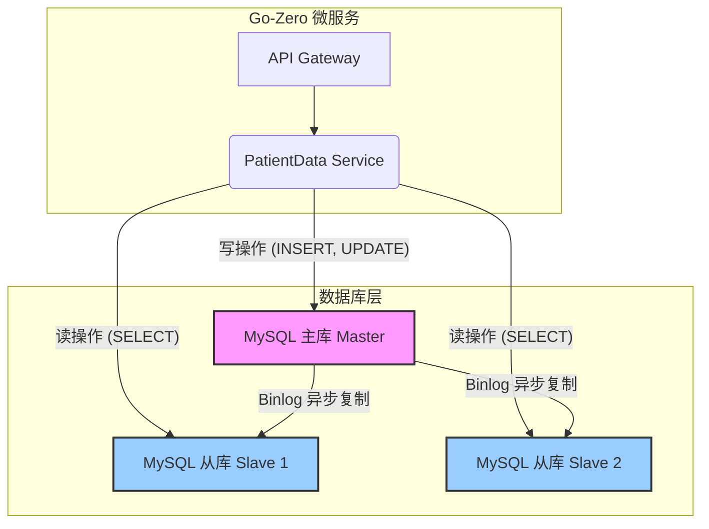

### Golang微服务：彻底搞懂读写分离与主从延迟痛点(Go-Zero实战)### 大家好，我是阿亮。

在咱们临床医疗这个行业，数据是核心资产，系统的稳定性和性能直接关系到研究的进展和患者的体验。我之前负责的一个项目——“临床研究智能监测系统”，就遇到了一个典型的性能瓶颈。

这个系统有两个核心场景：
1.  **高频写入**：研究中心的研究协调员（CRC）、医生会频繁录入和更新患者的临床数据、实验室检查结果、不良事件报告等。这些操作要求数据必须强一致性，绝对不能出错或丢失。
2.  **复杂读取**：另一边，数据监查员（CRA）、数据经理、项目经理和申办方需要从各种维度查询、汇总和分析这些数据，生成各种复杂的报表和可视化图表。这些查询往往涉及多表关联，计算量大，而且并发量在工作高峰期（比如月底出报告时）会非常高。

项目初期，我们用的是传统的单体架构加单个 MySQL 实例。随着数据量和用户量的增长，问题很快就暴露了：复杂的报表查询一跑起来，就会占用大量数据库资源，导致写入操作的响应时间急剧增加，CRC 和医生那边录入数据时经常感觉卡顿，甚至出现超时。

为了解决这个问题，我们决定对数据库架构进行升级，引入**读写分离**。这不仅仅是一个技术选择，更是保障我们核心业务稳定运行的关键一步。今天，我就把我们当时整个方案的思考、实践和踩过的坑，结合 `go-zero` 微服务框架，给大家详细拆解一下。

---

### 一、为什么读写分离是我们的“救命稻草”？

在深入技术细节之前，我们必须先想清楚一个问题：读写分离到底解决了什么？

简单来说，就是把“读”和“写”两类不同性质的数据库操作分流到不同的服务器上处理。

*   **写操作（写库/主库 Master）**：`INSERT`, `UPDATE`, `DELETE` 这些操作，我们把它们全部指向主数据库。主库是数据的唯一来源，保证了数据写入的强一致性。在我们系统里，所有患者数据的录入、修改都必须经过主库。
*   **读操作（读库/从库 Slave）**：`SELECT` 操作，我们把它们引到一台或多台从数据库上。从库的数据是从主库实时（有微小延迟）同步过来的副本。

这样做的核心好处是：

1.  **负载分担**：那些计算量大、耗时长的复杂查询，比如生成一个覆盖上千名患者、几十个指标的汇总报告，现在都在从库上运行，完全不会影响主库的写入性能。CRC录入数据时，系统依旧流畅如飞。
2.  **提升查询并发能力**：如果一个从库扛不住，我们可以水平扩展，加更多的从库。一个主库带多个从库，查询能力可以成倍提升。
3.  **高可用性**：主库万一宕机，我们可以手动或自动将一个从库提升为新的主库，保证核心写入业务的快速恢复（当然，这需要更复杂的配套设施，比如 MHA/Orchestrator）。

用一张图来表示这个架构，会非常清晰：



这里的 **Binlog（二进制日志）** 是关键。你可以把它理解成主库的一本“操作日记”，它忠实地记录了所有导致数据变更的操作。从库会伪装成一个客户端，不断地读取这本日记，然后在自己身上重放一遍，从而保证自己的数据和主库“几乎”一样。这个“几乎”带来的微小延迟，是我们采用读写分离架构必须接受的权衡。

---

### 二、实战演练：在 `go-zero` 中优雅地实现读写分离

理论讲清楚了，我们上手实操。`go-zero` 是一个非常优秀的微服务框架，它的配置管理和依赖注入机制，让我们实现读写分离变得非常简单和优雅。

#### 第1步：规划配置 - 让主从库信息一目了然

`go-zero` 强调“约定优于配置”，我们首先在服务的配置文件（例如 `internal/config/config.go` 对应的 `etc/patientdata-api.yaml`）中定义好主库和从库的连接信息。

**`etc/patientdata-api.yaml`**
```yaml
Name: patientdata-api
Host: 0.0.0.0
Port: 8888

# 数据库配置
Database:
  # 主库（写库）
  Master:
    DataSource: "root:your_password@tcp(127.0.0.1:3306)/clinical_db?charset=utf8mb4&parseTime=true&loc=Local"
  # 从库（读库），可以配置多个
  Slaves:
    - DataSource: "root:your_password@tcp(127.0.0.1:3307)/clinical_db?charset=utf8mb4&parseTime=true&loc=Local"
    - DataSource: "root:your_password@tcp(127.0.0.1:3308)/clinical_db?charset=utf8mb4&parseTime=true&loc=Local"
```
对应的，`go-zero` 会自动生成或需要我们手动调整 `internal/config/config.go` 文件来匹配这个结构。

**`internal/config/config.go`**
```go
package config

import "github.com/zeromicro/go-zero/rest"

type Config struct {
	rest.RestConf
	Database struct {
		Master DSN
		Slaves []DSN
	}
}

type DSN struct {
	DataSource string
}
```
这样，我们的配置就非常清晰了，DBA 或运维同学可以很方便地管理这些连接地址。

#### 第2步：服务上下文 `ServiceContext` - 初始化并管理数据库连接

`ServiceContext` 是 `go-zero` 的依赖注入容器，所有服务运行依赖的资源（比如数据库连接、Redis客户端等）都在这里初始化，并传递给 `logic` 层。

我们在这里创建主库和所有从库的连接。这里我推荐使用 `GORM` 作为 ORM，因为它对开发者更友好。

**`internal/svc/servicecontext.go`**
```go
package svc

import (
	"math/rand"
	"time"
    
	"github.com/zeromicro/go-zero/core/logx"
	"gorm.io/driver/mysql"
	"gorm.io/gorm"
    
	"your_project_name/internal/config"
)

type ServiceContext struct {
	Config    config.Config
	MasterDB  *gorm.DB // 主库连接
	SlaveDBs  []*gorm.DB // 从库连接切片
	// 可以增加其他依赖，比如 PatientModel
}

func NewServiceContext(c config.Config) *ServiceContext {
	// 初始化主库连接
	masterDB, err := gorm.Open(mysql.Open(c.Database.Master.DataSource), &gorm.Config{})
	if err != nil {
		logx.Must(err)
	}
	// GORM 连接池配置
    sqlDBMaster, _ := masterDB.DB()
    sqlDBMaster.SetMaxIdleConns(10)
    sqlDBMaster.SetMaxOpenConns(100)
    sqlDBMaster.SetConnMaxLifetime(time.Hour)


	// 初始化所有从库连接
	slaveDBs := make([]*gorm.DB, len(c.Database.Slaves))
	for i, slaveConfig := range c.Database.Slaves {
		db, err := gorm.Open(mysql.Open(slaveConfig.DataSource), &gorm.Config{})
		if err != nil {
			logx.Must(err)
		}
        sqlDBSlave, _ := db.DB()
        sqlDBSlave.SetMaxIdleConns(10)
        sqlDBSlave.SetMaxOpenConns(100)
        sqlDBSlave.SetConnMaxLifetime(time.Hour)
		slaveDBs[i] = db
	}

	return &ServiceContext{
		Config:   c,
		MasterDB: masterDB,
		SlaveDBs: slaveDBs,
	}
}

// GetSlaveDB 随机获取一个从库连接
// 这里使用一个简单的随机负载均衡策略
func (s *ServiceContext) GetSlaveDB() *gorm.DB {
	if len(s.SlaveDBs) == 0 {
		// 如果没有配置从库，安全起见返回主库
		return s.MasterDB
	}
	// 从多个从库中随机选择一个，实现负载均衡
	r := rand.New(rand.NewSource(time.Now().UnixNano()))
	return s.SlaveDBs[r.Intn(len(s.SlaveDBs))]
}
```

**关键点说明**：
*   我们分别创建了主库（`MasterDB`）和从库（`SlaveDBs`）的 `*gorm.DB` 实例。
*   我增加了一个 `GetSlaveDB()` 方法，这个方法非常重要。它实现了**从库的负载均衡**。当你有多个从库时，它会随机选择一个来执行查询，避免所有读请求都压在一个从库上。如果没配置从库，它会优雅地降级，返回主库连接，保证程序不会崩溃。
*   同时，我在这里配置了GORM的连接池参数，`SetMaxOpenConns`, `SetMaxIdleConns`, `SetConnMaxLifetime`，这对于生产环境至关重要，能有效管理数据库连接资源，防止连接耗尽。

#### 第3步：逻辑层 `Logic` - 按需选择数据源

现在，我们的准备工作都完成了。在 `logic` 层，也就是真正处理业务逻辑的地方，我们就可以根据操作类型，选择使用主库还是从库。

**示例1：创建患者记录（写操作）**

对于写入操作，我们必须使用主库。

**`internal/logic/createpatientlogic.go`**
```go
package logic

import (
	"context"
	
	"your_project_name/internal/svc"
	"your_project_name/internal/types"
	// 假设你有一个 model 层
	"your_project_name/internal/model"

	"github.com/zeromicro/go-zero/core/logx"
)

type CreatePatientLogic struct {
	logx.Logger
	ctx    context.Context
	svcCtx *svc.ServiceContext
}

func NewCreatePatientLogic(ctx context.Context, svcCtx *svc.ServiceContext) *CreatePatientLogic {
	return &CreatePatientLogic{
		Logger: logx.WithContext(ctx),
		ctx:    ctx,
		svcCtx: svcCtx,
	}
}

func (l *CreatePatientLogic) CreatePatient(req *types.CreatePatientReq) (resp *types.CreatePatientResp, err error) {
	patient := &model.Patient{
		Name:      req.Name,
		PatientID: req.PatientID,
		// ... 其他字段
	}

	// === 核心：使用主库进行写操作 ===
	db := l.svcCtx.MasterDB
	if err := db.Create(patient).Error; err != nil {
		// 记录错误日志，返回错误信息
		return nil, err
	}

	return &types.CreatePatientResp{Success: true}, nil
}
```
看，逻辑非常清晰，直接从 `svcCtx` 中获取 `MasterDB` 即可。

**示例2：获取患者列表（读操作）**

对于读取操作，我们就应该使用从库来分摊压力。

**`internal/logic/getpatientlistlogic.go`**
```go
package logic

import (
	"context"

	"your_project_name/internal/svc"
	"your_project_name/internal/types"
    "your_project_name/internal/model"

	"github.com/zeromicro/go-zero/core/logx"
)

type GetPatientListLogic struct {
	logx.Logger
	ctx    context.Context
	svcCtx *svc.ServiceContext
}

// ... NewGetPatientListLogic a similar constructor

func (l *GetPatientListLogic) GetPatientList(req *types.GetPatientListReq) (resp *types.GetPatientListResp, err error) {
	var patients []model.Patient
	var total int64

	// === 核心：使用从库进行读操作 ===
	db := l.svcCtx.GetSlaveDB() // 通过 GetSlaveDB() 获取一个从库连接

	// 分页查询
	query := db.Model(&model.Patient{})
	if req.Keyword != "" {
		query = query.Where("name LIKE ?", "%"+req.Keyword+"%")
	}

	if err := query.Count(&total).Error; err != nil {
		return nil, err
	}
	
	if err := query.Limit(req.PageSize).Offset((req.PageNum - 1) * req.PageSize).Find(&patients).Error; err != nil {
		return nil, err
	}

	// 转换数据结构并返回
	// ...
	
	return &types.GetPatientListResp{
        List: patients,
        Total: total,
    }, nil
}
```
在这里，我们调用了 `l.svcCtx.GetSlaveDB()`，这个小小的改变，就是读写分离架构在代码层面的最终体现。

---

### 三、生产环境的“坑”与思考：主从延迟问题

架构上线后，性能确实得到了巨大提升，报表查询再也没有影响到数据录入。但很快，我们遇到了一个经典的“坑”——**主从延迟导致的“写后读”问题**。

**场景复现**：一个 CRC 刚刚录入了一位新患者的信息，点击保存后，系统马上跳转到患者详情页。但详情页有 0.5% 的概率显示“患者不存在”。用户刷新一下，数据又出来了。

**原因分析**：
1.  **写操作**：`CreatePatient` 请求，数据被成功写入了**主库**。
2.  **读操作**：系统立刻发起 `GetPatientDetail` 请求去查询刚才写入的数据。这个读请求被我们的负载均衡策略路由到了一个**从库**。
3.  **问题所在**：由于主从复制存在毫秒级的延迟（网络繁忙或从库负载高时可能更长），`binlog` 还没来得及同步到这个从库。所以从库上查不到这条新数据，返回了“不存在”的结果。

这个问题在对数据实时性要求高的场景里是致命的。我们讨论后，采取了两种策略来解决：

**策略一：强制读主（简单粗暴，但不优雅）**

最直接的办法，就是在某些对实时性要求极高的读操作上，放弃从库，直接读主库。比如，获取刚刚创建的资源详情。

```go
// in GetPatientDetailLogic
func (l *GetPatientDetailLogic) GetPatientDetail(...) (...) {
    // 强制从主库读取，保证能立刻读到刚写入的数据
    db := l.svcCtx.MasterDB 
    // ... query logic
}
```
这种方式能解决问题，但违背了读写分离的初衷，如果滥用，会让主库压力又回来。

**策略二：上下文标记（更灵活，推荐）**

我们可以在业务流程中，通过 `context` 传递一个“强制读主”的标记。例如，在一个完整的业务事务中（比如创建并立即展示），所有后续的读操作都携带这个标记。

我们可以改造一下 `ServiceContext`：

```go
// in svc/servicecontext.go

// isForceMasterRead checks if the context contains a flag to force read from master
func isForceMasterRead(ctx context.Context) bool {
    force, ok := ctx.Value("force_master_read").(bool)
    return ok && force
}

// GetDB intelligently selects a DB connection based on context
func (s *ServiceContext) GetDB(ctx context.Context) *gorm.DB {
    if isForceMasterRead(ctx) {
        return s.MasterDB
    }
    return s.GetSlaveDB()
}
```
然后在 `logic` 层这样使用：

```go
// 在上层业务编排中
func (l *SomeOrchestrationLogic) CreateAndShowPatient(req *...) {
    // 1. 创建患者
    createLogic := NewCreatePatientLogic(l.ctx, l.svcCtx)
    createLogic.CreatePatient(...)
    
    // 2. 创建一个带有“强制读主”标记的新 context
    forceMasterCtx := context.WithValue(l.ctx, "force_master_read", true)
    
    // 3. 使用这个新 context 去查询详情
    getDetailLogic := NewGetPatientDetailLogic(forceMasterCtx, l.svcCtx)
    getDetailLogic.GetPatientDetail(...) 
}

// 在 GetPatientDetailLogic 中
func (l *GetPatientDetailLogic) GetPatientDetail(...) {
    // 使用改造后的 GetDB 方法
    db := l.svcCtx.GetDB(l.ctx) // 它会根据 context 自动选择主库或从库
    // ...
}
```
这种方式更加灵活和可控，把决策权交给了业务逻辑的编排者，是我们在项目中最终采用的方案。

---

### 四、总结

从单库到读写分离，对于我们的临床研究系统来说是一次重要的架构演进。它不仅仅是代码层面的修改，更是对业务场景深刻理解后的技术决策。

**核心要点回顾**：
1.  **识别场景**：明确系统中的“读多写少”特性是应用读写分离的前提。
2.  **分层实现**：在 `go-zero` 中，利用 `config` 层定义数据源，`svc` 层管理连接，`logic` 层消费连接，职责清晰，易于维护。
3.  **负载均衡**：当有多个从库时，别忘了在获取从库连接时做负载均衡。
4.  **关注一致性**：永远要警惕主从延迟带来的“写后读”问题，并准备好应对策略。

对于大多数处于快速发展阶段、读请求成为性能瓶颈的系统而言，读写分离是一个投入产出比非常高的优化方案。希望我这次的分享，能帮助大家在未来的项目实践中，少走一些弯路。