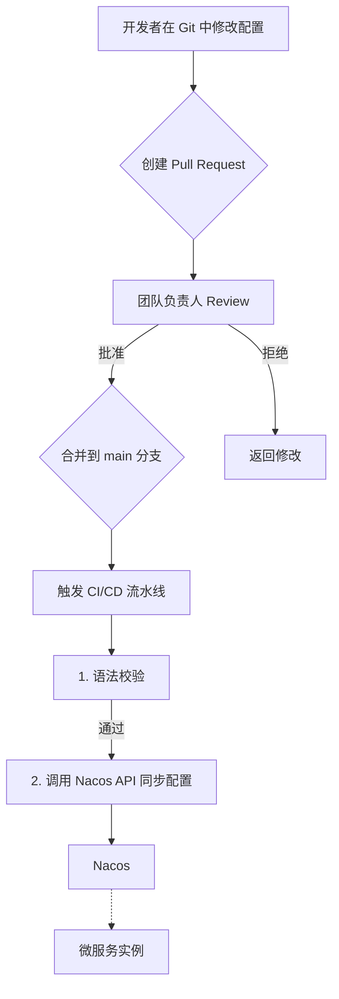

### Golang配置管理：彻底解决生产级配置痛点 (Viper, Nacos, GitOps实践)### 好的，各位同学，大家好，我是阿亮。

从业八年多，我一直在医疗科技这个“跟生命赛跑”的行业里摸爬滚打。我们团队构建的系统，从临床试验的电子数据采集（EDC），到给医院用的管理平台（HIS），再到让患者能随时上报健康状况的电子患者自报告结局系统（ePRO），每一行代码背后都承载着巨大的责任。

在这样的背景下，一个看似基础的技术点——**配置管理**——被我们提到了前所未有的战略高度。为什么？因为一次错误的配置，可能导致研究数据上传失败，影响临床试验进程；一个敏感信息（比如数据库密码、第三方API密钥）的泄露，在医疗行业更是灾难性的，可能直接触及HIPAA或国内的《个人信息保护法》等法规红线。

今天，我想和大家分享的，不是什么高深的理论，而是我们团队在无数个项目中，从“混沌”走向“有序”的真实演进过程。我会结合具体的业务场景，比如单体服务和微服务架构下的不同选择，掰开揉碎了讲讲配置管理的那些事儿。希望我踩过的坑，能成为大家未来路上的垫脚石。

---

### 第一章：单体应用时期的探索——Gin + Viper 的“黄金搭档”

#### 1.1 项目初期：为什么我们选择了 YAML？

还记得我们最早开发的那个“ePRO - 电子患者自报告结局系统”吗？项目初期，它是一个典型的单体应用，用 Gin 框架开发。那时候，我们需要一个地方存放应用的各种参数：数据库连接信息、Redis 地址、服务端口、JWT 密钥、日志级别等等。

在 `JSON`、`TOML` 和 `YAML` 之间，我们几乎没有犹豫就选择了 `YAML`。原因有三：

1.  **可读性极佳**：`YAML` 通过缩进来表示层级关系，没有 `JSON` 那么多的大括号和引号，配置写出来就像一份文档，特别清晰。对于复杂的配置结构，比如我们要定义不同类型患者问卷的提醒规则，`YAML` 的表现力远超其他两者。
2.  **支持注释**：这是 `JSON` 的硬伤。在我们的业务里，很多配置项需要详细说明其业务含义，比如某个第三方短信服务的 `AppKey` 是用于发送术后康复提醒的，还是用于新药试验通知的，写上注释，新来的同事一看就懂。
3.  **结构化能力强**：能很好地映射到 Go 的结构体（Struct），这对于我们做强类型语言开发的来说，简直是福音。

#### 1.2 实战场景：构建 ePRO 系统的配置文件

下面是我们当时 `ePRO` 系统一个简化的配置文件 `config.yaml`，你可以看到，业务逻辑的划分在配置层面就已经体现出来了。

```yaml
# 服务基础配置
Server:
  Port: ":8081" # 服务监听端口
  RunMode: "debug" # Gin的运行模式: debug, release, test
  ReadTimeout: 60 # 读取超时时间（秒）
  WriteTimeout: 60 # 写入超时时间（秒）

# 数据库配置 (PostgreSQL)
Database:
  Type: "postgres"
  Host: "localhost"
  Port: 5432
  User: "epro_user"
  Password: "your_dev_password" # 注意：开发环境密码，生产环境绝不能这样放！
  DBName: "epro_db"
  SSLMode: "disable"

# Redis 缓存配置
Redis:
  Addr: "localhost:6379"
  Password: "" # Redis密码
  DB: 0

# JWT 认证配置
JWT:
  Secret: "a_very_secret_key_for_epro" # 用于签名的密钥
  Expire: 7200 # Token有效期（秒），这里是2小时

# 日志配置
Log:
  Level: "debug" # 日志级别: debug, info, warn, error
  Format: "json" # 日志格式: console, json
  OutputDir: "logs/" # 日志文件输出目录

# 第三方服务: 短信通知 (用于提醒患者填写问卷)
SMSService:
  Provider: "aliyun" # 短信服务商
  AccessKeyID: "your_sms_access_key_id"
  AccessKeySecret: "your_sms_access_key_secret"
  SignName: "XX医疗中心"
  TemplateCode: "SMS_12345678"
```

#### 1.3 代码实现：用 Viper 将配置优雅地映射到 Go 结构体

光有配置文件还不行，我们需要在程序启动时把它加载进来，并方便地在任何地方使用。这里，我们引入了 `Viper` 这个强大的库。`Viper` 不仅能读取多种格式的配置文件，还能设置默认值、读取环境变量等，非常灵活。

**第一步：定义与 `config.yaml` 对应的 Go 结构体**

这是关键的一步，它让我们的配置变成了类型安全的对象，避免了在代码里到处写 `viper.GetString("Database.Host")` 这样的“魔法字符串”。

`config/config.go`:
```go
package config

// Config 是整个应用的配置结构体
type Config struct {
	Server     ServerConfig     `mapstructure:"Server"`
	Database   DatabaseConfig   `mapstructure:"Database"`
	Redis      RedisConfig      `mapstructure:"Redis"`
	JWT        JWTConfig        `mapstructure:"JWT"`
	Log        LogConfig        `mapstructure:"Log"`
	SMSService SMSServiceConfig `mapstructure:"SMSService"`
}

// ServerConfig 服务配置
type ServerConfig struct {
	Port         string `mapstructure:"Port"`
	RunMode      string `mapstructure:"RunMode"`
	ReadTimeout  int    `mapstructure:"ReadTimeout"`
	WriteTimeout int    `mapstructure:"WriteTimeout"`
}

// DatabaseConfig 数据库配置
type DatabaseConfig struct {
	Type     string `mapstructure:"Type"`
	Host     string `mapstructure:"Host"`
	Port     int    `mapstructure:"Port"`
	User     string `mapstructure:"User"`
	Password string `mapstructure:"Password"`
	DBName   string `mapstructure:"DBName"`
	SSLMode  string `mapstructure:"SSLMode"`
}

// RedisConfig Redis 配置
type RedisConfig struct {
	Addr     string `mapstructure:"Addr"`
	Password string `mapstructure:"Password"`
	DB       int    `mapstructure:"DB"`
}

// JWTConfig JWT 配置
type JWTConfig struct {
	Secret string `mapstructure:"Secret"`
	Expire int64  `mapstructure:"Expire"`
}

// LogConfig 日志配置
type LogConfig struct {
	Level     string `mapstructure:"Level"`
	Format    string `mapstructure:"Format"`
	OutputDir string `mapstructure:"OutputDir"`
}

// SMSServiceConfig 短信服务配置
type SMSServiceConfig struct {
	Provider        string `mapstructure:"Provider"`
	AccessKeyID     string `mapstructure:"AccessKeyID"`
	AccessKeySecret string `mapstructure:"AccessKeySecret"`
	SignName        string `mapstructure:"SignName"`
	TemplateCode    string `mapstructure:"TemplateCode"`
}
```
> **给初学者的提示**：
> 这里的 `mapstructure:"Server"` 标签（tag）是给 `Viper` 看的。它告诉 `Viper` 在解析配置文件时，YAML 文件里的 `Server` 这个顶级键对应的值，应该填充到 `Config` 结构体的 `Server` 字段里。这就像一个映射说明书，让数据能准确无误地找到自己的位置。

**第二步：编写加载配置的函数**

我们通常会把配置加载逻辑封装起来，做成一个全局可访问的实例。

`config/loader.go`:
```go
package config

import (
	"fmt"
	"log"

	"github.com/fsnotify/fsnotify"
	"github.com/spf13/viper"
)

var AppConfig Config

// Init 初始化配置
func Init(configPath string) {
	viper.SetConfigFile(configPath)
	viper.SetConfigType("yaml") // 明确指定配置文件类型

	// 读取配置文件
	if err := viper.ReadInConfig(); err != nil {
		// 使用 log.Fatalf，如果配置文件加载失败，程序直接退出，防止带着错误的配置运行
		log.Fatalf("Fatal error config file: %s \n", err)
	}

	// 将读取的配置反序列化到 AppConfig 结构体中
	if err := viper.Unmarshal(&AppConfig); err != nil {
		log.Fatalf("Unable to decode into struct, %v", err)
	}

	// 启动一个 goroutine 来监控配置文件的变化
	// 这就是“热重载”的基础
	viper.WatchConfig()
	viper.OnConfigChange(func(e fsnotify.Event) {
		fmt.Println("Config file changed:", e.Name)
		// 配置文件变化时，重新反序列化到 AppConfig
		if err := viper.Unmarshal(&AppConfig); err != nil {
			log.Printf("Error on re-unmarshal config: %v", err)
		}
		fmt.Println("AppConfig reloaded successfully.")
	})

	fmt.Println("Configuration loaded successfully.")
}
```

**第三步：在 `main` 函数中调用**

`main.go`:
```go
package main

import (
	"flag"
	"fmt"
	"my_epro_project/config" // 假设项目名叫 my_epro_project

	"github.com/gin-gonic/gin"
)

func main() {
	// 使用命令行标志来指定配置文件路径，增加灵活性
	var configPath string
	flag.StringVar(&configPath, "c", "config.yaml", "path to config file")
	flag.Parse()

	// 初始化配置
	config.Init(configPath)

	// 设置 Gin 模式
	gin.SetMode(config.AppConfig.Server.RunMode)
	
	router := gin.Default()

	router.GET("/ping", func(c *gin.Context) {
		// 在 handler 中可以直接使用加载好的配置
		c.JSON(200, gin.H{
			"message":  "pong",
			"logLevel": config.AppConfig.Log.Level, // 示例：获取日志级别
		})
	})

	fmt.Printf("Server starting on port %s\n", config.AppConfig.Server.Port)
	if err := router.Run(config.AppConfig.Server.Port); err != nil {
		log.Fatalf("Failed to run server: %v", err)
	}
}
```

这套“组合拳”在单体应用时期非常好用。它结构清晰、类型安全，还能热重载。但随着业务的扩张，它的弊端也逐渐显现：当我们的系统从一个胖胖的单体，演变成数十个微服务时，这套体系就有点力不从心了。

---

### 第二章：微服务时代的阵痛与变革——拥抱 Go-Zero 与配置中心

随着公司业务的飞速发展，我们的“互联网医院管理平台”、“临床试验项目管理系统”等多个大型系统相继立项。原先的 `ePRO` 单体应用也被拆分成了 `user-service`（用户中心）、`trial-service`（试验管理）、`notification-service`（通知服务）等多个微服务。

这时，原来的配置管理方式带来了巨大的麻烦：

1.  **配置散乱**：每个微服务都有一份自己的 `config.yaml`。几十个服务，就有几十个配置文件散落在各自的代码仓库里。
2.  **修改困难**：想象一下，我们需要把测试环境的数据库地址统一换掉。运维同学得去每个服务的仓库里修改、提交、再触发部署，效率低下且极易出错。
3.  **缺乏管控**：谁都能改配置，改错了也不知道是谁干的，没有审计、没有权限控制，安全隐患巨大。

我们意识到，必须引入**配置中心**了。

#### 2.1 为什么选择 Go-Zero 框架和 Nacos？

在技术选型上，我们最终敲定了 `Go-Zero` 作为微服务框架，并搭配 `Nacos` 作为配置中心。

*   **Go-Zero**：它不仅仅是个 web 框架，而是一整套微服务工程化的解决方案。它自带了 RPC、服务发现、限流熔断等能力，更重要的是，它对配置中心有原生的支持，能非常平滑地接入。
*   **Nacos**：作为阿里巴巴开源的产品，它功能强大且社区活跃。它集成了配置管理和服务发现两大核心功能，非常适合我们的场景。我们可以创建不同的命名空间（Namespace）来隔离开发、测试、生产等环境的配置，这对于我们严格区分不同临床试验阶段的环境来说至关重要。

#### 2.2 实战场景：用 Go-Zero 和 Nacos 管理“临床研究智能监测系统”

我们的“临床研究智能监测系统”由多个微服务构成，比如 `data-acquisition-api` (数据采集API网关)、`alert-rpc` (预警规则RPC服务)等。下面我以 `alert-rpc` 为例，展示如何改造。

**第一步：定义 `go-zero` 的配置结构体**

`go-zero` 的配置结构体与我们之前在 Gin 项目中定义的类似，但会包含更多微服务相关的配置，如 RPC 监听地址、服务注册等。

`internal/config/config.go`:
```go
package config

import "github.com/zeromicro/go-zero/zrpc"

type Config struct {
	zrpc.RpcServerConf // 内嵌 go-zero 的 RPC 服务基础配置
	DB struct {         // 数据库配置
		DataSource string
	}
	RedisCache struct { // Redis 缓存配置
		Host string
		Pass string
		Type string
	}
	AlertRules struct { // 业务相关配置：预警规则
		DefaultSeverity string `json:",default=high"` // 支持设置默认值
		EvaluationInterval int `json:",default=60"` // 评估间隔（秒）
	}
}
```

**第二步：在 Nacos 控制台创建配置**

我们登录 Nacos 的 web 界面，选择对应的命名空间（比如 `clinical-trial-test`），然后创建一个新的配置。

*   **Data ID**: `alert-rpc.yaml` (通常用 `服务名.文件类型` 命名)
*   **Group**: `DEFAULT_GROUP`
*   **配置内容 (YAML)**:

```yaml
Name: alert.rpc
ListenOn: 0.0.0.0:8080 # RPC 服务监听地址
Etcd:
  Hosts:
  - 127.0.0.1:2379 # 服务注册发现中心地址
  Key: alert.rpc
DB:
  DataSource: rpc_user:rpc_password@tcp(test-db-host:3306)/clinical_alert_db
RedisCache:
  Host: test-redis-host:6379
  Pass: 'test_redis_pass'
  Type: 'node'
AlertRules:
  DefaultSeverity: 'medium'
  EvaluationInterval: 120
```

**第三步：修改 `go-zero` 服务的入口文件，从 Nacos 加载配置**

`go-zero` 的妙处在于，你只需要在服务的 `etc/alert-rpc.yaml` 文件中告诉它去哪里找配置中心，剩下的事情它会自动处理。

本地的 `etc/alert-rpc.yaml` 文件现在变得极其简单：
```yaml
# 这个文件只用来引导服务去 Nacos 加载真正的配置
Mode: dev
Remote:
  Etcd:
    Hosts:
    - 127.0.0.1:2379
    Key: /configs/alert-rpc.yaml # 在etcd里配置nacos的地址等信息
  Type: nacos
```
*真正的做法是把 Nacos 的地址配置在 Etcd 或者另一个稳定的地方，服务启动时先去 Etcd 读取 Nacos 的地址，再去 Nacos 拉取业务配置。这里为了简化，我们假设服务已经知道 Nacos 的地址了。*

`go-zero` 提供了 `conf.MustLoad` 函数，它会自动识别 `Remote` 配置，并从 Nacos 拉取 `Data ID` 为 `alert-rpc.yaml` 的配置内容，然后解析到我们定义的 `Config` 结构体中。

```go
// alert.go (服务入口文件)
package main

import (
	"flag"
	"fmt"
	"my_alert_project/internal/config" // 导入配置包
	"my_alert_project/internal/server"
	"my_alert_project/internal/svc"
	// ... 其他导入

	"github.com/zeromicro/go-zero/core/conf"
	"github.com/zeromicro/go-zero/core/service"
	"github.com/zeromicro/go-zero/zrpc"
	// ...
)

var configFile = flag.String("f", "etc/alert-rpc.yaml", "the config file")

func main() {
	flag.Parse()

	var c config.Config
	// go-zero 的核心加载函数，它会处理本地和远程配置
	conf.MustLoad(*configFile, &c)

	ctx := svc.NewServiceContext(c)
	srv := server.NewAlertServer(ctx)

	s := zrpc.MustNewServer(c.RpcServerConf, func(grpcServer *grpc.Server) {
		// 注册 gRPC 服务
	})
	
	// ... 启动服务
}
```

#### 2.3 热更新的魔力

切换到配置中心后，我们获得了梦寐以求的**配置热更新**能力。

比如，在一次临床试验中，研究方临时要求将某个指标的预警评估频率从 120 秒调整为 60 秒。过去，这需要改代码、重新部署。现在，运维同学只需要在 Nacos 界面上，把 `EvaluationInterval` 的值从 `120` 改成 `60`，然后点击发布。

`go-zero` 的配置客户端会监听到这个变化，自动拉取最新的配置，并更新内存中的 `config.Config` 对象。如果你的业务逻辑是依赖这个配置对象来执行的，那么下次执行时，它就会使用新的值。

```go
// 示例：一个定期执行的任务
func (s *MyService) startEvaluationTicker(ctx *svc.ServiceContext) {
    // 初始时读取一次间隔
    interval := time.Duration(ctx.Config.AlertRules.EvaluationInterval) * time.Second
    ticker := time.NewTicker(interval)

    // 监听配置变更
    conf.OnChange(func(c *config.Config) {
        newInterval := time.Duration(c.AlertRules.EvaluationInterval) * time.Second
        if newInterval != interval {
            log.Printf("Evaluation interval changed from %v to %v", interval, newInterval)
            interval = newInterval
            ticker.Reset(interval) // 重置 Ticker 的间隔
        }
    })

    go func() {
        for range ticker.C {
            // 执行评估任务...
        }
    }()
}
```
> **架构师视角**：
> 热更新虽然强大，但也需要小心。不是所有配置都适合热更新。比如数据库连接地址，如果更新了，你需要有配套的逻辑去平滑地关闭旧连接池，创建新连接池，否则可能导致服务中断。通常，我们把热更新主要用在**功能开关（Feature Flag）、日志级别、业务阈值、限流参数**等相对安全的配置上。

---

### 第三章：安全与规范——为配置管理体系“查漏补缺”

当我们为配置的集中化和动态化欢呼时，新的问题也浮出水面：

1.  **安全问题**：数据库密码、第三方服务的 `SecretKey` 等敏感信息，以明文形式存储在 Nacos 里，这在医疗行业是绝对不能接受的。
2.  **变更管理问题**：虽然 Nacos 有历史版本功能，但谁在什么时候因为什么原因修改了配置，这个过程缺乏评审（Review）和流程化的管控。

为此，我们引入了两个重要的实践：**GitOps (Config-as-Code)** 和 **Secrets Management**。

#### 3.1 用 GitOps 流程规范配置变更

我们创建了一个专门的 Git 仓库，用来存放所有服务的**非敏感**配置。

**工作流如下**：

1.  **发起变更**：开发或运维同学想修改配置时，不能直接去 Nacos 界面操作。他需要在 Git 仓库里创建一个新的分支，修改对应的 YAML 文件，然后提交一个 Pull Request (PR)。
2.  **代码评审**：PR 中需要清晰地说明变更的原因和影响。相关的负责人（比如项目经理、架构师）会进行评审，确保变更的正确性和必要性。
3.  **自动化流水线**：PR 一旦被合并到主分支，就会触发 CI/CD 流水线。这个流水线会做两件事：
    *   **静态检查**：用工具检查 YAML 文件的语法是否正确。
    *   **同步到 Nacos**：调用 Nacos 的 OpenAPI，将 Git 仓库里的配置内容自动发布到对应的 Nacos 配置项中。




这样做的好处是显而易见的：
*   **完整的审计日志**：每一次配置变更都对应一个 Git commit，谁、何时、为何改了什么，一目了然。
*   **版本控制与回滚**：如果线上出了问题，我们可以通过 `git revert` 快速回滚配置变更，CI/CD 会自动将旧版本的配置同步回 Nacos。
*   **协同与知识沉淀**：PR 的讨论过程本身就是一种知识的传递和沉淀。

#### 3.2 用环境变量和 Secrets Manager 保护敏感信息

对于密码、密钥这类信息，我们遵循 **[The Twelve-Factor App](https://12factor.net/config)** 的原则：**通过环境变量注入**。

我们的 YAML 配置文件中不再包含具体的值，而是使用占位符：

```yaml
# Nacos 中的配置
DB:
  DataSource: ${DB_USER}:${DB_PASSWORD}@tcp(${DB_HOST}:${DB_PORT})/${DB_NAME}
```

这些环境变量的值，在生产环境中，由部署平台（比如 Kubernetes）从专门的 Secrets Management 工具（如 HashiCorp Vault、AWS Secrets Manager）中获取，然后在启动服务容器时注入进去。

这样一来，就实现了**配置与敏感信息的分离**。开发人员在他们的代码和配置仓库里，永远也看不到生产环境的真实密码。

### 总结：我的配置管理哲学

回顾这几年的演进，我总结出我们团队在配置管理上的核心哲学：

1.  **结构化优于扁平化**：用 `YAML` 或 `TOML` 配合强类型的 Go 结构体，让配置在代码层面就具备可读性和可维护性。
2.  **集中化优于分散化**：微服务架构下，配置中心是“刚需”，它解决了配置的一致性、下发效率和环境隔离问题。
3.  **自动化优于手动化**：引入 `GitOps` 流程，将配置的变更纳入到与代码同等重要的版本控制和评审流程中，用机器来保证规范的执行。
4.  **分离优于混合**：严格区分普通配置和敏感信息。普通配置走配置中心，敏感信息通过环境变量从专用的安全设施注入。

配置管理没有一劳永逸的“银弹”，它是一个随着团队规模、业务复杂度和安全要求不断演进的过程。希望我今天的分享，能给正在路上的你带来一些启发。

感谢大家。