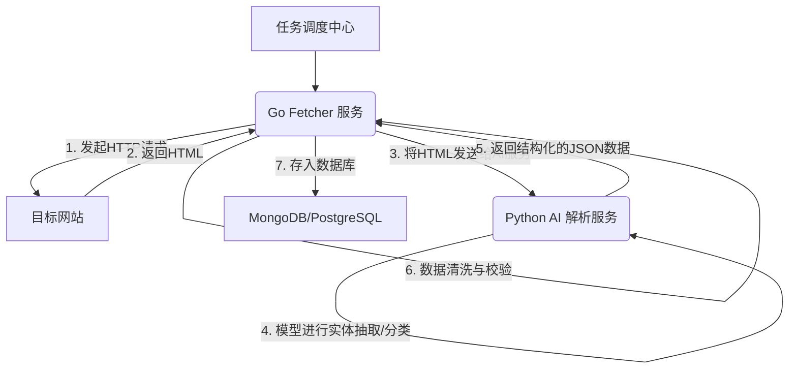

### Golang高并发爬虫：构建智能AI数据管道实现结构化信息采集(Go-zero实战)### 好的，各位同学，我是阿亮。

今天想跟大家聊聊一个我们项目中非常核心的话题：如何利用 Go 和 AI 技术，构建一个智能化的数据管道，把网上杂乱的公开信息，转化成我们临床研究系统里能直接用的、高质量的结构化数据。

在我们这个行业——临床研究和医疗信息化——数据的时效性和准确性就是生命线。比如，我们的“临床试验项目管理系统”需要实时跟踪全球新发布的临床试验方案，或者“学术推广平台”需要聚合最新的医学研究论文。这些信息散落在各大医学期刊网站、临床试验注册中心（像 ClinicalTrials.gov）和药品信息门户上。如果靠人力去搜集整理，不仅效率低下，还极易出错。

所以，我们团队从几年前就开始探索，最终落地了一套基于 Go 的高并发爬虫集群，并结合 AI 服务进行智能解析和清洗的自动化数据流水线。今天，我就把这套方案的设计思路、踩过的坑以及关键代码实现，毫无保留地分享给大家。这不只是理论，而是我们一行行代码码出来、一个个问题解决掉的实战经验。

---

### **第一章：从源头抓起——用 Go 构建稳定、高效的数据采集服务**

数据处理的第一步永远是获取数据。你可能会想，不就是写个爬虫嘛，用 `net/http` 发个请求就完事了。没错，对于单个页面是这样。但当你的目标是成千上万个页面，并且这些网站结构各异、反爬策略层出不穷时，一个“玩具”爬虫和一套“工业级”采集服务之间，就有了天壤之别。

#### **1.1 为什么选择 Go？为了极致的并发性能**

我们的采集任务是典型的 I/O 密集型场景：发起网络请求、等待响应，大部分时间都在等待。Go 的 Goroutine + Channel 模型简直是为此而生。

*   **Goroutine（协程）**：你可以把它理解成一个超轻量级的线程。启动一个 Goroutine 的开销极小（大概 2KB 内存），我们可以在一台机器上轻松跑成千上万个。每个采集任务（比如爬取一个 URL）都可以放在一个独立的 Goroutine 里，互不干扰。
*   **Channel（通道）**：这是 Goroutine 之间通信的桥梁。我们可以用它来安全地传递任务和结果，避免了传统多线程编程中复杂的锁机制。

一个典型的并发采集模型就像一个工厂流水线：一个 Goroutine 负责生产任务（把待爬取的 URL 放到一个 Channel 里），一群“工人”Goroutine 从这个 Channel 里取出任务去执行，完成后再把结果送到另一个 Channel 里，最后由一个“打包”Goroutine 统一处理。

#### **1.2 架构选型：为什么我们用 go-zero 构建微服务**

我们的数据采集模块不是一个孤立的脚本，而是整个数据平台的一部分。它需要接收上游系统（比如任务调度中心）的指令，并将采集结果推送给下游的解析和存储服务。因此，我们将它设计成了一个微服务。

我们选择了 `go-zero` 框架，原因有几点：

1.  **开箱即用**：`go-zero` 提供了完整的微服务治理能力，比如服务注册与发现、负载均衡、熔断、限流等，这些都是生产环境必不可少的。
2.  **代码生成**：通过 `.api` 或 `.proto` 文件，可以一键生成项目骨架、handler、logic 代码，让我们更专注于业务逻辑。
3.  **高性能**：`go-zero` 底层设计优秀，性能表现非常出色。

下面，我们来构建一个简化版的 `fetcher`（采集器）服务。

#### **1.3 实战：搭建一个 `fetcher` API 服务**

**第一步：定义 API 文件 (`fetcher.api`)**

这是我们服务的“契约”，定义了它能做什么。

```api
syntax = "v1"

info(
    title: "数据采集服务"
    desc: "根据URL获取网页原始HTML内容"
    author: "阿亮"
    email: "liang@example.com"
)

type FetchRequest {
    Url string `json:"url"` // 需要采集的URL
}

type FetchResponse {
    Url      string `json:"url"`
    RawHtml  string `json:"rawHtml"`  // 返回的原始HTML
    HttpCode int    `json:"httpCode"` // HTTP状态码
}

@server (
    prefix: /api/v1/fetcher
    group: fetch
)
service Fetcher {
    @handler FetchUrl
    post /fetch (FetchRequest) returns (FetchResponse)
}
```

**第二步：生成项目代码**

在终端执行 `goctl` 命令：

```bash
goctl api go -api fetcher.api -dir ./fetcher-api
```

`go-zero` 会帮我们生成一个完整的项目结构，我们只需要填充 `internal/logic/fetch/fetchurllogic.go` 里的业务逻辑。

**第三步：编写核心采集逻辑**

这里才是关键。一个健壮的采集器，绝不是 `http.Get()` 那么简单。

```go
// internal/logic/fetch/fetchurllogic.go

package fetch

import (
    "context"
    "fmt"
    "io/ioutil"
    "math/rand"
    "net/http"
    "time"

    "fetcher-api/internal/svc"
    "fetcher-api/internal/types"

    "github.com/zeromicro/go-zero/core/logx"
)

// 定义一些常用的User-Agent，模拟不同浏览器
var userAgents = []string{
    "Mozilla/5.0 (Windows NT 10.0; Win64; x64) AppleWebKit/537.36 (KHTML, like Gecko) Chrome/108.0.0.0 Safari/537.36",
    "Mozilla/5.0 (Macintosh; Intel Mac OS X 10_15_7) AppleWebKit/537.36 (KHTML, like Gecko) Chrome/108.0.0.0 Safari/537.36",
    "Mozilla/5.0 (X11; Linux x86_64) AppleWebKit/537.36 (KHTML, like Gecko) Chrome/108.0.0.0 Safari/537.36",
}

type FetchUrlLogic struct {
    logx.Logger
    ctx    context.Context
    svcCtx *svc.ServiceContext
}

func NewFetchUrlLogic(ctx context.Context, svcCtx *svc.ServiceContext) *FetchUrlLogic {
    return &FetchUrlLogic{
        Logger: logx.WithContext(ctx),
        ctx:    ctx,
        svcCtx: svcCtx,
    }
}

func (l *FetchUrlLogic) FetchUrl(req *types.FetchRequest) (resp *types.FetchResponse, err error) {
    // 关键点1: 使用自定义的HTTP Client，而不是http.DefaultClient
    // 我们可以设置超时、自定义Transport来管理连接池等
    client := &http.Client{
        Timeout: 30 * time.Second, // 必须设置超时，防止请求永久阻塞
    }

    httpReq, err := http.NewRequestWithContext(l.ctx, "GET", req.Url, nil)
    if err != nil {
        logx.Errorf("创建请求失败: url=%s, error=%v", req.Url, err)
        return nil, fmt.Errorf("创建请求失败: %w", err)
    }

    // 关键点2: 模拟浏览器行为，设置请求头
    // 随机选择一个User-Agent
    rand.Seed(time.Now().UnixNano())
    randomUserAgent := userAgents[rand.Intn(len(userAgents))]
    httpReq.Header.Set("User-Agent", randomUserAgent)
    httpReq.Header.Set("Accept", "text/html,application/xhtml+xml,application/xml;q=0.9,image/webp,*/*;q=0.8")
    httpReq.Header.Set("Accept-Language", "en-US,en;q=0.5")
    httpReq.Header.Set("Connection", "keep-alive")
    // 对于某些网站，可能还需要带上 Referer 或 Cookie

    // 发起请求
    httpResp, err := client.Do(httpReq)
    if err != nil {
        logx.Errorf("请求目标URL失败: url=%s, error=%v", req.Url, err)
        return nil, fmt.Errorf("请求目标URL失败: %w", err)
    }
    defer httpResp.Body.Close()

    // 读取响应体
    body, err := ioutil.ReadAll(httpResp.Body)
    if err != nil {
        logx.Errorf("读取响应体失败: url=%s, error=%v", req.Url, err)
        return nil, fmt.Errorf("读取响应体失败: %w", err)
    }

    resp = &types.FetchResponse{
        Url:      req.Url,
        RawHtml:  string(body),
        HttpCode: httpResp.StatusCode,
    }

    logx.Infof("成功采集URL: %s, 状态码: %d", req.Url, resp.HttpCode)

    return resp, nil
}
```

**代码解析与关键点：**

1.  **自定义 `http.Client`**：这是生产级代码的必备操作。`http.DefaultClient` 没有设置超时，一旦目标网站响应慢，你的 Goroutine 就会一直卡住，最终耗尽资源。我们必须为 `Client` 设置一个合理的 `Timeout`。
2.  **模拟请求头 `(Headers)`**：很多网站会检查 `User-Agent` 来识别是不是机器人。我们准备一个 `User-Agent` 列表，每次请求随机选一个，能有效绕过最基础的反爬检查。
3.  **`context.Context`**：`go-zero` 自动帮我们处理了 `context` 的传递。`context` 非常重要，它可以用来控制请求的生命周期，比如上游服务觉得这个任务太久了，可以主动取消，这个取消信号就会通过 `context` 一路传递下来，我们的 `http.NewRequestWithContext` 就能感知到，从而及时中止网络请求，释放资源。
4.  **详细的日志**：`logx` 是 `go-zero` 自带的日志库。记录详细的请求信息、错误和结果，对于排查问题至关重要。想象一下，成千上万个任务在跑，没有日志你就像个没头苍蝇。

到这里，我们就拥有了一个健壮、可扩展的数据采集微服务。它可以作为一个基础组件，为我们整个数据平台提供稳定的“弹药”。

---

### **第二章：赋予“眼睛”—— 结合 AI 服务，让机器读懂网页**

拿到了原始的 HTML，就像拿到了一本没分章节、没有目录的厚书。下一步，我们需要从中提取出有用的信息，比如临床试验的编号、标题、研究阶段、招募状态等。

#### **2.1 传统解析的痛点：`goquery` 与正则表达式**

对于结构非常固定的网页，我们可以使用像 `goquery` 这样的库（它提供了类似 jQuery 的 API，用 CSS 选择器来查找元素），或者干脆用正则表达式。

比如，我们要从一段 HTML 里提取试验标题：

```html
<h1 class="trial-title">A Study of Golang in Clinical Data Processing</h1>
```

用 `goquery` 就很简单：

```go
import "github.com/PuerkitoBio/goquery"
import "strings"

doc, err := goquery.NewDocumentFromReader(strings.NewReader(htmlContent))
if err != nil {
    // ... handle error
}

title := doc.Find("h1.trial-title").Text()
fmt.Println(title) // 输出: A Study of Golang in Clinical Data Processing
```

这在很多场景下够用了。但我们的业务面临更大的挑战：

*   **网站改版**：一旦网站前端调整了 `class` 名称或者 HTML 结构，我们的选择器就失效了，代码需要频繁更新。
*   **非结构化文本**：像“入排标准”（Inclusion/Exclusion Criteria）这种大段的自然语言描述，里面包含了关键信息（如年龄要求、疾病类型、关键生物标志物），这是选择器和正则无能为力的。

#### **2.2 破局之道：Go + Python AI 服务协同工作**

这就是 AI 发挥作用的地方。当前，最顶尖的自然语言处理（NLP）模型，比如 BERT 和 GPT 系列，生态主要在 Python。强行在 Go 里用 Cgo 绑定这些模型，不仅麻烦，性能和灵活性也受限。

我们采取的是业界非常成熟的**微服务协作模式**：

*   **Go `fetcher` 服务**：发挥其高并发、低开销的优势，专心做“体力活”——大规模、快速地抓取网页。
*   **Python AI 解析服务**：利用 Hugging Face、spaCy 等成熟的库，部署一个专门的 AI 模型服务，专心做“脑力活”——理解文本、提取实体、分类。

两者通过 gRPC 或 RESTful API 通信。这种架构实现了“关注点分离”，让两种语言都干自己最擅长的事。

**工作流程图如下：**



#### **2.3 智能解析的威力：从文本到洞见**

我们的 AI 服务能做什么？举个例子，对于一段临床试验的描述：

> "This is a Phase II, open-label study for adult patients (age >= 18 years) with non-small cell lung cancer (NSCLC) who have progressed on prior therapy. Participants must have an EGFR mutation."

AI 模型可以自动抽取出以下结构化信息：

```json
{
  "trialPhase": "Phase II",
  "studyDesign": "open-label",
  "patientAge": {
    "condition": ">=",
    "value": 18,
    "unit": "years"
  },
  "disease": "non-small cell lung cancer (NSCLC)",
  "criteria": [
    {
      "type": "biomarker",
      "name": "EGFR",
      "status": "mutation positive"
    }
  ]
}
```

看到差别了吗？这已经不是简单的文本提取了，而是**语义理解**。它知道 "Phase II" 是研究阶段，`age >= 18` 是年龄标准，"EGFR mutation" 是一个关键的生物标志物。这些信息可以直接入库，用于后续的患者匹配、数据分析和系统预警。

---

### **第三章：质量是底线——自动化数据清洗与流程优化**

从 AI 服务拿到结构化数据后，工作还没完。AI 也不是 100% 准确的，而且数据本身可能存在不一致。所以，在入库前，必须有一道严格的“质检”工序——数据清洗。

这一步，我们又回到了 Go 的主场。Go 的强类型系统和出色的性能，非常适合做这类数据校验和转换工作。

#### **3.1 在 Go 中定义清晰的数据模型**

我们会为每一种采集的数据源定义一个严格的 Go `struct`。

```go
// trial.go
package model

import "time"

// ClinicalTrial 代表一条临床试验的结构化信息
type ClinicalTrial struct {
    TrialID      string    `json:"trialId" bson:"trialId"` // 试验唯一ID，如 NCT123456
    Title        string    `json:"title" bson:"title"`
    Status       string    `json:"status" bson:"status"`     // e.g., "Recruiting", "Completed"
    Phase        string    `json:"phase" bson:"phase"`       // e.g., "Phase 1", "Phase 2"
    Disease      string    `json:"disease" bson:"disease"`
    MinAge       int       `json:"minAge" bson:"minAge"`
    MaxAge       int       `json:"maxAge" bson:"maxAge"`
    LastUpdate   time.Time `json:"lastUpdate" bson:"lastUpdate"` // 最后更新时间
    // ... 其他字段
}
```
`bson` tag 是用于 MongoDB 存储的。

#### **3.2 编写清洗和校验逻辑**

在 `fetcher` 服务的 Logic 层，我们会增加一个 `cleanAndValidate` 方法。

```go
func (l *FetchUrlLogic) cleanAndValidate(data *model.ClinicalTrial) (*model.ClinicalTrial, error) {
    // 1. 必填项检查
    if data.TrialID == "" || data.Title == "" {
        return nil, errors.New("关键字段 TrialID 或 Title 缺失")
    }

    // 2. 内容归一化 (Normalization)
    data.Title = strings.TrimSpace(data.Title)
    
    // 比如，把各种状态统一成我们的标准术语
    statusLower := strings.ToLower(data.Status)
    switch {
    case strings.Contains(statusLower, "recruiting"):
        data.Status = "Recruiting"
    case strings.Contains(statusLower, "completed"):
        data.Status = "Completed"
    default:
        data.Status = "Unknown"
    }

    // 3. 数值范围校验
    if data.MinAge < 0 || data.MaxAge > 150 || (data.MinAge > data.MaxAge && data.MaxAge != 0) {
        return nil, fmt.Errorf("年龄范围不合法: min=%d, max=%d", data.MinAge, data.MaxAge)
    }
    
    // 4. 默认值填充
    if data.Phase == "" {
        data.Phase = "N/A" // Not Applicable
    }
    
    return data, nil
}
```

这个过程非常重要，它保证了我们数据库里每一条数据的**一致性和可用性**。没有这步，下游的数据分析和应用系统就会寸步难行。

#### **3.3 异常处理与任务重试**

整个流程中，任何一步都可能失败：网站访问超时、HTML 解析失败、AI 服务异常、数据校验不通过...

我们的策略是：

*   **记录所有错误**：将失败的任务信息（URL、错误原因、时间）推送到一个专门的**死信队列**（Dead Letter Queue），比如一个 Redis List 或者 Kafka Topic。
*   **自动重试**：对于网络波动等临时性问题，我们会进行有限次数的自动重-试（比如，间隔 1 分钟、5 分钟、15 分钟重试）。
*   **人工介入**：重试几次仍然失败的任务，会触发告警，通知开发人员排查。这通常意味着目标网站结构大改，或者我们的反爬策略失效了。

---

### **总结：我的几点思考**

回顾我们构建这套系统的历程，我想总结几点核心体会：

1.  **技术选型要务实**：不要为了用某个技术而用。Go 的并发能力强，就让它去干 I/O 密集的活；Python 的 AI 生态好，就让它专注模型推理。用微服务把它们粘合起来，是现代复杂系统开发的最佳实践。
2.  **构建的是“系统”，而非“脚本”**：一个可靠的数据管道，必须考虑可观测性（日志、监控）、容错性（重试、死信队列）和可维护性（模块化、配置化）。从第一天起，就要用工程化的思维来设计。
3.  **数据质量是1，其他都是0**：采集再快，解析再智能，如果最终入库的数据是垃圾，那整个系统就毫无价值。数据清洗和校验的逻辑，值得你投入最多的精力去打磨。
4.  **AI 是强大的工具，但不是银弹**：AI 模型能解决传统方法搞不定的语义理解问题，但它也需要持续的监控和调优。理解它的边界，并设计好规则策略作为补充和保障，才能让系统稳定运行。

希望今天的分享，能给正在从事数据处理、爬虫开发或者对 Go 后端技术感兴趣的同学带来一些启发。我们这个领域，技术日新月异，但解决问题的核心思路是相通的：**拆解问题，选择合适的工具，然后用严谨的工程方法把它实现出来**。

我是阿亮，我们下次再聊。