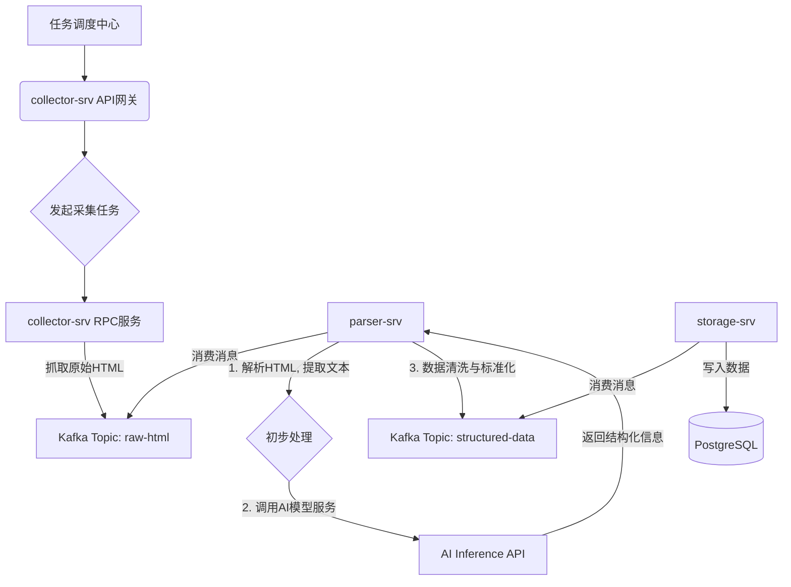

### Golang高并发编程：深入构建智能自动化数据采集微服务 (Go-zero/Chromedp实战)### 你好，我是阿亮。在医疗科技领域摸爬滚打了 8 年多，我和我的团队一直在构建和维护一系列复杂的临床研究系统。从早期的电子数据采集（EDC）到现在的 AI 驱动的智能监测平台，我们面临的一个核心挑战始终没变：如何高效、准确地获取和整合海量的外部临床研究数据。

今天，我想跟大家分享一下我们团队是如何利用 Golang 和 AI 技术，从零开始构建一个自动化临床试验信息采集和处理微服务的。这不仅仅是一个“爬虫教程”，更是我们在真实业务场景下，踩过无数坑后总结出的一套实战经验。

### 一、缘起：为什么我们需要一个“智能爬虫”？

在我们的临床试验项目管理系统（CTMS）中，一个关键功能是追踪全球范围内正在进行的临床试验动态。这些信息散落在各大公开注册中心，比如美国的 ClinicalTrials.gov、中国的“药物临床试验登记与信息公示平台”等。

最初，我们靠研究助理（RA）手动去这些网站上检索、复制、粘贴。这个过程效率极低，而且极易出错。一个试验编号（NCT ID）输错，可能导致整个项目的数据分析都跑偏。

为了解决这个问题，我们决定立项开发一个自动化的数据采集与整合系统。我们的目标很明确：
1.  **自动化**：系统能根据配置，定时抓取指定网站的试验信息。
2.  **结构化**：能从非结构化的网页文本（如“入选/排除标准”）中，智能提取出关键信息（如年龄范围、适应症、干预措施等）。
3.  **标准化**：对采集到的数据进行清洗和归一，比如将“United States”和“U.S.A”统一为“美国”，方便后续的数据分析和入库。
4.  **高可用**：整个系统必须稳定可靠，能够应对目标网站的改版和反爬策略。

选型时，我们毫不犹豫地选择了 Golang。原因很简单：
*   **并发性能**：采集任务天然适合并发执行。Go 的 Goroutine 和 Channel 机制让我们能用极低的成本轻松启动成千上万个采集任务。
*   **网络库强大**：标准库 `net/http` 非常成熟，足以应对复杂的网络请求场景。
*   **静态类型与工程化**：在处理严谨的医疗数据时，静态类型语言能帮我们避免很多低级错误。Go 的工具链和部署体验也远胜于脚本语言。

---

### 二、架构设计：从单体到微服务的演进

一开始，我们想得比较简单，写了个单体应用，把采集、解析、清洗、入库所有逻辑都放在一个项目里。但很快就遇到了瓶颈：
*   **采集模块**因为反爬被封 IP，整个应用就瘫痪了。
*   **AI 解析模块**（当时用 Cgo 调用了一个 Python 模型）特别耗费 CPU 和内存，严重影响了采集任务的性能。
*   任何一个环节的小改动，都需要整个应用重新编译部署，非常笨重。

于是，我们果断重构，转向了基于 `go-zero` 的微服务架构。`go-zero` 是一个集成了 RPC、API 网关、代码生成等功能的优秀框架，极大地提升了我们的开发效率。

我们的新架构主要包含以下几个核心服务：

1.  **`collector-srv` (采集服务)**：负责最“脏”的活，接收采集任务（比如一个 URL 列表），模拟浏览器行为抓取原始的 HTML 页面，然后将结果丢进消息队列（我们用的 Kafka）。它只做一件事：**把网页内容原封不动地搬回来**。
2.  **`parser-srv` (解析服务)**：订阅 Kafka 中的原始 HTML 数据。这是我们整个系统的“大脑”。它负责解析 HTML、调用 AI 模型提取非结构化信息、数据清洗和标准化。
3.  **`storage-srv` (存储服务)**：负责将 `parser-srv` 处理干净的结构化数据，安全地写入我们的核心数据库（PostgreSQL）。

整个数据流转过程如下图所示：



这样的架构好处非常明显：
*   **关注点分离**：每个服务职责单一，`collector-srv` 挂了不影响 `parser-srv` 处理已有的数据。
*   **弹性伸缩**：如果采集任务量巨大，我们可以独立增加 `collector-srv` 的实例数量。如果 AI 解析成为瓶颈，就增加 `parser-srv` 的实例。
*   **技术异构**：AI 模型服务我们是用 Python 的 FastAPI 搭建的，因为它有更成熟的生态。`parser-srv` 通过 HTTP/gRPC 的方式调用它，完美解耦。

---

### 三、核心实现：深入 `collector-srv` 的“脏活累活”

采集服务是所有工作的第一步，也是最容易出问题的地方。下面我分享几个关键点的 Go 实现细节。

#### 1. 构建一个生产级的 HTTP 客户端

千万不要直接用 `http.Get()`！在生产环境中，我们需要一个可精细化控制的 `http.Client`。

```go
package main

import (
	"net"
	"net/http"
	"time"
)

// NewCollectorClient 创建一个用于爬虫采集的HTTP客户端
// 为什么需要自定义？因为默认的Client没有超时设置，连接也无法复用，非常危险！
func NewCollectorClient() *http.Client {
	return &http.Client{
		// Transport是HTTP客户端的核心，所有请求都经由它处理
		Transport: &http.Transport{
			// DialContext用于建立网络连接，这里我们设置了连接超时
			DialContext: (&net.Dialer{
				Timeout:   15 * time.Second, // 建立TCP连接的超时时间
				KeepAlive: 60 * time.Second, // TCP KeepAlive时间
			}).DialContext,
			// TLSClientConfig: &tls.Config{InsecureSkipVerify: true}, // 如果目标网站证书有问题，可以打开这个，但不推荐

			MaxIdleConns:        100,              // 最大空闲连接数
			MaxIdleConnsPerHost: 20,               // 每个Host的最大空闲连接数
			IdleConnTimeout:     90 * time.Second, // 空闲连接的超时时间
			// ExpectContinueTimeout: 1 * time.Second,     // 处理 "100-continue" 状态的超时
		},
		// 整个请求的超时时间，包括连接、读取响应体等所有环节
		Timeout: 45 * time.Second,
	}
}

func main() {
    // 在你的服务初始化时，创建一个Client实例，并在整个服务生命周期内复用它。
	// 不要为每个请求都创建一个新的Client，这会导致资源浪费和性能问题。
	client := NewCollectorClient()
	
    // 使用这个client发起请求
	req, err := http.NewRequest("GET", "https://clinicaltrials.gov/", nil)
	if err != nil {
		// handle error
	}

    // 设置请求头是反爬的基础
	req.Header.Set("User-Agent", "Mozilla/5.0 (Windows NT 10.0; Win64; x64) AppleWebKit/537.36 (KHTML, like Gecko) Chrome/120.0.0.0 Safari/537.36")
	req.Header.Set("Accept-Language", "en-US,en;q=0.9")
	req.Header.Set("Referer", "https://www.google.com/")

	resp, err := client.Do(req)
    if err != nil {
        // ...
    }
    defer resp.Body.Close()
    
    // ... 读取 resp.Body
}
```
**关键点**：
*   **超时控制**：`Timeout` (整体超时) 和 `DialContext` (连接超时) 缺一不可，能防止请求无限期阻塞，耗尽系统资源。
*   **连接池**：通过 `MaxIdleConns` 和 `MaxIdleConnsPerHost` 复用 TCP 连接，大大减少了三次握手的开销，在高并发场景下性能提升巨大。
*   **请求头模拟**：`User-Agent` 是最基本的伪装。有些网站还会校验 `Referer`、`Accept-Language` 等，尽可能模拟真实浏览器的行为。

#### 2. 在 `go-zero` 中实现采集逻辑

下面我们看看如何在 `collector-srv` 中落地采集逻辑。

首先，定义 `collector.proto` 文件（或 `.api` 文件，取决于你是纯 RPC 还是提供 API）。

```protobuf
// collector.proto
syntax = "proto3";

package collector;
option go_package = "./collector";

message CrawlRequest {
  string url = 1;
  // 可以添加更多参数，如代理信息、Cookie等
}

message CrawlResponse {
  string raw_html = 1;
  int32 status_code = 2;
}

service Collector {
  rpc Crawl(CrawlRequest) returns (CrawlResponse);
}
```

然后用 `goctl` 工具生成代码框架。我们只需要在 `internal/logic/crawllogic.go` 文件中填充核心逻辑。

```go
// internal/logic/crawllogic.go
package logic

import (
	"context"
	"io"
	"net/http"
	
	"collector/internal/svc"
	"collector/collector"

	"github.com/zeromicro/go-zero/core/logx"
)

type CrawlLogic struct {
	ctx    context.Context
	svcCtx *svc.ServiceContext
	logx.Logger
}

func NewCrawlLogic(ctx context.Context, svcCtx *svc.ServiceContext) *CrawlLogic {
	return &CrawlLogic{
		ctx:    ctx,
		svcCtx: svcCtx,
		Logger: logx.WithContext(ctx),
	}
}

func (l *CrawlLogic) Crawl(in *collector.CrawlRequest) (*collector.CrawlResponse, error) {
	l.Infof("Received crawl task for URL: %s", in.Url)
	
	// 1. 创建请求
	req, err := http.NewRequestWithContext(l.ctx, "GET", in.Url, nil)
	if err != nil {
		l.Errorf("Failed to create request for %s: %v", in.Url, err)
		return nil, err
	}
	// ... 设置请求头 ...
	req.Header.Set("User-Agent", "...")

	// 2. 使用服务上下文(svcCtx)中初始化的HTTP客户端
	resp, err := l.svcCtx.CollectorHttpClient.Do(req)
	if err != nil {
		l.Errorf("Failed to execute request for %s: %v", in.Url, err)
		return nil, err
	}
	defer resp.Body.Close()

	// 3. 读取响应体
	body, err := io.ReadAll(resp.Body)
	if err != nil {
		l.Errorf("Failed to read response body for %s: %v", in.Url, err)
		return nil, err
	}
    
    // 4. 将原始HTML发送到Kafka (这里我们省略了Kafka的Producer代码)
    // l.svcCtx.KafkaProducer.SendMessage(body)
    l.Infof("Successfully crawled URL: %s, Body size: %d bytes", in.Url, len(body))

	return &collector.CrawlResponse{
		RawHtml:   string(body),
		StatusCode: int32(resp.StatusCode),
	}, nil
}
```

在 `internal/svc/servicecontext.go` 中，我们会初始化并注入那个生产级的 HTTP 客户端和 Kafka 生产者。

```go
// internal/svc/servicecontext.go
type ServiceContext struct {
	Config             config.Config
	CollectorHttpClient *http.Client
	// KafkaProducer      *kafka.Producer
}

func NewServiceContext(c config.Config) *ServiceContext {
	return &ServiceContext{
		Config:             c,
		CollectorHttpClient: NewCollectorClient(), // 调用我们之前定义的函数
		// KafkaProducer:      kafka.NewProducer(c.Kafka),
	}
}
```

这样，一个职责清晰、代码健壮的采集服务就基本成型了。

#### 3. 应对动态渲染页面

有些网站（尤其是国内的平台）大量使用 JavaScript 动态加载内容。我们用标准 `http` 库拿到的只是一个 HTML 壳子，没有实际数据。

这时候，我们就需要请出“大杀器”：**Headless Browser（无头浏览器）**。在 Go 中，`chromedp` 是一个非常优秀的库，它可以通过 Chrome DevTools Protocol 控制一个真实的 Chrome 浏览器实例。

```go
package main

import (
	"context"
	"log"
	"time"

	"github.com/chromedp/chromedp"
)

func fetchDynamicPage(url string) (string, error) {
	// 创建一个新的chromedp上下文
	ctx, cancel := chromedp.NewContext(context.Background())
	defer cancel()

	// 为上下文设置超时
	ctx, cancel = context.WithTimeout(ctx, 60*time.Second)
	defer cancel()

	var htmlContent string
	err := chromedp.Run(ctx,
		// 导航到目标URL
		chromedp.Navigate(url),
		// 等待某个关键的DOM元素出现，确保页面加载完成
		// 这里的 #trial-results 是一个假设的ID，代表试验结果列表
		chromedp.WaitVisible(`#trial-results`, chromedp.ByID),
		// 等待2秒，给一些额外的JS执行时间
		chromedp.Sleep(2*time.Second),
		// 执行JS获取渲染后的完整HTML
		chromedp.OuterHTML("html", &htmlContent),
	)

	if err != nil {
		return "", err
	}

	return htmlContent, nil
}

func main() {
	url := "https://some-js-heavy-site.com/trials"
	html, err := fetchDynamicPage(url)
	if err != nil {
		log.Fatalf("Failed to fetch dynamic page: %v", err)
	}
	log.Printf("Got HTML content of length: %d", len(html))
}
```
**权衡点**：`chromedp` 非常强大，但资源消耗也很大（毕竟背后是一个完整的浏览器）。我们只对那些必须使用 JS 渲染的“硬骨头”网站启用它，并将其部署在独立的、配置更高的服务器上。

---

### 四、`parser-srv`：AI 与规则的共舞

`parser-srv` 拿到原始 HTML 后，工作才真正开始。

1.  **HTML 解析**：我们使用 `goquery` 这个库，它的 API 和 jQuery 非常相似，可以方便地使用 CSS 选择器提取节点。

    ```go
    import "github.com/PuerkitoBio/goquery"

    doc, err := goquery.NewDocumentFromReader(strings.NewReader(rawHTML))
    if err != nil {
        // ...
    }
    
    // 提取试验标题
    title := doc.Find("h1.ct-title").Text()

    // 提取所有的入选标准
    doc.Find("#inclusion-criteria ul li").Each(func(i int, s *goquery.Selection) {
        criterion := s.Text()
        // ...
    })
    ```

2.  **调用 AI 模型服务**：对于像“入选/排除标准”这样的大段自然语言文本，简单的规则提取已经不够用了。我们需要从中抽取出**年龄（age）、疾病（disease）、肿瘤分期（tumor stage）**等实体信息。

    这部分工作，我们会调用一个由 Python FastAPI 搭建的 AI 服务。Go 负责准备数据并处理返回结果。

    ```go
    // 在parser-srv的logic中
    
    // 假设 inclusionText 是从goquery提取出的一段入选标准文本
    // "Eligible participants must be between 18 and 65 years of age, diagnosed with non-small cell lung cancer (NSCLC)."
    
    // 1. 构造请求体
    requestBody, _ := json.Marshal(map[string]string{
        "text": inclusionText,
    })
    
    // 2. 发起HTTP POST请求到AI服务
    aiServiceURL := l.svcCtx.Config.AIService.URL // 从配置中读取AI服务地址
    resp, err := http.Post(aiServiceURL+"/extract_entities", "application/json", bytes.NewBuffer(requestBody))
    // ... 错误处理 ...
    
    // 3. 解析AI服务的返回结果
    var result struct {
        Entities []struct {
            Text string `json:"text"`
            Type string `json:"type"`
        } `json:"entities"`
    }
    json.NewDecoder(resp.Body).Decode(&result)
    
    // 现在我们就拿到了结构化的实体信息
    // result.Entities -> [ {Text: "18 and 65 years", Type: "AGE_RANGE"}, {Text: "non-small cell lung cancer (NSCLC)", Type: "DISEASE"} ]
    ```

3.  **数据清洗与归一化**：AI 也不是万能的，它的输出还需要我们用规则去“修正”。

    ```go
    // 示例：标准化国家名称
    func NormalizeCountry(name string) string {
        name = strings.ToLower(strings.TrimSpace(name))
        switch name {
        case "united states", "u.s.a.", "us":
            return "USA"
        case "people's republic of china", "china":
            return "CHN"
        default:
            return strings.ToUpper(name)
        }
    }
    ```
    这类清洗规则在我们系统中积累了上百条，它们是保证数据质量的最后一道防线。

### 五、总结与反思

从最初的手工作业，到单体应用，再到现在的 Go 微服务架构，我们的临床数据采集平台走了不少弯路，但也积累了很多宝贵的经验：
1.  **架构先行**：面对复杂的、会不断变化的需求，一个设计良好、易于扩展的架构是成功的基石。微服务虽然引入了运维复杂性，但在我们这个场景下，收益远大于成本。
2.  **专业分工**：不要强求用一种语言解决所有问题。Go 负责高并发、强逻辑的后端服务，Python 负责它最擅长的 AI 模型开发与服务化，二者通过 API 协作，是最高效的组合。
3.  **日志是生命线**：在这样一个长链条的数据处理流程中，必须有完善的、结构化的日志。每一条数据，我们都记录了它的来源 URL、采集时间、处理过程中的各个版本，一旦下游发现数据问题，我们可以快速追溯到源头。
4.  **敬畏反爬**：爬虫与反爬是永恒的“猫鼠游戏”。尊重目标网站，控制采集频率，设置合理的请求头，使用代理 IP 池，这些都是工程师的基本素养。我们的目标是获取公开数据，而不是搞垮别人的网站。

希望我的这点经验，能对正在构建类似数据密集型应用的 Golang 开发者们有所启发。技术最终是为业务服务的，能用优雅的代码解决实际问题，这才是我们工程师最大的价值所在。