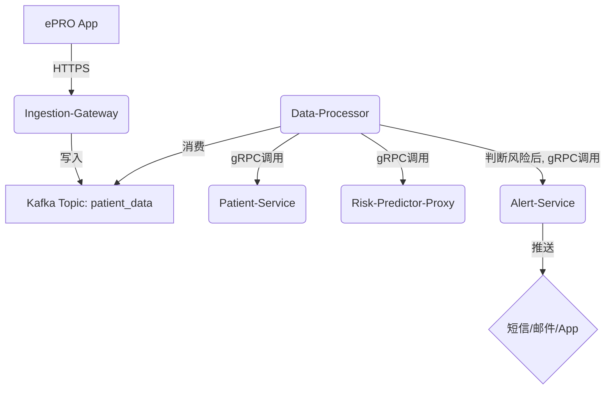

### Golang高并发：构建生产级毫秒响应系统 (协程池, gRPC微服务)### 好的，各位同学，大家好，我是阿亮。

在咱们这个行业，也就是临床医疗信息化领域，高性能和高并发已经不是一个“加分项”，而是“生命线”。今天，我想结合我们团队在构建**“临床试验智能监测系统”**时遇到的实际问题，跟大家聊聊如何用 Golang 来解决高并发场景下的数据处理和 AI 模型调用挑战。

这篇文章不是纯粹的理论堆砌，而是我们踩过坑、总结出来的实战经验。希望能帮大家把 Golang 的并发能力，真正落地到解决复杂业务问题上。

---

## **【Go高并发实战】：构建毫秒级响应的临床试验智能监测系统**

### **第一章：我们面临的挑战：从“数据洪峰”到“实时预警”**

#### **1.1 业务背景：当成百上千家医院，数万名患者同时上传数据**

想象一个场景：我们正在进行一项大型的多中心临床试验，全国有上百家医院参与，涉及数万名受试者。这些受试者需要通过手机 App（我们称之为 ePRO - 电子患者自报告结局系统）每天多次上传他们的生命体征、症状感受等数据。

在某个时间点，比如所有受试者早上 8 点服药后，系统会迎来一个巨大的流量洪峰。每秒可能有数千甚至上万条数据涌入。我们的**临床试验智能监测系统**的核心职责，就是实时接收这些数据，进行分析，并在几百毫大秒内判断是否存在“不良事件”（Adverse Event, AE）或“严重不良事件”（SAE）的风险，然后立即通知研究医生（PI）和临床监查员（CRA）。

如果系统处理延迟，哪怕只有几秒，都可能导致一次关键的医疗干预被错过，这在临床试验中是绝对不能接受的。

#### **1.2 传统架构的瓶颈：为什么 Java/Python 在这里会“力不从心”**

在我们项目的早期技术选型阶段，也评估过传统的 Java 体系。但很快发现了一些问题：

1.  **线程模型过重**：Java 每处理一个请求就可能需要一个独立的线程。面对上万的并发连接，线程的创建、销毁和上下文切换成本非常高，很快就会耗尽服务器的内存和 CPU 资源。
2.  **内存占用高**：JVM 本身的内存占用就比较大，在同样的硬件配置下，能支撑的并发数远不及 Golang。
3.  **异步编程复杂**：虽然有 Netty、CompletableFuture 等方案，但心智负担重，代码写起来容易出错，尤其是在复杂的业务逻辑链条中。

而 Golang 的出现，就像是为我们这个场景量身定做的一把“瑞士军刀”。

#### **1.3 Golang 的“杀手锏”：Goroutine 与 Channel**

Golang 的并发模型核心就是 **Goroutine**（协程）和 **Channel**（通道）。

*   **Goroutine（轻量级线程）**：你可以把它理解成一个极其轻量化的线程。创建一个 Goroutine 的初始内存开销只有 2KB 左右，而一个线程通常是 1MB。这意味着在一台普通的服务器上，我们可以轻松创建数十万甚至上百万个 Goroutine。每个患者的数据上传请求，我们都可以放心地交给一个独立的 Goroutine 去处理，而不用担心资源耗尽。
*   **Channel（数据通道）**：这是 Goroutine 之间进行通信的“管道”。它遵循“不要通过共享内存来通信，而要通过通信来共享内存”的哲学。这让我们在编写并发代码时，能极大地避免传统多线程编程中令人头疼的“锁”竞争和数据冲突问题，代码更安全、更简洁。

我们来看一个简化的例子。当系统收到一个患者数据包后，需要同时去查询这位患者的基本信息和该试验的方案（Protocol）信息，然后合并处理。

```go
package main

import (
	"fmt"
	"sync"
	"time"
)

// 模拟从数据库获取患者基本信息
func getPatientProfile(patientID string) string {
	time.Sleep(100 * time.Millisecond) // 模拟I/O延迟
	return fmt.Sprintf("Profile for patient %s", patientID)
}

// 模拟从缓存获取试验方案信息
func getTrialProtocol(trialID string) string {
	time.Sleep(120 * time.Millisecond) // 模拟I/O延迟
	return fmt.Sprintf("Protocol for trial %s", trialID)
}

func processPatientData(patientID, trialID string) {
	var wg sync.WaitGroup
	profileChan := make(chan string, 1) // 使用缓冲为1的channel
	protocolChan := make(chan string, 1)

	wg.Add(2) // 我们有两个并发任务

	// 任务一：并发获取患者信息
	go func() {
		defer wg.Done()
		profile := getPatientProfile(patientID)
		profileChan <- profile
	}()

	// 任务二：并发获取试验方案
	go func() {
		defer wg.Done()
		protocol := getTrialProtocol(trialID)
		protocolChan <- protocol
	}()

	wg.Wait() // 等待两个goroutine都执行完毕

	close(profileChan)
	close(protocolChan)

	// 从channel中取出结果
	profileResult := <-profileChan
	protocolResult := <-protocolChan

	fmt.Printf("Processing data with:\n  - %s\n  - %s\n", profileResult, protocolResult)
    // 接下来就是复杂的业务逻辑判断...
}

func main() {
	start := time.Now()
	processPatientData("P1001", "T008")
	fmt.Printf("Total processing time: %v\n", time.Since(start))
}
```

**代码讲解**：

*   **`sync.WaitGroup`**: 这是一个非常有用的同步工具，我们用它来等待一组 Goroutine 完成。`wg.Add(2)` 表示我们要等待两个任务，每个任务完成时调用 `wg.Done()`，主流程中的 `wg.Wait()` 会一直阻塞，直到计数器减到零。
*   **并发执行**: 我们用 `go func() {}()` 启动了两个 Goroutine，一个去拿患者信息，一个去拿试验方案。这两个网络请求是并行发出去的。
*   **Channel 通信**: 获取到的结果通过 `profileChan` 和 `protocolChan` 安全地传递回主流程。
*   **性能优势**: 串行执行这两个任务需要 `100ms + 120ms = 220ms`。而并发执行，总耗时取决于最慢的那个任务，也就是 `120ms` 左右。在高并发下，这种优化是指数级的。

通过这个简单的例子，你可以看到 Golang 如何用非常简洁优雅的方式，实现了高效的并发处理，这正是我们系统能够扛住“数据洪峰”的技术基石。

---

### **第二章：并发编程实战：从理论到可控的生产级代码**

理论讲完了，我们来点实际的。在生产环境中，光会用 `go` 关键字是远远不够的，我们还需要考虑并发安全、资源控制等一系列问题。

#### **2.1 并发安全：保护你的共享数据**

在我们的监测系统中，有一个全局的计数器，用来统计当天触发的“不良事件预警”总数。这个计数器会被成千上万个 Goroutine 同时访问和修改，如果不加保护，就会出现数据错乱（竞态条件）。

**错误示范：**

```go
var alertCount int

// 在多个goroutine中执行
func triggerAlert() {
    alertCount++ // 危险操作！
}
```

这个 `alertCount++` 实际上不是一个原子操作，它包含“读取-修改-写入”三个步骤，在并发环境下，多个 Goroutine 的这三步操作会交错执行，导致最终结果远小于预期。

**正确做法一：使用互斥锁（`sync.Mutex`）**

当我们需要保护一段比较复杂的逻辑代码块时，互斥锁是首选。

```go
var (
	alertCount int
	mu         sync.Mutex
)

func triggerAlert() {
	mu.Lock()         // 加锁
	defer mu.Unlock() // 确保函数退出时解锁，即使发生panic
	
	// --- 临界区开始 ---
	alertCount++
	// 可能还有其他复杂操作，比如写入日志、更新缓存等
	// --- 临界区结束 ---
}
```
*   **`mu.Lock()`**: 在进入“临界区”（需要保护的代码段）前获取锁。如果锁已被其他 Goroutine 持有，当前 Goroutine 会阻塞等待。
*   **`defer mu.Unlock()`**: 这是 Golang 的一个黄金实践。`defer` 语句会确保在函数返回前执行 `mu.Unlock()`，极大地避免了忘记解锁导致的死锁问题。

**正确做法二：使用原子操作（`sync/atomic`）**

如果只是对一个简单的数值变量进行增减操作，使用 `atomic` 包会比互斥锁性能更高，因为它利用了 CPU 级别的原子指令，避免了加锁带来的上下文切换开销。

```go
import "sync/atomic"

var alertCount int64 // 原子操作通常要求是特定类型，如 int32, int64

func triggerAlertAtomic() {
	atomic.AddInt64(&alertCount, 1) // 原子地+1
}

func getAlertCount() int64 {
	return atomic.LoadInt64(&alertCount) // 原子地读取
}
```
**小结：**

| 工具 | 适用场景 | 性能开销 |
| :--- | :--- | :--- |
| `sync.Mutex` | 保护一段代码逻辑（临界区），操作复杂 | 中等 |
| `sync/atomic` | 对单一基础类型变量（如int, pointer）的简单操作 | 低 |

在我们的项目中，简单的计数器用 `atomic`，而当触发预警需要同时更新数据库和缓存等多个操作时，则用 `Mutex` 来保证事务的原子性。

#### **2.2 资源控制：无节制的 Goroutine 是魔鬼**

我们曾经犯过一个错误：每来一个数据处理请求，就直接 `go process()`。在流量平稳时没问题，但一次流量高峰，瞬间启动了几十万个 Goroutine，导致服务器内存飙升，调度器压力巨大，GC（垃圾回收）频繁，整个系统响应变得极慢，甚至 OOM（内存溢出）。

这就是“Goroutine 泄露”或滥用的典型后果。解决方案是引入**协程池**。

协程池的核心思想是：**复用一定数量的 Goroutine 来处理无限的任务**。这样就把并发数控制在一个可预见的范围内，保护了系统资源。

下面是一个我们内部使用的、经过简化的协程池实现：

```go
package main

import (
	"fmt"
	"sync"
	"time"
)

// Task 定义了我们要在协程池中执行的任务
type Task struct {
	ID      int
	Execute func()
}

// Pool 是我们的协程池
type Pool struct {
	taskQueue chan *Task
	wg        sync.WaitGroup
}

// NewPool 创建一个协程池
// size: 池中 worker (goroutine) 的数量
// queueSize: 任务队列的缓冲大小
func NewPool(size, queueSize int) *Pool {
	p := &Pool{
		taskQueue: make(chan *Task, queueSize),
	}

	p.wg.Add(size)
	for i := 0; i < size; i++ {
		go p.worker(i + 1)
	}

	return p
}

// worker 是真正干活的goroutine
func (p *Pool) worker(workerID int) {
	defer p.wg.Done()
	fmt.Printf("Worker %d started\n", workerID)
	// 不断地从任务队列中取任务并执行
	for task := range p.taskQueue {
		fmt.Printf("Worker %d processing task %d\n", workerID, task.ID)
		task.Execute()
	}
	fmt.Printf("Worker %d stopped\n", workerID)
}

// AddTask 向协程池提交任务
func (p *Pool) AddTask(task *Task) {
	p.taskQueue <- task
}

// Shutdown 关闭协程池，等待所有任务完成
func (p *Pool) Shutdown() {
	close(p.taskQueue) // 关闭channel，worker们会退出循环
	p.wg.Wait()        // 等待所有worker都执行完毕
}

func main() {
	// 创建一个包含3个worker，任务队列容量为10的协程池
	pool := NewPool(3, 10)

	// 模拟提交10个任务
	for i := 0; i < 10; i++ {
		taskID := i
		pool.AddTask(&Task{
			ID: taskID,
			Execute: func() {
				// 模拟耗时任务
				time.Sleep(500 * time.Millisecond)
				fmt.Printf("Task %d finished\n", taskID)
			},
		})
	}

	fmt.Println("All tasks submitted. Shutting down...")
	pool.Shutdown()
	fmt.Println("Pool shutdown complete.")
}
```

**代码讲解**:

1.  **`Pool` 结构体**: 包含一个任务队列 `taskQueue`（一个 channel）和一个 `WaitGroup`。
2.  **`NewPool`**: 初始化时，创建了指定数量的 `worker` Goroutine。这些 worker 启动后就处于待命状态，等着从 `taskQueue` 拿任务。
3.  **`worker` 方法**: 它的核心是一个 `for range p.taskQueue` 循环。只要 channel `taskQueue` 没被关闭且里面有任务，它就会取出任务执行。当 channel 被关闭且里面的任务都被取完后，循环结束，worker Goroutine 优雅退出。
4.  **`AddTask`**: 外部通过这个方法把任务丢进任务队列。如果队列满了，这里会阻塞，这本身也起到了一种反压（Backpressure）的作用，防止任务提交过快。
5.  **`Shutdown`**: 先 `close(p.taskQueue)`，这会给所有 worker 一个信号：“别等了，没新任务了，干完手里的活就下班吧”。然后 `p.wg.Wait()` 确保所有 worker 都安全退出了。

在我们的实际项目中，协程池的大小会根据服务的 CPU 核心数和任务类型（CPU密集型 vs IO密集型）进行动态配置。这套机制，是保障我们系统7x24小时稳定运行的关键。

---

### **第三章：AI 模型集成：当 Golang 遇上 Python**

我们的智能监测系统，最核心的一环是调用一个用 Python (TensorFlow/PyTorch) 训练好的风险预测模型。这个模型会根据患者上传的各项指标，预测未来 24 小时内发生严重不良事件（SAE）的概率。

这就带来了一个典型的问题：**Golang 服务如何高效、稳定地调用 Python 模型？**

我们排除了直接在 Go 里用 Cgo 跑 Python 的方案（部署和维护太复杂），最终选择了微服务架构，通过 **gRPC** 进行跨语言通信。

#### **3.1 为什么是 gRPC？**

| 通信方式 | 优点 | 缺点 |
| :--- | :--- | :--- |
| **REST (JSON)** | 简单、易懂、调试方便 | 性能较低（JSON解析慢），文本协议冗余 |
| **gRPC (Protobuf)** | **性能极高**（Protobuf二进制序列化），**强类型**，支持双向流 | 稍微复杂，需要定义`.proto`文件并生成代码 |

对于我们这种内部服务间的高频调用，性能是第一位的。gRPC 带来的性能提升非常显著，单次调用的延迟比 RESTful API 低 30%-50%。

#### **3.2 实战：用 Go-Zero 构建 gRPC 客户端**

在我们的微服务体系中，所有服务都是基于 `go-zero` 框架构建的。`go-zero` 集成了服务发现、负载均衡、限流熔断等一系列微服务治理能力，并且对 gRPC 有着非常好的支持。

**第一步：定义 Protobuf 文件**

我们需要先定义服务和消息的契约。

`risk_prediction.proto`:
```protobuf
syntax = "proto3";

package prediction;

option go_package = "./prediction";

// 定义请求消息体
message PredictionRequest {
  string patient_id = 1;
  map<string, float> features = 2; // 患者的特征数据，如{"hr": 75.0, "bp": 120.5}
}

// 定义响应消息体
message PredictionResponse {
  string patient_id = 1;
  float probability = 2; // 预测出的SAE概率
}

// 定义服务
service RiskPredictor {
  rpc Predict(PredictionRequest) returns (PredictionResponse);
}
```

**第二步：在 Python 端实现 gRPC 服务**

Python 端需要用 `grpcio` 库来启动一个 gRPC server，加载模型，并实现 `Predict` 方法。这里不展开 Python 代码，但核心就是接收请求，调用模型，返回结果。

**第三步：在 Go 端（go-zero）调用 Python 服务**

`go-zero` 让我们调用 gRPC 服务变得非常简单。首先，`goctl` 工具会根据 `.proto` 文件帮我们生成客户端代码。

在我们的业务 `logic` 文件中，调用代码大致如下：

`internal/logic/dataprocesslogic.go`:
```go
package logic

import (
	"context"

	"clinical-trial/internal/svc"
	"clinical-trial/internal/types"
    // 引入 goctl 生成的客户端包
	"clinical-trial/rpc/prediction/riskpredictor" 

	"github.com/zeromicro/go-zero/core/logx"
)

type DataProcessLogic struct {
	logx.Logger
	ctx    context.Context
	svcCtx *svc.ServiceContext
}

// ... NewDataProcessLogic 等方法 ...

func (l *DataProcessLogic) Process(req *types.PatientDataReq) (*types.ProcessResp, error) {
	// 1. 在这里进行一系列数据清洗和转换...
	// ...
    // 假设我们已经把数据整理成了模型需要的 feature map
	features := map[string]float32{
		"heart_rate": req.HeartRate,
		"blood_pressure_systolic": req.BPS,
        // ... 其他特征
	}


	// 2. 调用 Python 的 AI 模型服务
	// l.svcCtx.RiskPredictor 是在 ServiceContext 中初始化的 gRPC 客户端
	resp, err := l.svcCtx.RiskPredictor.Predict(l.ctx, &riskpredictor.PredictionRequest{
		PatientId: req.PatientID,
		Features:  features,
	})

	if err != nil {
		logx.Errorf("Failed to call risk predictor for patient %s: %v", req.PatientID, err)
		// 错误处理，可能需要重试或标记为失败
		return nil, err
	}
    
    // 3. 根据模型返回的概率进行业务判断
    probability := resp.Probability
    if probability > l.svcCtx.Config.RiskThreshold {
        // 触发预警逻辑...
        logx.Infof("High risk detected for patient %s, probability: %.4f", req.PatientID, probability)
    }

	return &types.ProcessResp{Success: true}, nil
}
```

**代码讲解**:

*   **`ServiceContext`**: 在 `go-zero` 中，`svc.ServiceContext` 是一个非常重要的结构体，我们把各种依赖（比如数据库连接、Redis 客户端、RPC 客户端）都放在这里，由框架在启动时统一初始化，然后在 `logic` 中通过 `l.svcCtx` 使用。
*   **`l.svcCtx.RiskPredictor.Predict(...)`**: 这一行就是 RPC 调用的核心。它看起来就像调用一个本地函数一样简单，`go-zero` 在底层已经帮我们处理了连接、负载均衡、错误处理等所有复杂细节。
*   **`context.Context`**: 注意 `Predict` 方法的第一个参数 `l.ctx`。在微服务调用链中，`context` 扮演着至关重要的角色，它可以传递请求级别的元数据（如 `trace_id` 用于链路追踪）、超时控制和取消信号。

通过这种方式，我们成功地将 Golang 的高并发处理能力和 Python 的强大 AI 生态结合在了一起，各司其职，构建了一个健壮、高效的智能监测系统。

---

### **第四章：架构设计：从单体到高可用的微服务集群**

随着业务越来越复杂，我们的系统也从一个单一的应用演变成了一套完整的微服务体系。这套体系的设计目标是：高可用、可扩展、易维护。

#### **4.1 微服务拆分：职责单一原则**

我们根据业务领域，将系统拆分成了几个核心服务：

*   **`Ingestion-Gateway` (API 网关, go-zero)**: 负责接收所有来自 ePRO App 的数据，进行认证、参数校验和限流，然后通过 Kafka 消息队列将数据异步地发送给后端处理。这是抵御流量洪峰的第一道防线。
*   **`Data-Processor` (数据处理服务, go-zero)**: 消费 Kafka 中的原始数据，进行清洗、转换，并调用其他服务完成业务逻辑。这是我们的核心业务服务。
*   **`Patient-Service` (患者服务, go-zero)**: 维护患者的基本信息、入组信息等，提供 gRPC 接口供其他服务调用。
*   **`Risk-Predictor-Proxy` (AI代理服务, go-...哦不，这个是 Python 写的)**: 就是我们前面提到的 Python AI 模型服务。
*   **`Alert-Service` (预警服务, go-zero)**: 当 `Data-Processor` 判断出风险后，会调用此服务，通过短信、邮件、App 推送等方式通知相关人员。

**数据流转图**:



#### **4.2 缓存的力量：用 Redis 和本地缓存加速**

在我们的系统中，有些数据是“读多写少”的，比如患者的基本信息、试验方案的配置等。每次都去查数据库，在高并发下会把数据库拖垮。因此，我们引入了多级缓存策略：

1.  **本地缓存 (In-Memory Cache)**: 我们使用了 `go-cache` 这个库，在每个服务实例的内存中缓存了最热的数据。访问内存的速度是纳秒级的，这是最快的一级缓存。但它的问题是容量有限，且多实例间数据不一致。
2.  **分布式缓存 (Redis)**: Redis 作为我们的二级缓存。当本地缓存未命中时，会去查询 Redis。所有服务实例共享同一个 Redis 集群，保证了数据的一致性。

**缓存读取逻辑**:

```
function getPatient(patientID):
  // 1. 查本地缓存
  data = localCache.Get(patientID)
  if data is not nil:
    return data

  // 2. 查 Redis
  data = redis.Get("patient:" + patientID)
  if data is not nil:
    localCache.Set(patientID, data, 5 * time.Minute) // 写回本地缓存
    return data

  // 3. 查数据库 (回源)
  data = database.Query("SELECT * FROM patients WHERE id = ?", patientID)
  if data is found:
    redis.Set("patient:" + patientID, data, 24 * time.Hour) // 写回 Redis
    localCache.Set(patientID, data, 5 * time.Minute)      // 写回本地缓存

  return data
```
这种“旁路缓存模式”（Cache-Aside Pattern）是业界最经典、最常用的缓存策略。

#### **4.3 系统稳定性：限流、熔断与降级**

在微服务架构中，一个服务的故障可能会像多米诺骨牌一样，导致整个系统雪崩。`go-zero` 框架内置了强大的自适应限流和熔断机制，我们只需要在服务的配置文件中简单配置即可。

`data-processor.yaml`:
```yaml
# ...
RpcClient:
  Etcd:
    Hosts:
    - 127.0.0.1:2379
    Key: riskpredictor.rpc
  NonBlock: true # 开启熔断

# 全局中间件配置
Middlewares:
  Stat: true
  Prometheus: true
  Breaker: true # 开启自适应熔断
```

*   **限流 (Rate Limiting)**: 在 API 网关层，我们配置了令牌桶算法的限流器。比如，限制单个 IP 每秒最多请求 10 次，单个用户最多提交 30 次数据。这能有效防止恶意攻击和程序 bug 导致的流量异常。
*   **熔断 (Circuit Breaking)**: 如果 `Data-Processor` 调用 `Risk-Predictor-Proxy` 时，发现后者在一段时间内（比如5秒）的错误率超过了 50%，`go-zero` 的熔断器就会“跳闸”（open）。在接下来的一个时间窗口内（比如30秒），所有对 `Risk-Predictor-Proxy` 的调用都会立即失败并返回一个默认错误，而不会再发起真正的网络请求。这给了下游服务恢复的时间，也保护了上游服务不被慢请求或错误请求拖垮。
*   **降级 (Degradation)**: 当熔断发生时，我们可以选择执行一个“降级”逻辑。比如，AI 模型服务不可用时，我们可以暂时跳过 AI 预测，只基于一些简单的规则进行预警，虽然不那么智能，但保证了核心功能的可用性。

#### **4.4 部署：拥抱容器化和 K8s**

我们所有的服务都被打包成了 Docker 镜像，部署在公司的 Kubernetes (K8s) 集群上。

*   **Docker**: 解决了“在我电脑上明明是好的”这种经典问题，保证了开发、测试、生产环境的一致性。
*   **Kubernetes**: 自动化了服务的部署、扩缩容和运维。
    *   **弹性伸缩**: 我们可以配置 HPA (Horizontal Pod Autoscaler)，让 K8s 根据 CPU 或内存使用率自动增加或减少服务的实例数量。比如，在每天早上 8 点的数据上报高峰期到来前，K8s 会自动把 `Data-Processor` 服务的 Pod 从 3 个扩容到 10 个，高峰过后又自动缩减回去，极大地节约了成本。
    *   **自愈能力**: 如果某个服务的 Pod 挂掉了，K8s 会立刻发现并重新拉起一个新的，实现了服务的自愈。

---

### **第五章：总结与思考**

回顾我们构建这套系统的历程，Golang 无疑是成功的关键。它简洁的语法、超凡的并发性能、以及背后强大的 `go-zero` 等生态工具，让我们能够专注于业务逻辑，快速构建出一个能够承载医疗级别高并发、高可用需求的复杂系统。

对于正在学习或者使用 Golang 的同学，我的建议是：

1.  **打好并发基础**: 深入理解 `goroutine`、`channel`、`select` 和 `sync` 包。这是 Golang 的精髓，也是你写出高性能代码的基石。
2.  **掌握一个好框架**: 像 `go-zero` 或 `Gin` 这样的框架，能帮你解决工程化中的大量重复问题。不要重复造轮子，站在巨人的肩膀上。
3.  **实践出真知**: 理论学得再多，不如亲手写一个有挑战性的项目。可以从一个简单的 API 服务开始，逐步给它加上并发处理、缓存、数据库交互等功能。
4.  **关注可观测性**: 在生产环境中，日志（`logx`）、监控（Prometheus）、链路追踪（OpenTelemetry）是你的“眼睛”。没有它们，系统上线后就等于“裸奔”。

医疗信息化是一个充满挑战但也极具价值的领域。用技术守护生命，我相信这是我们每个技术人都能为之奋斗的目标。希望今天的分享能对大家有所启发。

谢谢大家。