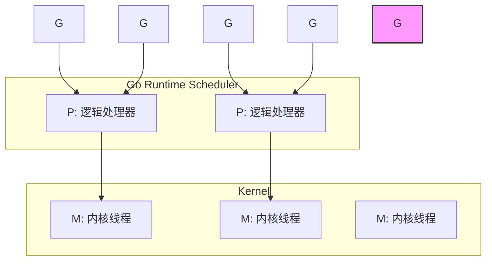
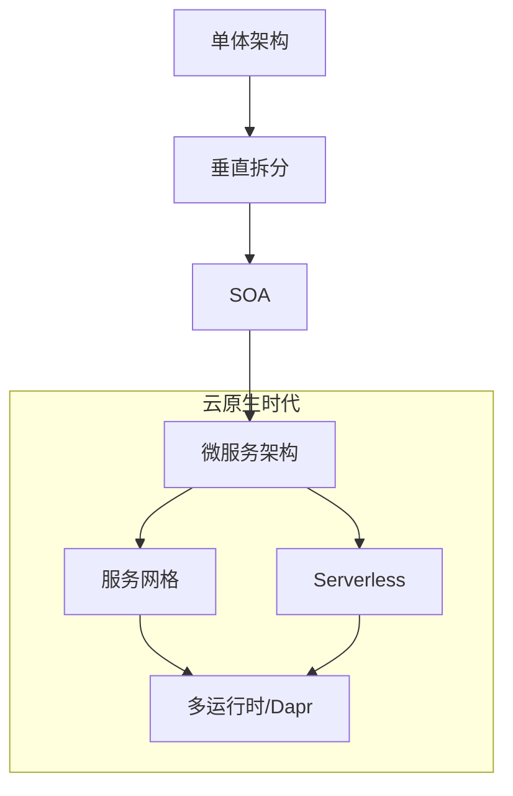

### **【Go项目实战案例解析】：以Go语言之道，构建电商高并发架构**


-----

### **引言：为什么选择Go来应对高并发挑战？**

在“双11”、“618”这样的数字洪流中，电商系统的稳定性、性能和一致性面临着极致的考验。传统的架构模式在应对数十上百倍的瞬时流量时，往往显得力不从心。本文将深入探讨电商高并发架构设计的核心要点，但我们将从一个独特的视角出发——**Go语言的视角**。

Go语言天生就是为网络和并发而生的。它的`goroutine`轻量级并发模型、`channel`的通信哲学以及简洁高效的工具链，为我们构建高性能、高可用、易于维护的分布式系统提供了无与伦-比的武器。让我们一起，用Go的思维，重新武装我们的架构设计。

-----

### **第一章：高并发之基石：Go语言的并发模型**

#### **1.1 Goroutine：比线程更轻、更快的并发单元**

高并发的本质是“同时处理大量任务”。传统多线程模型下，每个线程都是一个昂贵的内核资源，内存占用大（通常为MB级别），上下文切换开销高。这限制了系统能创建的线程数量，从而限制了并发能力。

Go语言给出了一个颠覆性的答案：`goroutine`。

* **轻量**：一个goroutine初始栈大小仅为2KB，可以在一个进程中轻松创建数十万甚至上百万个。
* **高效**：goroutine的调度由Go运行时在用户态完成，切换成本远低于线程。

**告别 `time.Sleep`：正确的Goroutine同步**

原文中等待goroutine的示例使用了`time.Sleep`，这在生产环境中是不可靠的，因为它无法保证goroutine一定能执行完毕。正确的做法是使用`sync.WaitGroup`。

```go
package main

import (
	"fmt"
	"sync"
)

func sayHello(wg *sync.WaitGroup) {
	defer wg.Done() // 任务完成，计数器减一
	fmt.Println("Hello from Goroutine")
}

func main() {
	var wg sync.WaitGroup // 创建一个等待组
	wg.Add(1)             // 启动一个goroutine，计数器加一

	go sayHello(&wg)

	fmt.Println("Hello from main")
	wg.Wait() // 阻塞等待，直到所有goroutine完成（计数器归零）
}
```

**架构师点评**：`sync.WaitGroup`是Go中最基本也是最重要的同步原语之一。它清晰地表达了“等待一组并发任务完成”的意图，是保证主流程与子任务正确协同的关键。

#### **1.2 G-P-M模型：Go并发调度之魂**

Goroutine之所以高效，离不开其背后的GPM调度模型。

* **G (Goroutine)**：我们的并发任务单元。
* **P (Processor)**：逻辑处理器，是G和M之间的调度上下文。P的数量默认等于CPU核心数。
* **M (Machine/Thread)**：系统内核线程，是真正执行代码的实体。

**流程简述**：
Go的调度器将G们公平地分配给P，再由P将G调度到M上执行。当一个G发生系统调用等阻塞操作时，调度器会将P与其M分离，并为P寻找另一个空闲的M来继续执行队列中的其他G。这种机制最大化地利用了CPU资源，避免了因单个任务阻塞而导致整个线程被挂起。



#### **1.3 CSP模型：优雅的数据同步之道**

Go语言推崇 **“不要通过共享内存来通信，而要通过通信来共享内存”**。这便是CSP（Communicating Sequential Processes）模型的核心，其在Go中的具象化实现就是`channel`（通道）。

相比于锁（`sync.Mutex`）这种“悲观”的、强制性的同步机制，channel提供了一种“乐观”的、流式的编排方式。

**优化订单处理流程：用Channel编排任务**

原文的`processOrder`示例展示了并发思想，但我们可以用channel让其结构更清晰，控制流更明确。

```go
package main

import (
	"fmt"
	"time"
)
// OrderResult 封装了订单处理的结果
type OrderResult struct {
	OrderID string
	Success bool
	Message string
}

// processOrder 启动一个goroutine处理订单，并通过channel返回结果
func processOrder(orderID string) <-chan OrderResult {
	resultChan := make(chan OrderResult, 1) // 使用带缓冲的channel避免阻塞

	go func() {
		defer close(resultChan) // 处理完毕后关闭channel

		// 1. 扣减库存
		if err := deductStock(orderID); err != nil {
			resultChan <- OrderResult{OrderID: orderID, Success: false, Message: "库存扣减失败"}
			return
		}

		// 2. 支付处理
		if err := chargePayment(orderID); err != nil {
			resultChan <- OrderResult{OrderID: orderID, Success: false, Message: "支付失败"}
			return
		}

		// 3. 所有步骤成功
		resultChan <- OrderResult{OrderID: orderID, Success: true, Message: "订单处理成功"}
	}()

	return resultChan // 立即返回一个channel，调用者可以用它来接收未来的结果
}

func deductStock(orderID string) error {
	fmt.Printf("订单[%s]: 正在扣减库存...\n", orderID)
	time.Sleep(50 * time.Millisecond)
	return nil
}

func chargePayment(orderID string) error {
	fmt.Printf("订单[%s]: 正在处理支付...\n", orderID)
	time.Sleep(50 * time.Millisecond)
	return nil
}

func main() {
	orderIDs := []string{"A001", "B002", "C003"}
	resultChannels := make([]<-chan OrderResult, len(orderIDs))

	// 并发处理所有订单
	for i, id := range orderIDs {
		resultChannels[i] = processOrder(id)
	}

	// 等待并收集所有订单的处理结果
	for _, ch := range resultChannels {
		result := <-ch
		fmt.Printf("结果: %s, 成功: %v, 信息: %s\n", result.OrderID, result.Success, result.Message)
	}
}
```

**架构师点评**：

* **Future/Promise模式**：`processOrder`函数立即返回一个channel，这个channel就像一个“未来的凭证”，调用者可以在需要的时候等待并获取结果。这与Java的`CompletableFuture`思想异曲同工，但在Go中实现得更轻量、更自然。
* **明确的生命周期**：通过`defer close(resultChan)`，我们清晰地管理了并发任务的生命周期，channel的关闭也成为了一个明确的“完成”信号。

-----

### **第二章：系统解耦与高可用架构**

解耦和高可用是现代分布式系统的两大支柱。我们将探讨如何利用Go和成熟的中间件，构建一个松耦合、高韧性的系统。

#### **2.1 异步消息：模块间的“缓冲带”**

商品、订单、支付、搜索等模块间的数据同步，绝不能采用同步RPC调用的“强绑定”模式。消息队列（MQ）是实现它们之间异步通信、削峰填谷的最佳选择。

**Go语言实战：使用RabbitMQ发布商品更新事件**
原文的Java示例很好地表达了思想。现在，我们用Go和RabbitMQ来实现它，并构建一个更完整的生产者。

```go
package main

import (
	"context"
	"encoding/json"
	"log"
	"time"

	"github.com/rabbitmq/amqp091-go"
)

// ProductUpdateEvent 封装事件结构
type ProductUpdateEvent struct {
	ProductID int64     `json:"product_id"`
	Timestamp time.Time `json:"timestamp"`
}

// MQPublisher 负责消息发布
type MQPublisher struct {
	conn *amqp091.Connection
}

// NewMQPublisher 创建一个新的发布者实例
func NewMQPublisher(amqpURL string) (*MQPublisher, error) {
	conn, err := amqp091.Dial(amqpURL)
	if err != nil {
		return nil, err
	}
	return &MQPublisher{conn: conn}, nil
}

// SendProductUpdateMessage 发布商品更新消息
func (p *MQPublisher) SendProductUpdateMessage(productID int64) error {
	ch, err := p.conn.Channel()
	if err != nil {
		return err
	}
	defer ch.Close()

	// 声明一个durable（持久化）的队列，确保MQ重启后队列不丢失
	q, err := ch.QueueDeclare(
		"product_update", // queue name
		true,             // durable
		false,            // delete when unused
		false,            // exclusive
		false,            // no-wait
		nil,              // arguments
	)
	if err != nil {
		return err
	}

	// 构造消息
	event := ProductUpdateEvent{ProductID: productID, Timestamp: time.Now()}
	body, err := json.Marshal(event)
	if err != nil {
		return err
	}

	ctx, cancel := context.WithTimeout(context.Background(), 5*time.Second)
	defer cancel()

	// 发布消息，并设置为持久化
	err = ch.PublishWithContext(ctx,
		"",     // exchange
		q.Name, // routing key
		false,  // mandatory
		false,  // immediate
		amqp091.Publishing{
			ContentType:  "application/json",
			Body:         body,
			DeliveryMode: amqp091.Persistent, // 保证消息持久化
		})
	if err != nil {
		return err
	}

	log.Printf(" [x] Sent message for product ID %d", productID)
	return nil
}

// Close closes the connection
func (p *MQPublisher) Close() {
	if p.conn != nil {
		p.conn.Close()
	}
}
```

**架构师点评**：

* **持久化**：`durable=True`和`DeliveryMode: amqp091.Persistent`是保证系统可靠性的关键。它告诉RabbitMQ，即使服务器宕机重启，这条消息也不能丢失。
* **上下文控制**：`PublishWithContext`允许我们为操作设置超时，防止因网络问题导致程序无限期阻塞，这是构建健壮Go程序的标准实践。

#### **2.2 数据高可用：从运维到应用**

数据层的高可用是系统的最后一道防线。

* **主从复制**：原文的MySQL `CHANGE MASTER TO`是DBA的工作。作为应用开发者，我们的Go程序需要感知这种架构。通过在配置中区分读、写数据源，将所有写请求路由到主库，将读请求分发到一个或多个从库，可以极大提升系统的读性能和可用性。

* **Raft与Go**：Raft共识算法已成为分布式一致性的事实标准。值得骄傲的是，Go语言是实现Raft算法的“故乡”，Etcd, Consul, TiDB, CockroachDB 等一系列伟大的分布式系统，其核心都由Go驱动。这得益于Go清晰的并发模型和强大的网络库，使得实现这类复杂协议变得相对容易。

-----

### **第三章：高并发优化核心实战**

#### **3.1 原子操作：根治库存超卖**

超卖的根源在于“读取库存 -\> 计算新库存 -\> 写入新库存”这三步操作非原子。Redis的单线程模型为我们提供了执行原子操作的绝佳场所。

**Go语言实战：使用 `go-redis` 保证原子性**
原文的Lua脚本方案非常通用且强大。在Go中，我们可以将其封装起来，或者在简单场景下使用Redis的原生原子命令。

```go
package main

import (
	"context"
	"fmt"
	"github.com/redis/go-redis/v9"
)

var ctx = context.Background()

// decrementStockInLua 使用Lua脚本，将“读-判断-写”封装为原子操作
func decrementStockInLua(rdb *redis.Client, productKey string) (int64, error) {
	script := `
        if redis.call('exists', KEYS[1]) == 0 then
            return -2 -- -2 表示库存不存在
        end
        local stock = tonumber(redis.call('get', KEYS[1]))
        if stock > 0 then
            return redis.call('decr', KEYS[1])
        else
            return -1 -- -1 表示库存不足
        end
    `
	res, err := rdb.Eval(ctx, script, []string{productKey}).Result()
	if err != nil {
		return 0, err
	}
	return res.(int64), nil
}

func main() {
	rdb := redis.NewClient(&redis.Options{Addr: "localhost:6379"})
	productKey := "product:1001:stock"

	// 初始化库存
	rdb.Set(ctx, productKey, 5, 0)

	stock, err := decrementStockInLua(rdb, productKey)
	if err != nil {
		fmt.Println("Error:", err)
	} else {
		switch stock {
		case -2:
			fmt.Println("库存记录不存在")
		case -1:
			fmt.Println("库存不足")
		default:
			fmt.Printf("扣减成功，剩余库存: %d\n", stock)
		}
	}
}
```

#### **3.2 分布式锁：跨节点的资源协调**

当Go服务以集群模式部署时，我们需要一个“全局锁”来协调对共享资源的访问。Redis是实现分布式锁的常用选择。

**Go语言实战：一个更安全的Redis分布式锁**
一个健壮的分布式锁必须满足：**互斥性**、**防死锁**（通过过期时间）、**防误删**（锁的值必须唯一）。

```go
package main

import (
	"context"
	"github.com/google/uuid"
	"github.com/redis/go-redis/v9"
	"time"
)

var ctx = context.Background()

// acquireLock 尝试获取锁
func acquireLock(rdb *redis.Client, lockKey string, expiration time.Duration) (string, bool) {
	uniqueID := uuid.New().String()
	// 使用SetNX命令，原子地设置key。如果key已存在，则失败。
	// Go-redis的SetNX方法返回一个bool值表示是否成功
	ok, err := rdb.SetNX(ctx, lockKey, uniqueID, expiration).Result()
	if err != nil || !ok {
		return "", false
	}
	return uniqueID, true
}

// releaseLock 释放锁
func releaseLock(rdb *redis.Client, lockKey, uniqueID string) bool {
	// 使用Lua脚本保证“读-比-删”的原子性，防止误删他人的锁
	script := `
        if redis.call("get", KEYS[1]) == ARGV[1] then
            return redis.call("del", KEYS[1])
        else
            return 0
        end
    `
	res, err := rdb.Eval(ctx, script, []string{lockKey}, uniqueID).Result()
	if err != nil {
		return false
	}
	return res.(int64) == 1
}
```


* **原子性是灵魂**：获取锁使用`SetNX`带过期参数的原子命令，释放锁使用Lua脚本，都是为了保证操作的原子性。
* **唯一ID是身份**：`uniqueID`确保了“谁加的锁，就由谁来解”，避免了因业务处理超时，锁自动过期后，前一个请求回来错误地释放了后一个请求的锁。

-----

### **第四章：架构演进与Go的未来**

软件架构的演进永无止境，从单体到微服务，再到服务网格和Serverless。Go语言在这一波澜壮阔的浪潮中，始终扮演着关键角色。

* **微服务**：Go编译出的静态单二进制文件、极小的内存占用和飞快的启动速度，使其成为构建微服务的理想语言。部署极其简单，资源消耗极低。
* **服务网格 (Service Mesh)**：Istio, Linkerd等主流服务网格的数据平面代理（如Envoy）或控制平面组件，越来越多地采用Go编写，看中的正是其在网络编程和并发处理上的卓越性能。
* **云原生与Serverless**：Go是云原生时代的“C语言”。Docker、Kubernetes、Prometheus、Etcd... 整个云原生生态的基石几乎都由Go构建。在Serverless领域，Go的冷启动速度远超Java/Python等解释型语言，使其成为AWS Lambda、Google Cloud Functions等平台的宠儿，能为用户节省大量成本并提供极致的弹性。

**架构演进趋势图**



### **结论**

高并发架构设计是一个复杂的系统工程，但Go语言为我们提供了一套简洁而强大的工具集。通过深入理解并善用`goroutine`的轻量并发、`channel`的优雅同步，结合成熟的中间件和设计模式，我们可以构建出既能抵御流量洪峰，又易于维护和演进的现代化电商系统。未来，随着云原生技术的不断深化，Go语言必将在构建下一代分布式应用中扮演更加核心的角色。