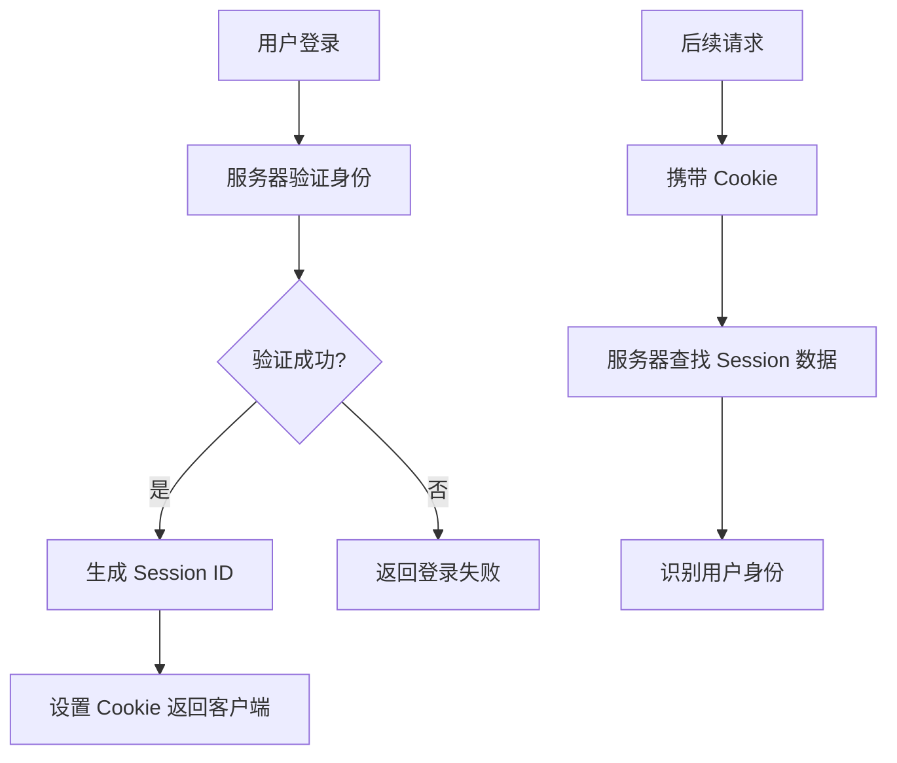
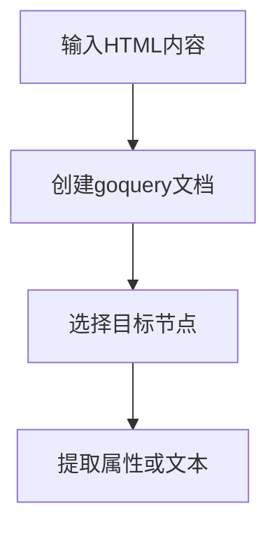
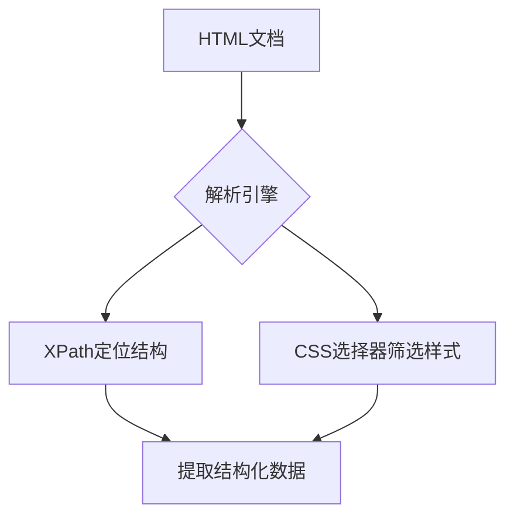
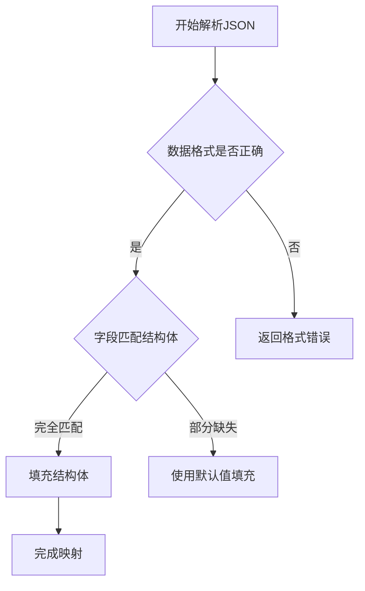
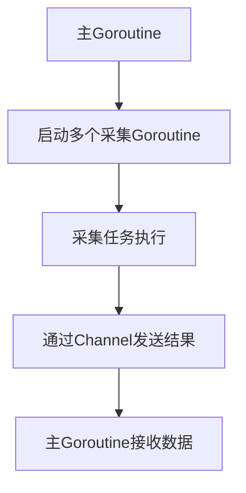
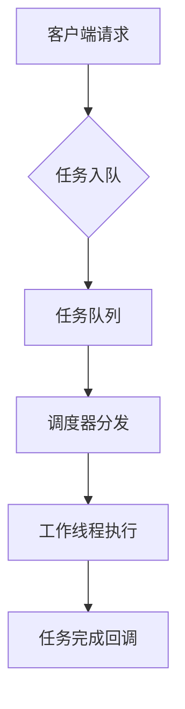
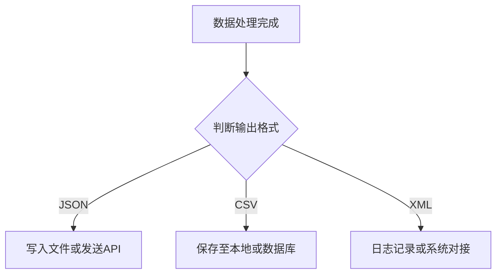
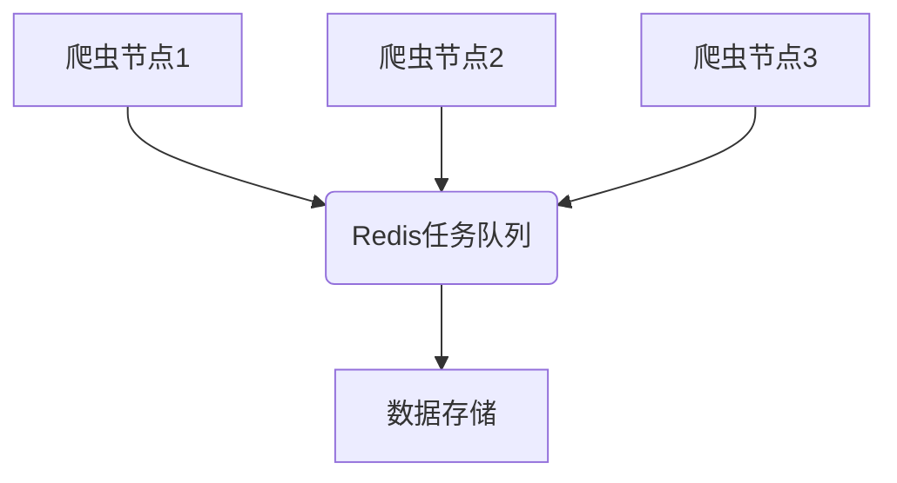

# golang实现高效网络爬虫

## 第一章: Go语言爬虫开发环境搭建

Go语言中常用的爬虫库包括 `net/http` 用于发起请求，`goquery` 用于HTML解析。使用以下命令安装：

```bash
go get github.com/PuerkitoBio/goquery
```


随后可在代码中导入并使用。

### 一个简单的HTTP请求示例

以下是一个使用Go发起GET请求并打印响应状态码的示例：

```go
package main

import (
    "fmt"
    "net/http"
)

func main() {
    resp, err := http.Get("https://example.com")
    if err != nil {
        panic(err)
    }
    defer resp.Body.Close()

    fmt.Println("Status Code:", resp.StatusCode) // 打印响应状态码
}
```


运行程序：

```bash
go run main.go
```


输出应为类似 `Status Code: 200`，表示请求成功。

通过以上步骤，Go语言爬虫开发环境已基本搭建完成，可以开始编写更复杂的爬虫逻辑。

## 第二章: Go语言网络请求基础

### 2.1 HTTP客户端基本用法与GET请求实现

在现代网络编程中，HTTP客户端是实现服务间通信的基础组件。使用HTTP客户端发起GET请求，是获取远程资源的最常见方式。

以 Go 语言为例，发起一个基本的 GET 请求非常简单：

```go
package main

import (
    "fmt"
    "net/http"
    "io/ioutil"
)

func main() {
    response, err := http.Get("https://api.example.com/data")
    if err != nil {
        panic(err)
    }
    defer response.Body.Close()

    body, err := ioutil.ReadAll(response.Body)
    if err != nil {
        panic(err)
    }

    fmt.Println("Status Code:", response.StatusCode)
    fmt.Println("Response Body:", string(body))
}
```


GET请求也可以携带查询参数,参数会被自动编码并附加在URL后面，例如：`https://api.example.com/data?key1=value1&key2=value2`。

使用GET请求时应注意：
- 参数暴露在URL中，不适合传输敏感信息；
- 有长度限制，受浏览器和服务器约束；
- 适用于数据获取，不应用于修改服务器状态。

### 处理POST请求与表单提交

在Web开发中，POST请求常用于提交表单数据，相较于GET请求，POST更适用于传输敏感或大量数据，因为它不会将数据暴露在URL中。

#### 表单结构与提交方式

一个基本的HTML表单包含`<form>`标签，设置`method="POST"`以指定提交方式，并通过`action`属性定义数据提交的目标URL。

```html
<form method="POST" action="/submit">
  <input type="text" name="username" />
  <input type="password" name="password" />
  <button type="submit">提交</button>
</form>
```


#### 后端接收与解析

在Go语言中，可以使用标准库中的 `net/http` 包来处理POST请求和表单数据：

```go
package main

import (
	"fmt"
	"net/http"
)

func main() {
	// 处理POST请求
	http.HandleFunc("/submit", func(w http.ResponseWriter, r *http.Request) {
		if r.Method == "POST" {
			// 解析表单数据
			err := r.ParseForm()
			if err != nil {
				http.Error(w, "Failed to parse form", http.StatusBadRequest)
				return
			}

			// 获取表单字段值
			username := r.FormValue("username")
			password := r.FormValue("password")

			// 处理逻辑
			fmt.Fprintf(w, "Username: %s, Password: %s", username, password)
		}
	})

	// 启动服务器
	fmt.Println("Server starting on :8080")
	http.ListenAndServe(":8080", nil)
}
```


#### 安全性注意事项

- 避免直接存储明文密码，建议使用加密算法（如bcrypt）处理；
- 使用CSRF令牌防止跨站请求伪造攻击；
- 对输入进行验证与过滤，防止注入攻击。

### 2.3 使用Header与User-Agent模拟浏览器行为

在进行网络请求时，服务器通常会通过检测请求头（Header）中的 User-Agent 字段来识别客户端类型。为了模拟浏览器行为，提升请求的"真实性"，常通过自定义请求头来伪装成浏览器访问。

#### 请求头（Header）的作用

HTTP 请求头中包含大量元信息，其中 User-Agent 是最关键的部分之一，它告诉服务器当前请求来源的浏览器类型和操作系统信息。

示例代码如下：

```python
import requests

headers = {
    'User-Agent': 'Mozilla/5.0 (Windows NT 10.0; Win64; x64) AppleWebKit/537.36 (KHTML, like Gecko) Chrome/120.0.0.0 Safari/537.36',
    'Accept-Language': 'en-US,en;q=0.9',
    'Accept-Encoding': 'gzip, deflate, br',
    'Accept': 'text/html,application/xhtml+xml,application/xml;q=0.9,image/avif,image/webp,*/*;q=0.8',
    'Connection': 'keep-alive'
}
```


逻辑分析：

- `User-Agent`：模拟 Chrome 浏览器在 Windows 系统下的访问行为；
- `Accept-Language`：表示客户端接受的语言类型；
- `Accept-Encoding`：指定内容编码方式，有助于服务器返回压缩内容；
- `Accept`：说明客户端希望接收的响应内容类型；
- `Connection`：控制是否保持 TCP 连接。

使用该 Header 发送请求可有效绕过部分反爬机制，提升数据抓取的成功率。

### 2.4 设置超时机制与重试策略提升健壮性

在网络通信或任务执行中，设置合理的超时机制是保障系统稳定性的第一步。通过限制单次请求的等待时间，可以有效避免线程阻塞和资源浪费。例如：

```go
package main

import (
    "context"
    "fmt"
    "net/http"
    "time"
)

// 带重试机制的HTTP请求函数
func requestWithRetry(url string, maxRetries int) (*http.Response, error) {
    var resp *http.Response
    var err error
    
    for i := 0; i <= maxRetries; i++ {
        // 创建带超时的上下文
        ctx, cancel := context.WithTimeout(context.Background(), 5*time.Second)
        
        // 创建请求
        req, reqErr := http.NewRequestWithContext(ctx, "GET", url, nil)
        if reqErr != nil {
            cancel()
            return nil, reqErr
        }
        
        // 发起请求
        client := &http.Client{}
        resp, err = client.Do(req)
        cancel()
        
        // 如果请求成功，直接返回
        if err == nil && resp.StatusCode == http.StatusOK {
            return resp, nil
        }
        
        // 如果还有重试机会，等待一段时间后重试
        if i < maxRetries {
            // 指数退避算法：等待时间翻倍
            waitTime := time.Duration(1<<uint(i)) * time.Second
            fmt.Printf("请求失败，%v后进行第%d次重试...\n", waitTime, i+1)
            time.Sleep(waitTime)
        }
    }
    
    return resp, err
}

func main() {
    resp, err := requestWithRetry("https://api.example.com/data", 3)
    if err != nil {
        fmt.Println("请求最终失败:", err)
        return
    }
    defer resp.Body.Close()
    
    fmt.Println("请求成功，状态码:", resp.StatusCode)
}

```


上述代码中，`5*time.Second`表示如果5秒内未收到响应，则抛出Timeout异常，便于后续处理。

在超时或网络波动场景下，加入重试策略可以进一步提升系统的容错能力。常见的做法是使用指数退避算法控制重试间隔，避免雪崩效应：

- 首次失败后等待1秒重试
- 第二次失败后等待2秒
- 第三次失败后等待4秒，以此类推

结合超时与重试机制，系统在面对临时性故障时具备自我恢复能力，显著提升整体健壮性。

### 2.5 使用Cookie与Session维持登录状态

在Web应用中，维持用户登录状态是实现个性化体验和权限控制的关键环节。由于HTTP协议本身是无状态的，服务器需要借助额外机制来识别用户身份，其中最常用的就是 Cookie 与 Session 技术。

#### Cookie 的基本原理

Cookie 是服务器发送给客户端的一小段文本信息，存储在浏览器中。当用户再次访问时，浏览器会自动携带该 Cookie，服务器通过解析 Cookie 内容来识别用户身份。

示例代码如下：

```javascript
// 设置 Cookie，用户登录后写入浏览器
res.setHeader('Set-Cookie', 'username=admin; Max-Age=3600; Path=/; HttpOnly');
```


- `username=admin`：表示存储的用户信息
- `Max-Age=3600`：设置 Cookie 的有效时间为 1 小时
- `Path=/`：指定 Cookie 的作用路径
- `HttpOnly`：防止 XSS 攻击，禁止客户端脚本访问 Cookie

#### Session 的作用机制

Session 是一种服务器端的会话机制，通常与 Cookie 配合使用。服务器为每个用户创建一个唯一的 Session ID，并将其通过 Cookie 返回给客户端。客户端后续请求携带该 Session ID，服务器通过查找对应的 Session 数据来识别用户。

#### Cookie 与 Session 的对比

| 特性 | Cookie | Session |
|------|--------|---------|
| 存储位置 | 客户端浏览器 | 服务器端 |
| 安全性 | 相对较低 | 相对较高 |
| 可扩展性 | 易于分布式部署 | 需要集中或共享存储 |
| 性能影响 | 减轻服务器负担 | 增加服务器资源消耗 |

#### 工作流程图




#### 安全性考虑

为了防止 Cookie 被窃取导致的会话劫持，应启用 HttpOnly 和 Secure 标志，前者防止 XSS 攻击读取 Cookie，后者确保 Cookie 仅通过 HTTPS 协议传输。

同时，Session ID 应具备高随机性和时效性，避免被猜测或长期有效。服务器端应定期清理过期 Session，防止内存溢出。

#### 实际应用中的优化策略

在实际开发中，常采用 Token（如 JWT）替代传统的 Session 来减轻服务器压力。Token 机制通过在客户端存储加密信息，服务器无需保存会话状态，提升了系统的可扩展性。

但 Token 的使用也带来了新的挑战，如 Token 注销机制复杂、签名算法的安全性要求等。因此，选择 Cookie/Session 还是 Token，应根据具体业务场景和系统架构综合考量。

#### 小结

通过 Cookie 与 Session 的结合使用，Web 应用能够在无状态的 HTTP 协议基础上，实现稳定可靠的用户状态维持机制。理解其原理、流程与安全策略，是构建安全、高效 Web 应用的基础。

## 第三章：网页内容解析与数据提取

### 3.1 使用goquery解析HTML文档结构

`goquery` 是 Go 语言中用于解析和操作 HTML 文档的强大库，其设计灵感来源于 jQuery 的语法风格，使开发者可以更便捷地遍历和提取 HTML 节点内容。

#### 核心使用方式

要使用 goquery，首先需要通过 `go get github.com/PuerkitoBio/goquery` 安装该库。然后可通过 `goquery.NewDocumentFromReader()` 方法从 HTML 字符流中构建文档对象。

示例代码：提取网页链接

```go
package main

import (
    "fmt"
    "github.com/PuerkitoBio/goquery"
    "strings"
)

func main() {
    html := `<html><body><a href="https://example.com">示例链接</a></body></html>`
    doc, _ := goquery.NewDocumentFromReader(strings.NewReader(html))

    // 查找所有 a 标签
    doc.Find("a").Each(func(i int, s *goquery.Selection) {
        href, _ := s.Attr("href")         // 获取 href 属性
        text := s.Text()                   // 获取链接文本
        fmt.Printf("链接地址: %s, 文本: %s\n", href, text)
    })
}
```


逻辑分析：

- `NewDocumentFromReader`：将 HTML 字符串解析为可操作的文档结构。
- `Find("a")`：查找文档中所有 `<a>` 标签。
- `Attr("href")`：获取当前节点的指定属性值。
- `Text()`：获取当前节点的文本内容。

#### 核心流程图




通过上述方式，可以高效地从 HTML 页面中提取所需结构化数据，广泛应用于爬虫、页面分析等场景。

### 3.2 结合XPath与CSS选择器提取数据

在实际的数据抓取任务中，单一使用XPath或CSS选择器往往难以满足复杂页面结构的解析需求。通过结合两者的优势，可以更灵活地定位和提取目标数据。

例如，在Scrapy框架中，可以通过Selector对象同时支持XPath与CSS语法：

```python
# 使用XPath定位标题，使用CSS选择器提取链接
title = response.xpath('//h1/text()').get()
link = response.css('a.primary-link::attr(href)').get()
```


逻辑说明：

- `response.xpath('//h1/text()')`：通过XPath表达式获取页面中第一个h1标签的文本内容；
- `response.css('a.primary-link')`：用CSS选择器匹配具有primary-link类的链接元素；
- `::attr(href)`：提取该元素的href属性值。

#### 混合使用的优势

| 特性 | XPath优势 | CSS优势 | 混合使用效果 |
|------|-----------|---------|--------------|
| 语法简洁性 | 相对复杂 | 简洁直观 | 提升代码可读性 |
| 属性匹配能力 | 支持多条件组合 | 支持类选择与属性筛选 | 更加灵活的定位策略 |
| 文档结构解析能力 | 强于层级与文本提取 | 偏向样式与节点选择 | 完善的数据提取路径 |

#### 数据提取流程示意




通过将XPath的结构化路径表达与CSS选择器的样式类匹配能力结合，可以实现更高效、精准的数据提取流程。

### 3.3 JSON数据解析与结构体映射技巧

在现代应用开发中，JSON已成为数据交换的标准格式。解析JSON并将其映射为结构体是提升开发效率和代码可维护性的关键步骤。

#### 结构体自动映射原理

主流语言如Go、Rust、Python等均支持通过反射（reflection）机制将JSON字段自动绑定到结构体字段。以Go语言为例：

```go
type User struct {
    Name string `json:"name"`
    Age  int    `json:"age,omitempty"`
}

// 示例解析
func main() {
    data := []byte(`{"name": "Alice", "age": 30}`)
    var user User
    json.Unmarshal(data, &user)
}
```


逻辑分析：

- `json.Unmarshal` 函数解析字节流数据；
- 结构体标签（tag）定义了JSON字段与结构体字段的映射关系；
- 使用指针 `&user` 是为了在函数内部修改结构体内容。

#### 映射策略与最佳实践

| 场景 | 技巧 |
|------|------|
| 字段缺失容错 | 使用 `omitempty` 标签策略 |
| 嵌套结构处理 | 多层结构体嵌套，支持自动递归解析 |
| 类型不匹配规避 | 优先使用接口类型 `interface{}` 或自定义解析器 |

#### 错误处理流程

使用Mermaid绘制流程图说明解析流程与错误处理路径：




## 第四章：高并发爬虫架构设计与优化

### 4.1 Goroutine与Channel实现并发采集

在Go语言中，Goroutine和Channel是实现并发采集任务的核心机制。通过轻量级的Goroutine，可以轻松启动多个并发任务，而Channel则用于在Goroutine之间安全地传递数据。

#### 并发采集模型设计

使用Goroutine发起多个HTTP请求，每个请求独立运行，互不阻塞：

```go
go func(url string) {
    resp, err := http.Get(url)
    if err != nil {
        log.Println(err)
        return
    }
    defer resp.Body.Close()
    // 处理响应数据
}(url)
```


#### 数据同步与通信

通过Channel将采集结果从各个Goroutine中汇总到主协程：

```go
ch := make(chan string)

go func() {
    ch <- "采集结果1"
}()

result := <-ch // 主协程等待结果
```


#### 采集任务调度流程

mermaid流程图如下，展示了任务分发与结果回收的流程：




### 4.2 使用WaitGroup与Context控制任务生命周期

在并发编程中，如何协调多个 Goroutine 的启动与退出是关键问题之一。Go 语言标准库提供了 `sync.WaitGroup` 和 `context.Context` 两个核心组件，用于精准控制任务的生命周期。

#### 任务同步与退出控制

使用 WaitGroup 可以实现主 Goroutine 对子任务的等待：

```go
var wg sync.WaitGroup
for i := 0; i < 3; i++ {
    wg.Add(1)
    go func() {
        defer wg.Done()
        // 模拟业务逻辑
    }()
}
wg.Wait()
```


逻辑说明：

- `Add(1)` 表示新增一个待完成任务；
- `Done()` 表示当前任务完成；
- `Wait()` 会阻塞直到所有任务完成。

#### 任务取消与上下文传递

通过 `context.Context` 可以实现任务的主动取消与超时控制：

```go
ctx, cancel := context.WithCancel(context.Background())
go func() {
    time.Sleep(1 * time.Second)
    cancel() // 主动取消任务
}()

select {
case <-ctx.Done():
    fmt.Println("任务被取消")
}
```


参数说明：

- `context.Background()` 创建根上下文；
- `WithCancel` 返回可取消的上下文和取消函数；
- `Done()` 返回一个 channel，用于监听取消信号。

#### 两者结合使用的优势

| 特性 | WaitGroup | Context |
|------|-----------|---------|
| 控制任务等待 | ✅ | ❌ |
| 支持任务取消 | ❌ | ✅ |
| 支持超时与传递 | ❌ | ✅ |

将 WaitGroup 与 Context 结合使用，可以实现更健壮的并发控制逻辑。例如在取消信号触发时，通过 Context 通知所有子任务退出，并通过 WaitGroup 等待所有任务清理完成。

### 4.3 构建任务队列与调度器提升效率

在高并发系统中，任务队列与调度器的构建是提升系统吞吐能力和资源利用率的关键手段。通过将耗时任务异步化，系统能够更高效地处理请求，避免阻塞主线程。

#### 异步任务处理流程

使用任务队列可以将请求与执行解耦，典型的处理流程如下：




#### 常见任务调度策略

调度器通常支持多种任务分发策略，以适应不同场景需求：

| 策略名称 | 描述 | 适用场景 |
|----------|------|----------|
| 轮询调度 | 依次分发任务 | 负载均衡 |
| 优先级调度 | 按优先级执行任务 | 紧急任务优先处理 |
| 工作窃取调度 | 空闲线程从其他队列"窃取"任务 | 多核并发任务处理 |

#### 任务队列实现示例（Python）

```python
import queue
import threading

task_queue = queue.Queue()

def worker():
    while True:
        task = task_queue.get()
        if task is None:
            break
        # 执行任务逻辑
        print(f"Processing {task}")
        task_queue.task_done()

# 启动多个工作线程
threads = [threading.Thread(target=worker) for _ in range(4)]
for t in threads:
    t.start()
```


逻辑分析：

- `queue.Queue()` 是线程安全的任务队列实现；
- `task_queue.get()` 用于从队列中取出任务并阻塞直到有任务可用；
- `task_queue.task_done()` 通知队列当前任务已完成；
- 多线程并发执行任务，提升整体处理效率；
- 使用 None 作为哨兵值，通知线程退出循环。

### 4.4 数据持久化存储与输出格式设计

在完成数据采集与处理后，如何高效地将结果持久化存储并设计合理的输出格式，是构建稳定系统的关键环节。

#### 数据持久化策略

常见的持久化方式包括关系型数据库（如 MySQL）、NoSQL 数据库（如 MongoDB）以及本地文件系统（如 JSON、CSV）。选择时应考虑数据结构、访问频率和扩展性。

例如，使用 Python 将数据写入 JSON 文件的示例如下：

```python
import json

data = {
    "id": 1,
    "name": "Alice",
    "age": 30
}

with open('output.json', 'w') as f:
    json.dump(data, f, indent=4)
```


逻辑说明：

- `json.dump()` 用于将 Python 字典对象序列化为 JSON 格式并写入文件。
- 参数 `indent=4` 表示以 4 个空格缩进美化输出格式，便于阅读。

#### 输出格式对比

| 格式 | 优点 | 缺点 | 适用场景 |
|------|------|------|----------|
| JSON | 易读、跨语言支持好 | 不适合大数据量 | Web 接口、配置文件 |
| CSV | 简洁、适合表格数据 | 不支持嵌套结构 | 数据分析、报表 |
| XML | 支持复杂结构 | 冗余多、解析慢 | 传统系统交互 |

#### 数据写入流程设计

使用 Mermaid 绘制典型的数据写入流程：




通过合理设计输出格式与存储机制，可以提升系统扩展性与维护效率。

## 第五章：反爬应对与爬虫工程化实践

在实际的爬虫开发中，数据抓取往往面临来自目标网站的各类反爬机制。从简单的 IP 封锁到复杂的验证码识别，再到行为分析与动态渲染限制，反爬技术不断升级，对爬虫系统的稳定性与灵活性提出了更高要求。本章将围绕真实项目场景，探讨如何构建具备高可用性的爬虫系统，并有效应对常见的反爬策略。

### 动态 User-Agent 与请求头管理

在多数网站中，User-Agent 是识别爬虫行为的重要依据之一。为避免被识别为固定爬虫特征，建议采用动态 User-Agent 策略。可通过维护一个 User-Agent 池，在每次请求时随机选取，同时结合浏览器指纹模拟，增强请求的"人类"特征。

示例代码如下：

```python
import requests
import random

user_agents = [
    'Mozilla/5.0 (Windows NT 10.0; Win64; x64) AppleWebKit/537.36 (KHTML, like Gecko) Chrome/91.0.4472.124 Safari/537.36',
    'Mozilla/5.0 (Macintosh; Intel Mac OS X 10_15_7) AppleWebKit/605.1.15 (KHTML, like Gecko) Version/14.1.1 Safari/605.1.15',
    'Mozilla/5.0 (X11; Linux x86_64) AppleWebKit/535.11 (KHTML, like Gecko) Chrome/90.0.4430.93 Safari/537.36'
]

headers = {
    'User-Agent': random.choice(user_agents),
    'Accept-Language': 'en-US,en;q=0.9',
    'Referer': 'https://www.google.com/'
}

response = requests.get('https://example.com', headers=headers)
```


### 分布式爬虫架构设计

面对大规模数据抓取任务，单机爬虫往往难以满足性能与稳定性需求。引入分布式架构是提升爬虫工程化水平的关键。常见的方案包括使用 Scrapy-Redis 实现任务队列共享，配合多个爬虫节点并行抓取。

下图展示了一个典型的分布式爬虫架构：




通过 Redis 作为中间调度器，各节点可实现任务自动分发、去重控制与状态同步，显著提升抓取效率与容错能力。

### 验证码识别与行为模拟

面对滑块验证、点选验证码等复杂反爬机制，传统静态请求已无法满足数据获取需求。此时可结合 Selenium 或 Puppeteer 模拟浏览器行为，配合第三方 OCR 服务（如云打码平台）进行自动化识别。

以下是一个使用 Selenium 模拟点击验证码按钮的片段：

```python
from selenium import webdriver
from selenium.webdriver.common.by import By
import time

driver = webdriver.Chrome()
driver.get('https://example.com/login')

# 等待验证码加载
time.sleep(3)

# 模拟点击验证码按钮
captcha_button = driver.find_element(By.ID, 'captcha-button')
captcha_button.click()

# 此处可接入图像识别接口或人工干预
time.sleep(5)

driver.quit()
```


在实际部署中，建议将验证码识别模块封装为独立服务，通过接口调用完成识别流程，提升系统解耦与可维护性。